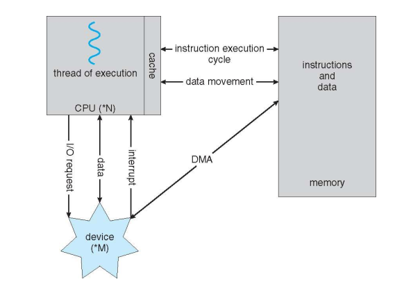
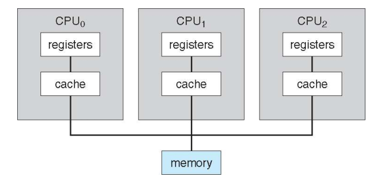
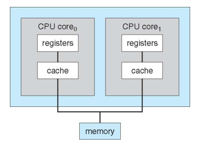
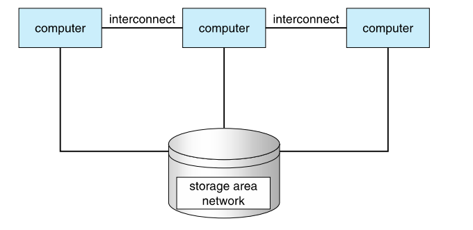
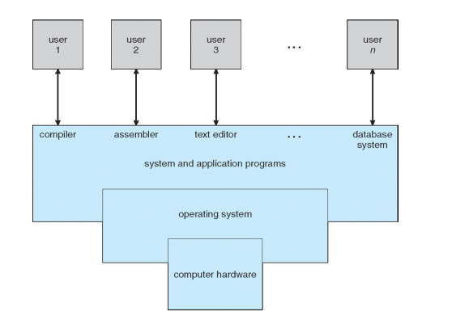
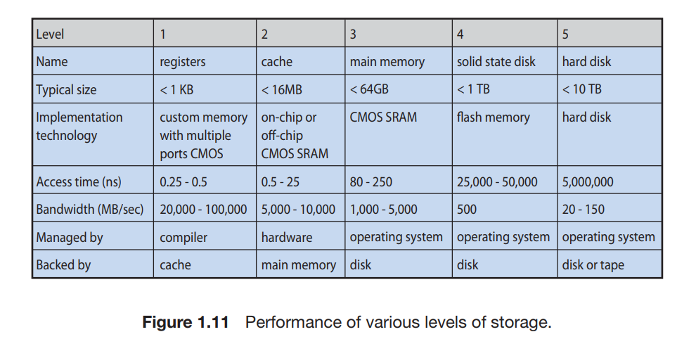

# 操作系统定义

操作系统是一直运行在计算机上的程序(通常称为**内核**)

# 计算机系统组成

## 计算机系统组成

-   CPU、控制器通过总线共享存储
-   CPU 和设备分时复用内存周期
-   I/O 设备和 CPU 可以同时运行
-   每个设备控制器负责特定的设备类型
-   每个设备控制器具有本地缓冲区
-   CPU 将数据从主存移到缓冲区/从缓冲区移到主存
-   设备控制器通过引起中断来通知 CPU 它已完成操作

## 计算机启动

-   引导程序 在开机或重启时加载
    -   通常存储在 ROM 或 EPROM 中，通常称为 固件
    -   全方面初始化系统
    -   操作系统内核加载到内存中并开始执行
-   系统进程或系统保护
    -   在内核运行的整个过程中运行
    -   在 UNIX 上，第一个系统进程是“ init”
-   完全引导后，等待事件发生
    -   由**中断**发出信号

## 中断处理

-   中断可由硬件和软件触发
    -   硬件向 CPU 发送信号
    -   软件执行特殊操作：**系统调用**
-   中断过程
    -   CPU 停止正在执行的操作
    -   执行中断服务例程
    -   CPU 恢复
-   操作系统是由**中断驱动**的

## 中断常见功能

-   每个计算机设计都有自己的中断机制处理器
-   中断将控制权转移给中断服务程序
    -   中断程序指针表(中断向量)可用于提供足够的速度
    -   指针表存储在低内存中
-   中断体系结构必须保存被中断指令的地址
    -   现代体系结构存储返回值系统堆栈上的地址

# 存储结构

## 存储结构

-   按层次结构组织的存储系统
    -   速度
    -   成本
    -   易变性
-   主存储器
    -   CPU 只能从存储器中加载指令(CPU 唯一可以直接访问的大型存储介质)
    -   随机访问， 通常是**小型**且**易失的**
    -   所有形式内存提供一个字节数组
        -   每个字节都有其自己的地址
        -   交互：加载和存储(内存$\leftrightarrow$寄存器)
-   指令执行周期

    -   从内存中获取一条指令并存储在寄存器中
    -   解码指令(必要时获取操作数)
    -   将结果到内存中

-   二级存储–提供了大**非易失性**容量存储容量的主存储器的拓展
    -   硬盘–覆盖有磁记录材料的硬质金属或玻璃盘
        -   磁盘表面在逻辑上分为**多个磁道**，细分为**扇区**
        -   磁盘**控制器**确定该设备和计算机之间的逻辑交互
    -   **固态磁盘**-比硬盘更快，非易失性
        -   多样化的技术
        -   更加流行

## 缓存

-   **缓存**–将信息复制到更快的存储系统中；可以将主内存视为二级存储的缓存
-   首先检查更快的存储(缓存)以确定是否存在信息
    -   如果存在，则直接从缓存中使用信息(快速)
    -   如果不存在，则将数据复制到缓存并在那里使用
-   缓存小于要缓存的存储
    -   缓存管理重要的设计问题
    -   缓存大小和替换策略
-   重要原理，在计算机(如硬件，操作系统，软件等)的多个级别上执行

## I/O 结构

-   存储只是众多 I/O 设备中的一种
-   设备控制器
    -   可以连接多个设备
    -   本地缓冲区存储和一组寄存器
-   设备驱动程序：用于每个设备控制器来管理 I/O，在控制器和内核之间提供统一的接口
-   中断-驱动 I/O
    -   设备驱动程序在控制器内加载寄存器
    -   控制器检查寄存器以决定要采取的措施
    -   设备控制器开始将数据传输到其本地缓冲区
    -   通过中断通知驱动程序并将控制权交回 OS

## 存储器直接访问结构

-   用于高速 I/O 设备，能够以接近内存的速度传输信息
-   设备控制器将**数据块**从缓冲存储器直接传输到主存储器，**无需 CPU 干预**
-   每次仅生成一个中断块，而不是每个字节一个中断。

> **现代计算机如何工作**
>
> 

# 系统体系结构

## 计算机系统体系结构

-   大多数系统使用单个通用处理器
    一个能够执行通用指令集的主 CPU

-   可能也有特殊用途的处理器

    -   设备专用处理器：硬盘，键盘，等等
    -   运行有限的指令集
    -   不运行用户程序
    -   由 OS 管理或内置于硬件

-   **多处理器**系统的使用和重要性不断提高-也称为**并行系统，多核系统**
    -   优势包括：
        1. **吞吐量提高**
        2. **规模效益**：共享外围设备，大容量存储和电源
        3. **提高可靠性**–平稳降级或容错
    -   两种类型
        1. **非对称多处理**–每个处理器都分配有特殊任务：老板与工人的关系
        2. **对称多处理(SMP)**–每个处理器执行所有任务：所有处理器都是对等的。

## 对称多处理体系结构

-   对称多处理(SMP)

    -   硬件或软件产生的结果
    -   添加 CPU 以提高计算能力
    -   导致非均匀内存访问(NUMA)
        

-   多核

    -   在单个芯片上包含多个核
    -   更高效
        -   片上通信比芯片之间通信的速度更快
        -   减小功率
    -   双核心设计
        
        > 核
        > 核心(Core)又称为内核，是 CPU 最重要的组成部分。CPU 中心那块隆起的芯片就是核心，是由单晶硅以一定的生产工艺制造出来的，CPU 所有的计算、接受/存储命令、处理数据都由核心执行。

-   集群系统
    -   类似多处理器系统，但多个系统协同工作
    -   通常是通过共享存储**存储区域网络(SAN)**
    -   提供**高可用性**服务，可在故障中幸存
    -   **非对称集群**具有一台处于热备模式[^1]的计算机
    -   **对称集群**具有多个节点运行应用程序，互相监视
    -   一些集群用于**高性能计算(HPC)**
        -   必须编写应用程序以使用**并行化**
    -   一些具有**分布式锁管理器(DLM)**以避免操作冲突
        
        > **热备模式**
        > 双机热备是应用于服务器的一种解决方案，其构造思想是主机和从机通过 TCP/IP 网络连接，正常情况下主机处于工作状态，从机处于监视状态，一旦从机发现主机异常，从机将会在很短的时间之内代替主机，完全实现主机的功能。

# 什么是操作系统

1. 操作系统在哪
   
   计算机系统的 4 个组成部分

    1. 硬件 –提供基本的计算资源(CPU，内存，I / O 设备)
    2. 用户：人员，机器，其他计算机
    3. 应用程序/程序 –定义系统的方式
       用于解决计算问题的资源
        - 文字处理器，编译器，Web 浏览器，数据库系统，视频游戏等
    4. 操作系统
       便捷与效率的设计权衡

2. 什么是操作系统

    - 以**进程**为起点
      无论运行什么程序，都将创建流程
    - 因此，**进程周期**，**进程管理**和其他相关问题是本课程的重要主题

3. 操作系统能做什么

    1. **系统视角**
        - OS 是**控制程序**
          控制程序的执行以防止错误和计算机的不当使用
        - OS 是**资源分配器**
            - 管理所有资源
            - 平衡效率和公平的冲突
    2. **用户视角**

4. 操作系统定义
    - 没有普遍接受的统一定义
    - 通用的定义 –“始终在计算机上运行的一个程序” **内核**

# 操作系统的结构

1. 操作系统提供程序运行的环境
2. 提高效率所需的**多进程设计**：操作系统最重要的方面
    - 多进程设计组织工作(代码和数据)，所以 CPU 总是有一项工作要执行
    - 所有工作最初都保存在工作池中的磁盘上，系统中总工作的一个子集保存在内存中
    - 工作通过工作调度被选中并运行
    - 当必须等待时，操作系统切换到另一项工作
3. 分时系统
    1. 要求计算机系统可交互
    2. 允许多用户同时共享一条计算机
    3. 采用 CPU 调度和多进程设计
        - 进程：加载到内存并执行的程序
        - 作业调度：选择加载多个作业中的哪个到内存中
        - CPU 调度：选择执行多个程序中的哪个

# 操作系统的执行

1. 双重模式与多重模式的执行

    - 用户模式&内核模式(监视模式、系统模式、特权模式)
    - 硬件通过一个**模式位**表示当前模式：内核模式-0 用户模式-1
    - 执行用户应用时，处于用户模式
      用户应用通过系统调用，请求操作系统服务时，切换到内核模式
      **内核模式执行系统调用、特权指令等**
      **操作系统控制计算机时，就处于内核模式**
    - 系统启动时，内核模式$\to$加载操作系统$\to$用户模式$\xrightarrow{中断}$内核模式$\xrightarrow{控制交回用户程序}$用户模式
    - 拓展模式概念 -虚拟机管理器(VMM)
    - 系统调用：程序和操作系统之间的**接口**
      系统调用&库调用

2. 定时器
    - 操作系统设置计时器，当计数器计数为 0 时，产生中断，控制转到操作系统
    - 可以防止用户程序运行过长 -采用程序允许执行的事件来初始化计数器

# 操作系统组件

## 进程管理

-   程序不是进程
    -   程序是被动实体
    -   进程是主动实体
-   进程是系统的工作单元
    -   系统由多个线程组成：系统进程&用户进程
    -   进程并发执行
-   操作系统负责的进程管理活动
    1. 在 CPU 上调度进程和线程
    2. 创建和删除用户进程和系统进程
    3. 挂起和重启进程
    4. 提供进程同步机制
    5. 提供进程通信机制

## 内存管理

-   内存是个快速访问的数据仓库，被 CPU 和 I/O 设备共享
-   CPU 在**获取指令周期**时，从内存读取指令；在**获取数据周期**时，对内存数据进行读写
-   操作系统负责内存管理的活动
    1. 记录内存的那部分在被使用，以及被谁使用
    2. 决定哪些进程(或其部分)回调入或调出内存
    3. 根据需要分配和释放内存空间

## 存储管理

-   操作系统对存储设备的物理属性进行了抽象，并定义了逻辑存储单元-**文件**
-   操作系统映射文件到物理媒介，并通过存储设备来访问文件

1. 文件系统管理
   操作系统负责文件管理的活动

    1. 创建和删除文件
    2. 创建和删除目录，以便组织文件
    3. 提供文件和目录的操作原语
    4. 映射文件到外存
    5. 备份文件到稳定(非易失的)存储介质

2. 大容量存储器管理
   操作系统负责有关硬盘管理的活动

    1. 空闲空间管理
    2. 存储空间分配
    3. 硬盘调度

    - 二/三级存储
      操作系统相关功能
        1. 安装&卸载设备媒介
        2. 为进程互斥使用而分配和释放设备
        3. 将数据从二级存储移动到三级存储

3. 高速缓存

    - 工作原理
      信息被使用时，临时复制到更快存储系统，即高速缓存
      需要特定信息时，检查是否在高速缓存中，若是，则直接使用；若否，则使用源地的信息，并复制到高速缓存以便下次重用
    - 各种级别存储的性能
      
    - 高速缓存一致性：位于一个高速缓存的 A 值更新，应理科反映到所有其他 A 所在的高速缓存

4. I/O 系统
   I/O 子系统为操作系统隐藏了 I/O 设备的特性
   包括以下组件
    1. 包括缓冲、高速缓存和假脱机的内存管理组件
    2. 设备驱动器的通用接口
    3. 特定硬件设备的驱动程序
       只有设备驱动程序才知道控制设备的特性

## 保护与安全

-   保护：用于控制进程或用户访问计算机系统的资源的一种机制
-   保护和安全要求系统能够区分所有用户
    -   通常用一个列表维护用户名称及其关联的**用户标识**(UID)(安全 ID Secure ID, SID)
-   升级特权一获得某个活动的额外许可 -方式多样

## 内核数据结构

1. 列表、堆栈及队列

    - 数组
    - 列表：链表
        1. 单向链表：每项指向它的后继
        2. 双向链表：每项指向它的前驱与后继
        3. 循环链表：最后一项指向第一项
    - 堆栈：后进先出(LIFO: Last In First Out)
    - 队列：先进先出(FIFO: First In First Out)

2. 树

    - 一般树
    - 二叉树
    - 二叉查找树
    - 平衡二叉查找树

3. 哈希函数与哈希表

    - 哈希函数将一个数据作为输入，进行数值运算，然后返回一个数值
    - 哈希碰撞：两个输入产生了相同的输出值
        - 处理方法：在冲突处建立链表
    - 哈希表：利用哈希函数，将关键字和值关联起来

4. 位图
    - 位图：n 和二进制位的传，用于标识 n 项的状态
    - 位图的第 i 个位置的值和第 i 个资源相关联，表示资源是否可用
    - 磁盘块的可用性就通过位图表示

# 计算环境

1. 传统计算

2. 移动计算

    - 智能手机&平板电脑

3. 分布计算

    - 分布式系统：物理上分开的、可能异构的、通过网络相连的一组计算机系统，可供用户访问系统维护的各个资源
    - 网络：两个或多个系统之间的通信路径
        - 网络协议：传输控制协议/网间协议(Transport Control Protocol/Internet Protocol, TCP/IP)
        - 局域网
        - 广域网
    - 网操作系统

4. 客户机-服务器计算

    - 服务器系统：计算服务器系统&文件服务器系统

5. 对等计算(Peer-to-Peer, P2P)
   不区分客户机与服务器

6. 虚拟化

    - 客户操作系统&主机操作系统

7. 云计算

-   通过网络提供计算、存储，设置应用程序等服务
-   云计算种类
    1. 公云
    2. 私云
    3. 混合云
    4. 软件即服务
    5. 平台即服务
    6. 基础设施即服务

8. 实时嵌入式系统

-   嵌入式系统
    1. 通用计算机
    2. 专用集成电路(Application Specific Integrated Circuit, ASIC)
-   实时操作系统
    -   处理器执行或数据流动具有严格时间要求
    -   具有明确的、固定的时间约束，处理必须在规定时间按约束内完成，否则系统出错

# 开源操作系统
