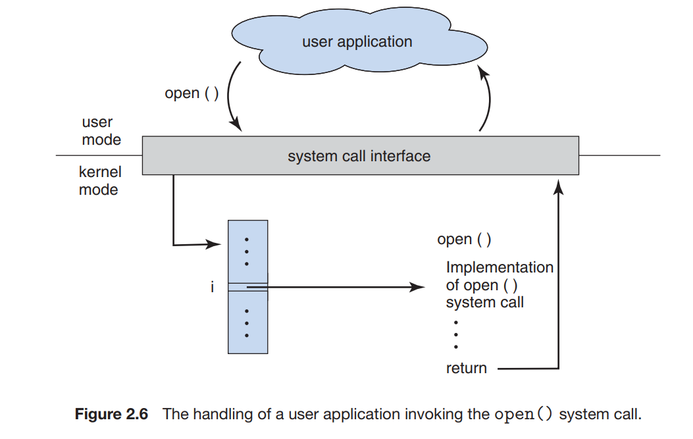
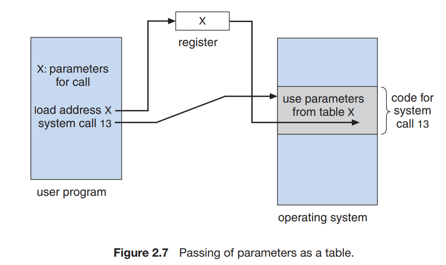

# 操作系统服务

## 用户界面

    - 命令行界面(Command-Line Interface, CLI)
    - 图形用户界面(Graphical User Interface, GUI)

## 程序执行

    加载程序到内存，并加以运行

## I/O 操作

## 文件系统操作

## 通信

    进程与进程交换信息
    1. 共享内存：两个或多个进程读写共享内存趋于
    2. 消息交换：符合预先定义格式的信息分组可以通过操作系统在进程之间移动

## 错误检测

## 资源分配

## 记账

记录用户使用资源的类型和数量

## 保护与安全

# 用户与操作系统的界面

## 命令解释程序

-   外壳(shell)：解释程序
-   主要功能：获取并执行用户指定的吓一跳命令
    -   实现方式
        1. 命令解释程序本身包含代码以执行这些命令
        2. 通过系统程序实现大多数命令，命令解释程序通过命令确定一个文件，加载到内存并执行

## 图形用户界面

## 界面的选择

# 系统调用

1. 系统调用提供操作系统的服务接口
1. API：应用程序接口(Application Programming Interface)
    - API 通常在后台为应用程序员调用实际的系统调用
    - 优点
        1. 可移植性好
        2. 使用方便
        3. 无需知道系统调用细节
1. 系统调用过程
    1. 系统调用接口截取 API 函数的调用
    2. 调用 OS 中所需的系统调用
       
1. 传递参数方式
    1. 寄存器传递参数：可能参数数量比寄存器数量多。通常将参数存在内存的块或表中，其地址通过寄存器来传递
    2. 内存块传递参数：寄存器传递内存块地址
       
    3. 堆栈传递参数：参数通过程序入栈，由 OS 出栈

# 系统调用的类型

## 进程控制

-   如果一个系统调用异常停止当前执行的程序，或者程序运行遇到问题并引起错误陷阱，有时转储内存到磁盘
-   内存信息转储到磁盘后，可用调试器来确定问题原因
-   操作系统将控制权转到调用命令解释程序，命令解释程序读入下一个命令
-   可能需要定义错误级别，命令解释程序课利用错误级别来确定下一个操作

## 文件管理

-   创建&删除文件
-   对各种属性的值加以读取&设置，包括文件名、文件类型、保护码、记账信息等

## 设备管理

-   请求设备，确保设备的专门使用
-   使用完设备之后，释放设备

## 信息维护

1. 提供程序的时间曲线，表示在特定位置或位置组合上的执行时间
2. OS 维护所有进程的信息，可通过系统调用来访问

## 通信

1. 消息传递模型
   先建立连接，再开始通信
2. 内存共享模型
   创建共享内存，并访问其他进程拥有的内存区域

## 保护

保护提供控制访问计算机的系统资源的机制

# 系统程序

-   系统程序，也称系统工具，为程序开发核执行提供了一个方便的环境
-   分类
    1. 文件管理
    2. 状态信息
    3. 文件修改
    4. 程序语言支持
    5. 程序加载与执行
    6. 通信
    7. 后台服务

# 操作系统的设计与实现

## 设计目标

-   用户目标：便于使用、易于学习、可靠、安全、快速
-   系统目标：软件工程原则

## 机制与策略

-   策略与机制分离
-   机制决定如何做，策略决定做什么

## 实现

-   用高级语言编写，更容易移植到其他硬件

# 操作系统的结构

## 简单结构

1. 没有仔细地划分为模块
2. 单片结构，分为内核和系统程序，内核包含大量功能
    - 优势：系统调用接口和内核通信的开销非常小

## 分层方法

-   操作系统分成若干层
-   操作系统层采用抽象对象，包括数据和操纵这些数据的操作
-   每层只能调用更低层的功能和服务，简化了调试和验证
-   每层为更高层隐藏一定的数据结构、操作、硬件
-   难点：如何合理定义各层

## 微内核

-   从内核中删除所有不必要的部件，将其作为系统级和用户级的程序来实现
-   为客户端程序和运行在用户空间中的各种服务提供通信
-   优点：便于扩展操作系统，容易从一种硬件平台移植到另一种硬件平台，安全性，可靠性
-   缺点：增加系统功能的开销，性能受损

## 模块

-   内核有一组核心组件，内核可通过模块链入额外服务
-   内核提供核心服务，其他服务可在内核运行时动态实现

## 混合系统

# 操作系统的调试

# 操作系统的生成

1. 完全定制：系统管理员可以修改操作系统源代码的副本
2. 系统描述可用来创建表，并从预先已编译的库中选择模块，模块连接起来，生成操作系统
3. 构造完全由表驱动的系统

# 系统引导

-   系统引导(booting)：加载内核以启动计算机的过程
-   引导程序/引导加载程序：可以定位内核，并加载到内存以开始执行的一小块代码
-   引导程序放在固件上，操作系统放在磁盘上。
    1. 引导程序先争端
    2. 再从磁盘固定位置读取整块信息到内存
    3. 最后执行引导块的代码
    4. 存储在引导块的程序加载整个操作系统到内存，并开始执行
-   引导盘/系统盘：具有引导分区的磁盘
