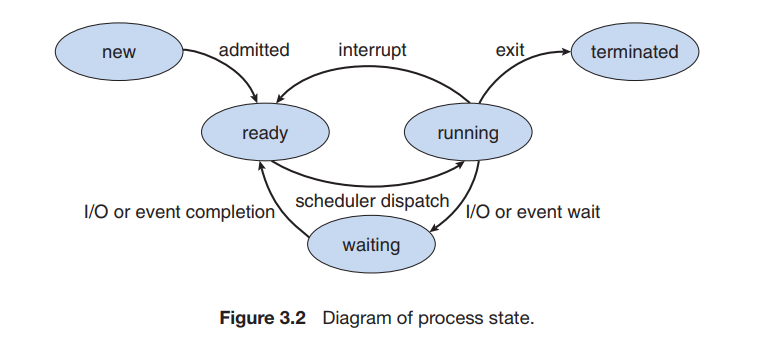
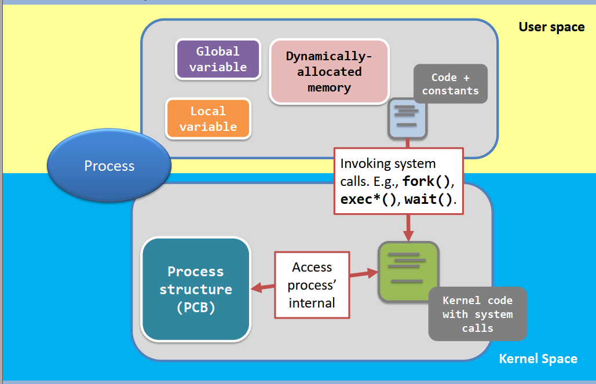
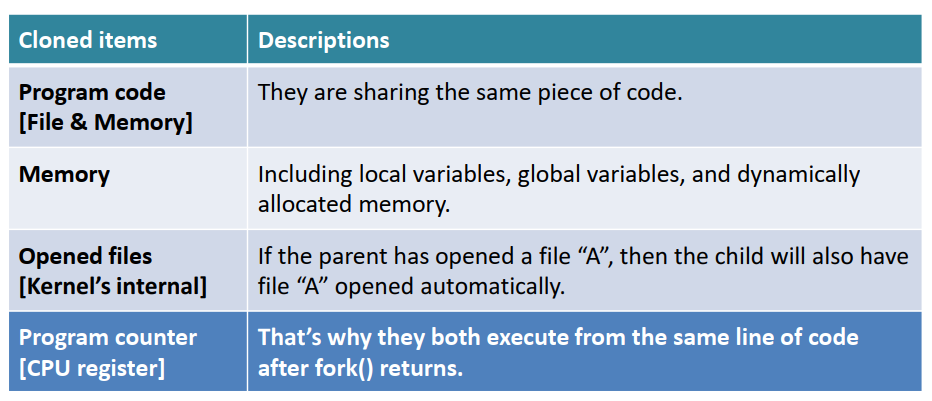
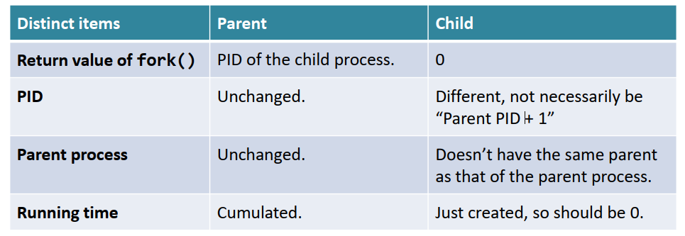

# 进程的概念

## 进程

-   进程是执行的程序，是活动的实体，具有一个程序计数器用于表示下个执行命令和一组相关资源(如堆栈、数据、文本)。
-   进程本身也可作为一个环境，用于执行其他代码。

## 进程状态

1. 开始
2. 运行
3. 等待：等待某事发生(如 I/O 完成)
4. 准备：等待 CPU 处理
5. 结束

## 进程控制块(PCB, Process Control Block, 任务控制块)

包含进程的以下信息

1. 进程状态
2. 程序计数器：进程将要执行的下个指令的地址
3. CPU 寄存器：包括累加器、索引寄存器、栈指针、通用寄存器、其他条件码信息寄存器
4. CPU 调度信息：进程优先级、调度队列的指针和其他调度参数
5. 内存管理信息：基地址和界限寄存器的值、页表或段表
6. 记账信息：CPU 事件、实际使用时间、时间期限、几张数据、作业、进程数量
7. I/O 状态信息：I/O 设备列表、打开文件列表
   

> 什么是进程？
> 进程是正在运行的程序
> process (active entity) $\not=$ program (static entity)
> 任何处理器，同时只能运行 1 个进程
> 一个程序可能会产生多个进程
> 一个进程可以为其他代码运行提供环境(java program)

进程包含的数据
fork 后的操作
继承哪些内容

## 进程运行

-   系统必须提供的功能
    1. 识别进程
    2. 创建进程
    3. 执行进程
    4. 终止进程

### 识别进程

每个进程都有一个 process ID, PID，通过 getpid()系统调用进行识别。

### 创建进程

-   一个进程可能创建新的进程
    -   父进程：创建进程的进程
    -   子进程：被创建的进程
-   第一个进程：init，PID=1
-   通过进程树管理进程
-   孤儿进程
    -   父进程结束时，子进程变为孤儿进程
    -   孤儿进程进一步创建新的进程，进程树变为进程森林
-   re-parent 机制
    Linux 系统中，防止孤儿进程的出现，有 re-parent 机制：进程变为孤儿进程时，init 会变为该进程的父进程
    > Linux 系统中，由于 re-parent 机制的存在，始终有且仅有 1 棵进程树。
    > re-parent 机制使子进程运行无需等待父进程结束
-   父进程与子进程的关系

1. 资源共享
    - 父子进程贡献所有资源
    - 子进程分享部分父进程的资源
    - 父子进程无资源共享
1. 运行
    - 同时运行
    - 父进程等待子进程结束
1. 地址空间
    - 子进程复制父进程的地址
    - 子进程有一个新的地址

> system call: fork()
>
> 1.  behaves like “cell division”, It creates the child process by cloning from the parent process
>     clone this
>     
>     not clone this
>     
> 2.  For parent, the return value of fork() is the PID of the created child
>     For child, the return value of fork() is 0
