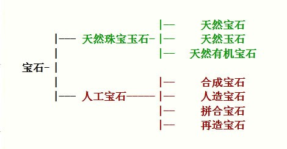

# 宝石学概论

1. 起源：英国
2. 1908，英首创珠宝研究机构
3. 英国宝石协会在全世界进行函授教学，每*半年*在全世界进行一次统一考试，成绩合格者发给证书，承认作为它的会员(FGA)。
    - FGA 是英国宝石协会和宝石检测实验室(Fellowship of Gemological Association and Gem Testing Laboratory of Great Britain)的简称。
4. 世界上第一所专门研究宝石的高等院校是美国宝石学院 GIA (Gemological Institute of America)
    - 目的是向首饰商 、珠宝商提供鉴定、分级及评价方面的知识，并提供权威性的市场分析。
5. 在中国创办最早、影响最大的是**中国地质大学武汉珠宝学院** 。
6. 我国*国家人事部*和*国家技术监督局*每*两年*举行一次全国珠宝玉石质检师执业资格的考试 。
7. 宝石学最初源于矿物学、岩石学、工艺美术学，现己发展为一门多学科相互交叉、渗透的新兴综合性学科。
8. **研究对象**主要是天然宝石、合成宝石和人造宝石，其研究内容涉及到宝石的形成、找矿、开采、优化处理、合成晶体、宝石加工、设计与镶嵌，直到成为商品的全过程。

**CMA** 珠宝检验机构

# 宝石的概念与分类

-   宝石的概念
    天然珠宝玉石和人工宝石的统称
-   成因分类 

    -   天然珠宝玉石
        由自然界产出，具有美观、耐久、稀少性，具有工艺价值、可加工成装饰品的物质统称为天然珠宝玉石。包括天然宝石、天然玉石和天然有机宝石

        1. 天然宝石
           由自然界产出，具有美观、耐久、稀少性，可加工成装饰品的**矿物单晶体**(可含双晶)
        2. 天然玉石
           由自然界产出，具美观性、耐久性、稀少性和工艺价值的**矿物集合体**
        3. 由自然界生物生成，部分或全部由有机物质组成，可用于首饰及装饰品的材料， **养殖珍珠**(简称“珍珠”)也归于此类 。

    -   人工宝石
        完全或部分由**人工生产或制造**，用作首饰及装饰品的材料(纯金属材料除外)统称为人工宝石。包括合成宝石、人造宝石、拼合宝石和再造宝石。
        1. 合成宝石
           完全或部分由人工制造，且**自然界有己知对应物**的晶质或非晶质体或集合体，其**化学成分、物理性质和晶体结构**与所对应的天然珠宝玉石基本相同。
        2. 人造宝石
           由人工制造且**自然界无己知对应物**的晶质、非晶质体或集合体称为人造宝石。
        3. 拼合宝石
           由两块或两块以上材料经人工拼合而成，且给人以整体印象的珠宝玉石称拼合宝石，简称拼合石。
        4. 再造宝石
           通过人工手段将天然珠宝玉石的碎块或碎屑熔接 或压结成具整体外观的珠宝玉石。

-   仿宝石
    用于模仿某一种天然珠宝玉石的颜色、特殊光学效应等外观特征的珠宝玉石或其它材料。**仿宝石不代表珠宝玉石的具体类别。**
-   价值分类
    1. 高档宝石：钻石、红宝石、蓝宝石、祖母绿、猫眼、翡翠、软玉等
    2. 中档宝石：海蓝宝石、碧玺、尖晶石、方柱石等
    3. 低档宝石：水晶、红色石榴石、玛瑙、虎睛石、东陵石等．

# 宝石的命名

-   错误称谓
    1. 消费者缺乏珠宝知识，望文生义
    2. 不法商人以次充好，以假乱真，牟取暴利
-   几种错误命名方式

    1. 颜色直接命名宝石
       后果
        1. 将呈现同一颜色的许多不同品种宝石混为一谈
        2. 将具有不同颜色的同一品种宝石看成许多品种的宝石
    2. 以特殊光学效应直接命名宝石
    3. 以产地命名宝石
        1. 以产地代替宝玉石品种
        2. 以“产地＋高档宝石”命名普通宝石
    4. 以生产国、生产厂家 、生产方式等直接命名人工宝石

-   命名原则
    1. 以矿物、岩石名称作为天然宝石材料的基本名称
    2. 部分名称采用珠宝首饰行业传统名称
        - 天然宝石 无需加“天然”二字
            1. 产地不参加定名
            2. 禁止使用由两种天然宝石名称组合而成的名称，“变石猫眼”除外
            3. 禁止使用含糊不清的商业名称
        - 天然玉石 无需加“天然”二字
            1. 不用雕琢形状定名天然玉石
            2. 不允许单独使用“玉”或“玉石”直接代替具体的天然玉石名称
            3. 规范性附录中列出的带有地名的天然玉石基本名称，不具有产地含义
        - 天然有机宝石 无需加“天然”二字 但“天然珍珠”、“天然海水珍珠”、天然淡水珍珠” 除外
            1. 养殖珍珠可简称“珍珠”，海水养殖珍珠可简称为“海水珍珠”，淡水养殖珍珠可简称为“淡水珍珠”
            2. 不以产地修饰天然有机宝石名称
    3. 为了突出宝石的星光效应、猫眼效应。直接将其置于宝石种属名称前面或后面
    4. 人工宝石定名时，在相应的宝石材料前冠以“合成 ”、“人造 ”、“再造 ”，以示与天然宝石的区别
       但“塑料 ”、“玻璃 ”除外
        1. 禁止使用生产厂、制造商的名称直接定名
        2. 禁止使用易混淆或含混不清的名词定名
        3. 不允许用生产方法参与定名
    5. 拼合宝石命名时应突出“ 拼合石 ”三字
        - 可逐层写出组成材料名称或只写主要材料名称
    6. 经处理的珠宝玉石应在其基本名称后用括号标出“(处理)” 二字
        - 或注明处理方法
        - 也可以在所对应的珠宝玉石名称前描述具体处理方法
    7. 仿宝石
        1. 在所仿天然珠宝玉石名称前冠以 “仿” 字
        2. 应尽量给出具体珠宝玉石名称，且采用下列表示方式 如 “玻璃” 或 “仿水晶(玻璃〉”
        3. “仿宝石” 不应单独作为珠宝玉石名称
        4. 当使用 “仿某种珠宝玉石”时，意味着该珠宝玉石不是所仿的珠宝玉石
        5. 具体模仿材料有多种可能性

# 影响宝石价值的因素

-   综合考虑以下因素
    | **美丽** | **稀少性**|**宝石切磨工艺**|
    |:---:|:---:|:---:|
    |**耐久性**|**宝石重量**|**消费者的需求和偏好**|

## 美丽

1. 颜色
   彩色宝石要求其颜色艳丽、纯正、均匀
2. 透明度&纯净度
   透明度是指宝石 透过可见光的能力。宝石透明度与宝石的纯净程度和裂隙多少有关，杂质包裹体越多、裂隙越多，则宝石的透明度越低。从这个角度来讲，宝石的透明度反映了宝石结晶完美的程度。如果说颜色是彩色宝石美丽的主要因素，那么，透明度与纯净度则是无色宝石质美的最重要因素。一般来说，透明度越高，宝石越完美，价值越高．
3. 光泽
   光泽是宝石表面反射光的能力和特性。这种反光视觉效果为宝石平添了一份灵气。其强弱决定于宝石的表面性质、折射率、反射率等因素。表面性质与加工过程中最后抛光的光洁度有关；宝石的折射率和反射率则是宝石固有的物理性质。无色钻石之所以能成为宝石之王，很重要的一个因素是它具有极强的金刚光泽，在阳光下光芒四射，给人以光彩夺目、灿烂辉煌的感觉。
4. 色散
   将白光分解成七种单色光的现象叫色散。宝石色散能力的大小是用宝石对红光(687nm)和紫光(431nm)的折射率的差值来表示．高色散使宝石增加了无穷魅力。尤其是对于无色宝石来说更是如此。钻石具有较高的色散值(0. 044)，当自然光照射到角度适宜的钻石刻面时，就会分解出光谱色，在钻石表面显示出一种五颜六色的光彩。
5. 特殊光学效应
   如星光效应、猫眼效应、变彩效应、月光效应等。

## 耐久性

宝石的耐久性主要取决于宝石的力学性质和化学稳定性。宝石硬度越大，在日常配戴中越不易被磨损。
绝大多数宝石都有非常高的化学稳定性，一般不发生分解、氧化。
但欧泊、绿松石等含水宝石会因过分干燥或受热脱水而失去光泽、变色及开裂。

## 稀少性

-   天然宝石的形成经历了非常漫长而复杂的历程，首先是在某种特定的地质条件下才能形成，这些条件包括**温度、压力、化学元素种类及浓度梯度**等，当这些条件均恰到好处集合时，才有可能成就天地精萃一一宝石，形成后还需在后期地壳升降运动以及风化剥蚀作用下，宝石矿床达到近地表才能被人类发现开采和利用。
-   宝石的稀有性包括品种上的稀有性和质量上的稀有性，它对宝石价值的影响是非常明显的。

## 宝石的重量

宝石价格＝$K\times D^n$
K：每克拉宝石的价值(1 克拉= 0. 2 克)
D：宝石的重量，单位：克拉
n: >=1，越高档 、越稀少的宝石，n 越大 。

## 宝石的切磨工艺

宝石学家按照不同宝石的特性和折射率大小设计了特定的款式，每种款式各刻面的交角、大小均有严格比例，以期最大限度地展示宝石的亮度、光泽、色散等。

## 艺术设计

## 消费者的需求和偏好

## 文化内涵

# 基本功用

## 日常佩戴饰品-首饰

## 纪念物、礼品
15  周年结婚纪念称为水晶婚
25  周年结婚纪念称为银婚
30  周年结婚纪念称为珍珠婚
35  周年结婚纪念称为珊珊婚
40  周年结婚纪念称为红宝石婚
45  周年结婚纪念称为蓝宝石婚
50  周年结婚纪念称为金婚
60  周年结婚纪念称为钻石婚

一月是石榴石 代表贞操、友爱、忠实
二月是紫水晶 精力充沛、避邪、忠诚、善良
三月是海蓝宝石 沉着与勇敢”、“幸福和长寿”
四月是钻石 贞洁与纯洁
五月是祖母绿 爱和生命的象征，代表着充满盎然生机的春天
六月是珍珠或月光石 健康、长寿、富贵
七月是红宝石 永世不变的爱情
八月是橄榄石 幸福与和谐
九月是蓝宝石 忠诚、坚贞、慈爱和诚实
十月是碧玺或欧泊 希望与幸福
十一月是蓝黄玉(托帕石) 友情和幸福
十二月是绿松石或锆石 成功与必胜

## 收藏、保值

## 护身符

# 宝石的形成与产地

## 形成

1. 宝石矿物分布在岩石中(**原生矿**) 或分布在由岩石衍生出的砂砾中(**砂矿**)。
2. 岩石分类
    1. 火成岩：是在高温的条件下由岩浆或熔岩流冷凝而成的岩石。随火山爆发喷出地表而形成的火成岩称为“**火山岩**”。而熔融岩浆在地表下凝固而成的称为“**侵入岩**”。一般来说，岩石冷却凝固得越慢所产生的宝石矿物晶体就越大。(即主要在侵入岩中)
    2. 沉积岩：是在地表或接近地表的条件下，由砂、砾、泥质或溶解物质，经沉积固结而成的岩石。沉积岩一般成层堆积。
    3. 变质岩：是由火成岩或沉积岩在较高的温度和压力条件下经过变化改造而成的岩石
    - 宝石矿物或许能地在地表找到，但也可能被深埋于地下
    - 有些宝石矿物分布于基岩中
    - 有些由于侵蚀作用而与基岩分离，被河水携带到河流、湖泊或海洋中
3. **有机宝石**的形成：有别于无机矿物宝石，它们来自动物或植物。

## 产地

1. 有些宝石产于世界各地，如水晶和石榴石。
2. 有些宝石则由于形成的地质条件较为特殊，仅分布于少数几个国家或地区，如红宝石、钻石。
3. 有些宝石即使分布较广，但可能仅有极少部分达到宝石级别。

# 著名珠宝商

1. 卡地亚-法
2. Van Cleef & Arpels-法
3. 蒂芙尼-美
4. Bvlgari-意
