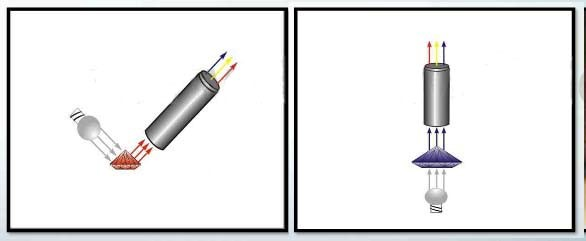
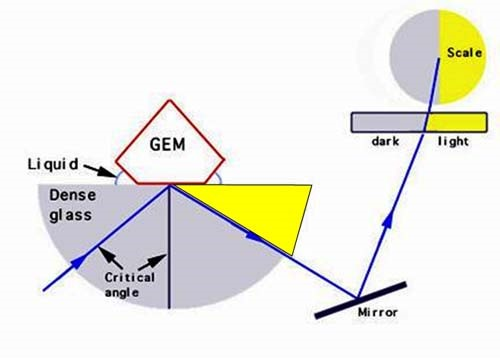
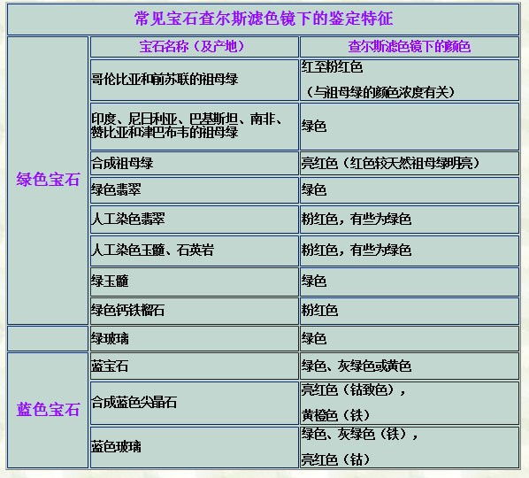

# 宝石鉴定及仪器

1. 涉及内容

    1. 区别天然品的种类
    2. 合成品的识别
    3. 人工优化处理的鉴别

2. 鉴定方法

    1. 肉眼观察鉴定
    2. 物理性质测试鉴定
    3. 以晶体光学性质为依据的偏光显微镜鉴定
    4. 晶体结构分析
    5. 化学成分分析

3. 特殊性
    1. 检测需要无损
    2. 为商业服务，需要简单、快速、便捷、经济
    3. 判别是天然/人工/人工优化处理

# 肉眼检查

1. 常用工具：放大镜
   
2. 观察内容

    1. 表面损伤(刻痕、凿痕、表面瑕疵)
    2. 切磨质量(小面大小、角度的准确性及对称性)、抛光质量
    3. 内部裂隙、解理及双晶纹
    4. 包裹体(指固相、气相及液相包裹体)
    5. 颜色分布特征 、均匀程度(色带、色块)
    6. 某些合成宝石的生长线和气泡
    7. 拼合宝石的接合面、光泽和气泡层

3. 宝石显微镜观察
   三个光源：底光源、顶光源、侧光源

# 宝石偏光镜

1. 作用：总的来说，就是宝石的偏振特性

    1. 观察透明宝石的消光情况，判断它们是均质体、非均质体或多晶质集合体
        - 单晶体：在整体范围内原子都是规则排列的；
        - 多晶体：由许多小单晶体(晶粒)构成，在各晶粒范围内，原子是有序排列的。整体各向同性、无规则的外形。
    2. 鉴定均质宝石的异常双折射现象
    3. 检查宝石的多色性
    4. 与石英楔子配合可测定宝石的光性符号

2. 操作方法&鉴定方法
    1. 转动上偏光片，使其与下偏光振动方向正交。此时视域最暗，处于消光位置。
        1. 将所测宝石放置在下偏光片之上的载物台上，转动宝石 360°，根据消光情况，判断宝石的有关性质：
        2. 如果宝石全黑，没有明暗变化，则属均质体。即为非晶质或等轴晶系晶体。如钻石、石榴石、尖晶石等
        3. 如果宝石有四明四暗变化，则表明为非均质体。如红宝石、蓝宝石、祖母绿、水晶、碧玺、托帕石等。
        4. 如果宝石始终是明亮的，则可能为多晶质集合体。由于组成集合体的许多微小晶体的方向各不相同，使得宝石在各种位置都不能消光。如玛瑙、翡翠等。
    2. 用宝石偏光镜可以测定均质宝石异常双折射现象  
       钻石、石榴石、合成尖晶石、玻璃及琥珀等可具异常双折射现象，这些宝石在正交偏光下呈不规则的明亮变化。
       在此情况下，先将宝石在正交偏光镜下转动至最亮处，然后转动上偏光使其与下偏光振动方向平行：
       若为均质体宝石，则宝石的亮度变强。若为非均质体宝石，则亮度基本保持不变 。
    3. 测定有色非均质宝石的多色性。转动上偏光使其与下偏光振动方向平行。转动宝石即可。
    4. 测量轴性。
        1. 在上偏光与下偏光处于正交的位置上使宝石的光轴方向直立；
        2. 加上透镜聚光。即可测定非均质宝石的轴性。

# 二色镜

1. 用一块无色透明的冰洲石菱面体，因为冰洲石的双折射率高，它将穿过宝石的两条平面偏振光分离开来，并将两束偏振光并列展示于窗口
2. 若见有多色性，该宝石必定是非均质体(一轴晶或二轴晶)；
3. 若一颗宝石只显示两种颜色(或色调)，它可能为一轴晶，也可能为二轴晶
4. 若一颗宝石可显示三种颜色，它一定是二轴晶 。
5. 均质体宝石(等轴晶系及非晶质体)无多色性 。
6. 同时，无色的非均质体宝石也不具多色性 。

# 分光镜

1. 根据宝石对可见光谱的选择性吸收现象，研究宝石颜色的组成及致色因子，进而达到鉴别宝石目的的一种仪器
2. 观察方式
   
3. 作用
    1. 鉴定具有特征吸收光谱的宝石
    2. 区分天然品与仿制品
    3. 区分天然品与人工优化处理品

# 折射仪

1. 根据所测得的折射率值准确鉴定宝石品种
2. 工作原理：全反射
   将宝石置于折射仪的测台上，宝石的小面通过折射油与棱镜紧密接触，目镜中所观察到的明暗界线即是相应的折射率值。在转动宝石360°。
   
3. 结果
    1. 有一个阴影边界。即宝石只有一个折射率值，说明所测宝石为均质体．
    2. 出现二个阴影边界。说明所测宝石为非均质体
        1. 一条阴影边界移动，此时宝石为一轴晶：
           若高折射率的阴影边界移动，则为正光性
           若低折射率的阴影边界移动，则为负光性
        2. 二条阴影边界均移动，此时宝石为二轴晶：
           若高折射率的阴影边界移动幅度大，则为正光性
           若低折射率的阴影边界移动幅度大，则为负光性
           最高折射率与最低折射率的差值，即为该宝石的双折射率值．
    3. 仅有折射油的阴影边界。说明宝石的折射率值超出折射仪的量程。
4. 作用
   测**折射率**、**双折射率**，判断**轴性**、**光性正负**

# 查尔斯滤色镜

1. 查尔斯(Chelsea)滤色镜又称滤色器．滤色镜仅使红色光和黄绿色光通过
2. 曾是专门用以鉴别祖母绿的一种简易设备，现在查尔斯镜的用途已经扩大
   
3. 翡翠在滤色镜下变绿色部分的一定是染色的

# 热导仪

1. 根据钻石的良好传热性而设计的，用来鉴别钻石真假
2. 操作方法
    1. 打开热导仪的电源，对金属针状测头进行约 20 秒钟的加热
    2. 将热针触及被测“钻石”样品的表面，根据热导仪的信号即可确定出其真伪
    3. 如果红色二极管点亮，并伴随发出蜂鸣声说明被测者为真钻石
    4. 如果红色二极管未点亮，且仪器不发出蜂鸣声，说明被测者为假钻石或仿冒品
3. 合成碳化硅(莫桑石)在热导仪上有着与钻石一样的反应。需要使用另一种仪器字再次甄别，其原理是钻石具有透过长波紫外线的能力；而合成碳化硅却吸收长波紫外线

# 比重测试

1. 适合于未镶嵌的宝石、玉石
2. 静水称重法
   计算公式
    $$
    宝石比重=\frac{宝石在空气中的重量}{宝石在空气中的重量-宝石在液体中的重量}\times液体的比重
    $$
3. 重液法
   利用重液法可以快速测试宝石比重的近似值。其方法是把宝石放在配制好的己知比重的重液中：
    1. 当宝石的比重小于重液的比重时，宝石在重液中上浮；
    2. 当宝石的比重大于重液的比重时，宝石在重液中下沉；
    3. 当宝石的比重等于重液的比重时，宝石悬浮于重液中。
4. 最常见的重液是二溴二烯(2.18)、三溴甲烷(2.89)、二碘甲烷 (3.33)
    用上述三种重液与二甲苯(0.87)按各种比例混合可配制出密度值为3.33——0.87的一系列重液

# 紫外灯

1. 紫外线的波长范围大约在 100-380nm 之间
2. 长波紫外线(365nm)、短被紫外线(253.6nm)
3. 作用
    1. 区别天然宝石及其仿制品
    2. 区别合成品与天然品
    3. 人工优化处理的鉴别
