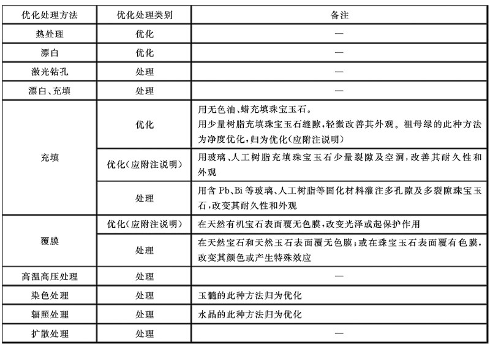
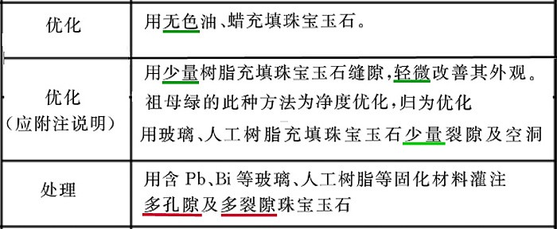

# 人工优化处理

1. 宝石的优化处理是指人们利用某种技术和工艺来改善珠宝玉石的外观(颜色、透明度、光泽、净度或特殊光学效应)、耐久性或可用性，从而提高宝石美学价值和商品价值的过程。
2. 作用 解决宝石需求矛盾
3. 分类
    1. 优化
       传统的、被人们广泛接受的、使珠宝玉石潜在的美显示出来的优化处理方法
    1. 处理
        - 非传统的、尚不被人们接受的优化处理方法。
        - 属于处理的珠宝玉石应在其基本名称后用括号标出“(处理)”二字
        - 也可以在所对应的珠宝玉石名称前描述具体的处理方法
        - 如不能确定是否经过处理时，在珠宝玉石名称中可不予表示，但必须加以附注说明
        - 属于“处理”的人工宝石可直接使用其基本名称
4. 优化处理方法分类表
   

# 人工优化处理方法及检测

1. 表面**处理**
    - 利用涂层、覆膜、镀层、背衬、刻划条纹等方式使宝石改变颜色、增强反光亮度和产生光学效应
    - 这些手法属于**处理范畴**。但天然有机宝石表面覆无色膜属于*优化*(改变光泽或其保护作用)
    1. 涂色层
       在宝石的腰部及弧面型宝石的底部表面涂覆一层透明的有色物质，以改善宝石颜色。
    2. 覆膜
       膜物质仅覆盖在宝石表层或局部，易脱落，有时可见到结合面，易于识别。
    3. 背衬
       在宝石的底部贴上一小块金属垫片，以加强宝石对光的反射，使宝石更明亮，或者使宝石产生星光等特殊光学效应
    4. 镀层
       用电镀或离子喷涂的方法在宝石表面产生一金属薄层，以增加宝石反光的能力或因干涉产生辉光。
    5. 刻划
       金珀背面覆上红膜，再在红膜上画出图案后雕刻，正面看时没图案的地方就是红膜透过来的，侧面看是金珀的本色。
2. 致密度**优化**
    - 在一定温度、压力和电解质的作用下，改善绿松石表层、近表层的质地以及光学、力学性质。
    - 适用于质地较好的绿松石
    - 属于**优化**，但应**附加说明**
3. 高温热处理(**优化**)
    - 通过人工控制温度和氧化还原环境等条件，对样品进行加热，促使宝石的特征向人们所希望的方向转变。
    - 属于**优化**
    - 红宝石、蓝宝石、海蓝宝石、托帕石、水晶、玛瑙
    - 热处理宝石的鉴定要点
        1. 在其小面和腰棱处可见到麻点、小凹坑
        2. 宝石中的液态包裹体在热处理时发生膨胀，其周围有胀裂现象
        3. 固态包裹体边缘有熔融现象
4. 高温高压(HPHT)**处理**
    - 在高压下将钻石加热到高温，以移除或改变其颜色
    - 属于**处理**
5. 漂白处理(**优化**)
    - 采用化学溶液对珠宝玉石进行浸泡，使珠宝玉石的颜色变浅或除去杂质。
    - 属于**优化**范畴
    - 珍珠、虎睛石、翡翠等
6. 填充**处理**
   
    - 充填处理是把某些物质如油、蜡、塑料或玻璃等物质注入宝石的孔隙和裂纹中
    - 一方面提高宝石的透明度、改善颜色
    - 另一方面也可提高宝石的物理稳定性
    - 祖母绿、翡翠、红宝石、蓝宝石、钻石、绿松石、欧泊、碧玺等。
    - 浅色绿松石灌注处理后颜色更深，性质更稳定
    - 若使用一些强酸、强碱及氧化剂等化学溶液对玉石进行浸泡处理，会对玉石的结构有一定的破坏作用，在放大镜或显微镜下 可观察到腐蚀痕迹。经过这样处理后的玉石是无法直接使用的，必须再经过后续的充填处理。属于**处理**
    - 填充处理宝石的**鉴定特征**
      在显微镜下可以看到由于孔隙没有被全部充填所留下的空隙以及充填物与宝石在颜色、光泽等方面的差异。如果充填的是油，包装纸上往往会有油迹，用热针检测时有油从裂隙中渗出
7. 染色**处理**
    - 将致色物质(如有色油、有色蜡、染料等)渗入珠宝玉石，达到改善或改变颜色的目的。
    - 属于**处理**范畴。但**染色玉髓类**归为**优化**。
    - 石英岩、大理岩、翡翠、和田玉、绿松石、玉髓类玉石以及珍珠、珊瑚常进行染色处理。
    - 一般有孔隙和裂隙的宝石才能进行染色处理
    - 染色处理的宝石有以下**鉴别标志**
        1. 颜色过于浓艳，颜色分布不均，在裂隙和孔隙处颜色浓；
        2. 染色宝石的吸收光谱与天然品不同；
        3. 紫外光下，染色宝石与天然品可能有差别；
        4. 在查尔斯滤色镜下，染色宝石与天然品有时有差异；
        5. 大多数有机染色剂可使用蘸有丙酮的的棉球染色
8. 辐射**处理**
    - 用高能射线(电子束、X 射线、γ 射线等)辐照珠宝玉石，使其颜色发生改变
    - 辐照处理常附加热处理。属于**处理**范畴。但**辐照水晶**归为**优化**
    - 辐照处理改色技术已广泛应用于水晶、托帕石、钻石、绿柱石、尖晶石、蓝宝石等宝石的改色
9. 激光钻孔**处理**
    - 钻石内部有时含有较大的深色矿物包裹体，用很细的激光束钻一个通达包裹体的细孔，并用化学品将内部深色包裹体溶解掉
    - 属于**处理**范畴
10. 扩散**处理**
    - 在一定的温度条件下，将外来元素扩散进入宝石，以改变其颜色或产生特殊光学效应
    - 属于**处理**范畴
    - 将宝石覆裹于化学试剂中，然后在高温下焙烧，化学试剂中的致色离子从宝石表面向晶体内部扩散，从而改善宝石的颜色或产生星光效应
    - 鉴别特征：
        1. 颜色不均匀，集中于面棱及裂隙处
        2. 由于高温焙烧引起的局部熔融，表面可见到麻坑
        3. 由于再次抛光，出现多面腰棱
        4. 可能出现异常的吸收光谱、二色性或荧光色
        5. 对于扩散的星光，其星线过于均匀、完美，且观察不到产生星光的针状包体
11. 拼合处理
