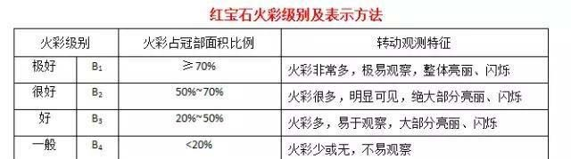

# 天然宝石

# 钻石

## 文化赏析

1. 古罗马 普林尼记录 亚历山大大帝 钻石谷
2. 塔沃尼 钻石之父
3. 尤里卡钻石 21.5 克拉
4. 英 朗德 南非 戴比尔斯公司 控制钻石市场

## 世界名钻

1. 库利南 Cullinan
   南非 比勒陀利亚 普列米尔 金伯利岩管 3106 克拉
   9 粒大钻 96 粒小钻 1063.65 克拉 34.25%

    1. Cullinan-1 钻石，重 530.20 克拉，呈梨形。被命名为 “伟大的非洲之星” (Great Star of Africa) 。 1910 年被镶嵌在英国国王爱德华(Edward)七世的权杖上(1661 年为英主查理二世加冕典礼而制)
    2. Cullinan-2 钻石，重 317.40 克拉，呈圆垫形，极漂亮，镶嵌在英国女王伊丽莎白二世的皇冠上。
    3. Cullinan-3，重 94.40 克拉，呈梨形
    4. Cullinan-4，重 63.60 克拉，呈圆垫形
    5. Cullinan-5，重 18.80 克拉，呈心形
    6. Cullinan-6，重 11.50 克拉，呈橄尖形
    7. Cullinan-7，重 8.80 克拉，呈方形形
    8. Cullinan-8，重 6.80 克拉，呈橄尖形
    9. Cullinan-9，重 4.40 克拉，呈梨形

2. 高贵无比 Excelsior
   南非 奥伦杰 亚赫斯丰坦 金伯利岩管 995.20 克拉
   梨形 蓝白色 加工为 21 块 命名 11 块
   Excelsior-1 镶嵌在维多利亚女王的项链上

3. 塞拉里昂之星 Star of Serra Leone
   西非 塞拉里昂 科诺 河流冲积砂矿 968.90 克拉
   晶形不完整 无色透明 砂矿中发现的世界最大宝石级金刚石
   加工为 17 块 命名为 Star of Serra Leone-1~17 总重量 238.48 克拉

4. 莫卧儿大帝 Great Mogul (光明之山)
   古印度 戈拉康达 金刚石砂矿 793.50 克拉
   晶形不完整 碎块状 无色透明
   加工为光明之山 Konl Noor
   镶嵌在伊丽莎白王后的王冠顶上十字架的正面

5. 奥洛夫 Orlov
   古印度 戈拉康达 309 克拉
   镶嵌在俄罗斯权杖顶端

6. 琼格尔 Jonker
   南非 比勒陀利亚 726 克拉
   无色透明
   加工为 13 颗钻石
   Jonker-1 祖母绿形切割 146.9 克拉

7. 百年 Centenary
   南非 普列米尔 金伯利岩管 599 克拉
   加工为 273.85 克拉

8. 威廉姆森 Williamson
   坦桑尼亚 姆瓦杜伊 金伯利岩 54.5 克拉 粉红色
   加工后，最大重 23.6 克拉 圆形
   姆瓦杜伊是迄今世界上已知最大的金伯利岩管。 116 万平方米

9. 霍普 Hope 厄运之星
   古印度戈拉康达 科勒 110.5 克拉 碎块状 深蓝色
   加工后，最大重 45.5 克拉 圆垫形

10. 德累斯顿
    世界上最大的绿色钻石 40.70 克拉 法国 德勒斯坦宝库

11. 蒂凡尼 Tiffany
    南非 金伯利岩管 287.42 克拉 八面体 金黄色
    加工后，最大重 128.51 克拉

12. 沙赫
    印度 原石 95 克拉 仅打磨，未切割 淡黄色 棒槌形 加工后重 88.7 克拉
    三个刻面上刻有图形美妙但难以理解的古波斯文
    先存于莫斯科克拉姆林宫钻石库

13. 南非之星 Star of South Africa
    南非 霍普敦 奥伦治河滩 83.50 克拉 白色
    布尔丰坦农场发现世界上第一个金伯利岩型金刚石原生矿床

14. 摄政王 Regent
    印度 戈拉康德 原石重 410.0 克拉 加工后 140.5 克拉
    陈列在法国巴黎卢浮宫

15. 千禧之星
    扎伊尔姆布吉马伊 777 克拉 加工为 203.04 克拉 梨形
    世界上唯一一颗内部外部均无暇的钻石

16. 穆萨耶夫 Moussaieff
    世界上最大的红色钻石 5.11 克拉 原石 13.9 克拉 巴西

17. De Young Red
    第三重红钻 5.03 克拉 南非
    现放置于华盛顿 D.C 的 Smithsonian Museum

18. 无与伦比 Incomparable
    黄钻 世界最大有色钻石 407.48 克拉 原石 890 克拉

19. 科拉落日 Cora Sun-Drop
    黄钻 110.03 克拉

20. Auora Green
    绿钻 5.03 克拉

21. 蓝月亮 Blue Moon
    蓝钻 12.3 克拉

-   中国现存的 100 克拉以上的大钻
    1. 常林钻石 158.78 克拉 透明 淡黄色
    2. 陈埠一号 124.27 克拉
    3. 蒙山一号 119.01 克拉
    4. 蒙阴四号 101.47 克拉
    -   金鸡钻 281.25 克拉 流落日本，下落不明

## 形成与开采

1. 形成
   高温、极高压、还原环境下缓慢结晶 1200-1300℃ 4000-6000atm
   金伯利岩 钾镁煌斑岩
   80%-工业 20%-首饰&收藏

2. 开采
   20%原生矿 80%砂矿 海底采矿

## 钻石产地&切割中心

1. 产地

    1. 非洲南部
       世界上最大的钻石砂矿-西南非纳米比亚
       世界上最大的金伯利岩筒 Mwadui-坦桑尼亚
       世界上首次发现的原生钻石矿床-南非 Premier
       博茨瓦纳-另一重要钻石产地
       扎伊尔、博茨瓦纳、南非、纳米比亚、安哥拉、坦桑尼亚、加纳、塞拉利昂(宝石级占 60%以上)等
       非洲国家拥有的钻石储量曾经为全世界钻石总储量的 56%，宝石级平均为 31%
    2. 澳大利亚
       钾镁煌斑岩
       阿尔盖是当今世界含钻石最丰富、储量最大的钾镁煌斑岩体。
       澳大利亚是目前金刚石产量最多的国家，其储量占全球的 26%，但其中宝石级的仅约 5%。
    3. 俄罗斯
       西伯利亚雅库特地区的金伯利岩中，虽然粒度小，但优质透明者多。
       阿尔罗萨钻石公司是世界上最大的金刚石开采公司之一，其开采量占世界开采总量的 25%，占俄罗斯金刚石开采总量的 97%。
    4. 加拿大
    5. 亚洲及中国 - 印度：是世界上最早发现钻石的地方，但目前产量很低。
        - 中国
            1. 湖南抚江流域 砂矿 宝石级 40% 品位低 分布零散
            2. 山东蒙阴 宝石级 12% 品位高 储量大 色泽偏黄 多用于工业
            3. 辽宁南部复县瓦房店岚崮山 原生矿床 宝石级 70% 亚洲最大原生钻石矿山 无色金刚石最多
               

2. 切磨中心
    1. 比利时安特卫普(精湛钻石加工中心)
       有“世界钻石之都”的美誉，全世界 50%以上的钻石交易在这里进行，一颗钻石如标有“安特卫普切工”即是完美切工的代名词。有 51 位 De Beers 统售机构的看货人。
    2. 以色列特拉维夫(精湛小钻加工中心)
       优良切割及花式切割新式切割钻石的主要供应地，有 40 位看货人，钻石出口额占整个以色列工业出口额的 1/3
    3. 美国纽约(大颗粒钻石加工中心)
       纽约曼哈顿 47 街第五、六大道之间是闻名全球的钻石街，以前只加工 3 克拉以上的大钻，目前扩大为 2 克拉以上
    4. 印度孟买(小颗粒钻石加工中心)
       有 29 位看货人。印度是世界上最大的钻石切割和打磨加工中心，占世界供应总值的 60%，重量的 85%，件数的 92%。

## 钻石的基本特征

自然界中将最大硬度、高折射率、强色散三大要素指标集为一体的唯有钻石。

1. 主要成分：C
2. 理想单晶形态：八面体，少量棱形十二面体、立方体
3. 颜色：成分纯净、结构完美的钻石无色透明。但无色系列的钻石常具浅黄至褐色调。彩色钻石的颜色有 ：黄、橙、棕、红、蓝、绿等。红色、紫色钻石非常稀少。
4. 硬度：10，脆性也较大，避免碰撞
5. 比重：$3.52g/cm^3$，比一般宝石大
6. 热导率：导热能力最强的物质
7. 热膨胀率：很低
8. 折射率&光泽：n=2.417，天然无色宝石中最高的，明显金刚光泽，均质体
9. 色散：色散值 0.044，天然无色宝石之最
10. 亲和性：强烈亲油
11. 化学稳定性：很高
12. 可燃性：燃烧温度 850-1000℃
13. 发光性：紫外光照射下，通常为蓝、浅蓝色，少数为黄、黄绿、橙色、粉色。一般来说不发荧光的钻石最硬，发蓝 白色的最不硬，发黄色的居中。所有钻石在 X 射线下和阴极射线下都发荧光，且为一致的蓝白色，利用此特征选矿既敏感又精确。

## 钻石的评价

4C - Carat(重量) Color(颜色) Clarity(净度) Cut(切工)

1. 重量 1 克拉=0.2 克
   用准确度是 0.0001g 的天平称量时，数值保留至小数点后第 4 位。换算为克拉值时，保留至小数点后第 2 位。克拉值小数点后的第 3 位逢 9 进 1，其他忽略不计。此原则非常严格 。

2. 净度

    1. 内部特征：包含在或延伸至钻石内部的天然包裹体、生长痕迹和人为造成 的缺陷。
       类型：点状包体、浅色包体、深色包体、云状物、羽状纹、内部纹理、须状腰、破口、空洞、激光痕、击痕……
    2. 外部特征：暴露在钻石外表的天然生长痕迹和人为造成的缺陷
       类型：原始晶面、额外刻面表面纹理、抛光纹、烧痕、缺口、刮伤、棱线磨损等
    3. 通常净度分为 5 个大级别、11 个小级别:
       | 级别 | 标准 |
       |:---:|:---|
       | LC| 10 倍放大镜下，未见钻石具内部、外部特征。细分为 FL、IF |
       | VVS | 10 倍放大镜下，钻石具极微小的内部、外部特征。细分为 VVS1、VV2 |
       | VS | 10 倍放大镜下，钻石具细小的内部、外部特征。细分为 VS1、VS2 |
       | SI | 10 倍放大镜下，钻石具明显的内部、外部特征。细分为 SI1、SI2 |
       | P | 从冠部观察，肉眼可见钻石具内部、外部特征。细分为 P1、P2、P3 |
       换而言之，SI 及其以上级别均称为“肉眼下洁净”
       对于质量小于 0.47ct 或者已经镶嵌好的钻石，净度级别可划分为五个大级别：LC，VVS，VS，SI，P

3. 颜色

    - 通常见到的钻石都是近无色或略带黄(褐)色，称为 Cape 系列。
      颜色分级主要是针对开普系列的钻石。 随着颜色的加深钻石的颜色级别降低。
      其具体分级方法是把样品与一套已标定颜色级别的标准圆钻型钻石标样进行目视比色

    1. 待分级钻石与某一比色石颜色相同时，则该比色石的颜色级别为待分级钻石的颜色级别
    2. 待分级钻石的颜色介于相邻两粒连续比色石之间时，则以其中较低级别表示待分级钻石的颜色级别
    3. 待分级钻石的颜色高于比色石的最高级别时， 仍用最高级别表示待分级钻石的颜色级别
    4. 待分级钻石的颜色低于 “N” 比色石时，则用$<N$表示
       

    - 颜色分级条件
      在无阳光直射的室内环境下进行(北半球交易大厅内只开朝北的窗户)。周围色调应为白色或灰色，分级灯的色温 5500-7200K，并以比色板或比色纸为背景。应由 2-3 名受过专门技能培训的人员独立完成同一样品的颜色分级，并取得统一结果。
    - 荧光强度及其级别
      按钻石在长波紫外光下发光强弱划分为 4 个级别：“无” 、“弱” 、“中” 、“强”
        1. 待分级钻石的荧光强度与荧光强度对比样品中的某一粒相同时，则该样品的荧光强度级别为待分级钻石的颜色级别。
        2. 待分级钻石的荧光强度介于相邻的两粒对比样品之间时，则以较低级别表示待分级钻石的荧光强度级别。
        3. 待分级钻石的荧光强度高于对比样品中的“强”时，仍用“强”示待分级钻石的荧光强度级别。
        4. 待分级钻石的颜色低于对比样品中的“弱”，则用 无”表示待分级钻石的荧光强度级别。

4. 切工 - 光泽主要受折射率、抛光程度及透明度的影响，火彩受色散值、切割比例的影响；闪光取决于刻面数目、抛光程度、切磨比例等因素的影响
    
   - 切工评价 
      1. 切磨比率&级别划分
      台宽比、冠高比、腰厚比、亭深比、底尖比、全深比、冠角、亭角等
      每一小项均分为极好、很好、好、一般、差五个级别 
      2. 修饰度&级别划分 对称性级别 抛光级 
          1. 对称性 1.台面偏心 2.钻石腰围不圆 3.冠部与亭部刻面尖点未对齐 4.刻面尖点不够尖锐 5.同种刻面大小不均等 6.台面和腰部不平行 7.波状腰 8.底尖偏心 9.腰部厚度不均 10.刻面缺失 11.刻面畸形 12.额外刻面 13.刻面尖点不够尖锐 14.台面偏心 15.底尖偏心 16.同名刻面不等大 17.冠部与亭部刻面尖点未对齐 18.额外刻面 
          2. 抛光级别 抛光纹、划痕、烧痕、缺口、棱线磨损、击痕、粗糙腰围、“蜥蜴皮”效应、粘杆烧痕
            

## De Beers 与钻石供应链

戴比尔斯联合矿业公司。一百多年的运作，这个控制钻石跨国集团垄断了全球钻石产量的 70%，其下属的中央销售组织(Central Selling Organization，简称 CSO)是世界钻石毛坯的主要供应者。
戴比尔斯拥有世界上规模最大的矿山，并通过投资控股形式在世界各地开采钻石所产钻石的价值为全球总产值的一半。通过与主要钻石生产国签订协议进行外国市场收购，戴比尔斯曾近控制了世界 80% 以上的钻石原石。
戴比尔斯的创立和存在对钻石行业产生了深刻的影响，它对全球钻石业的贡献在于：

1. 聘用多国优秀的地质学家参与全球钻石找矿勘查及评价工作，利用现代高新技术从事钻石的开采，协助各钻石生产国发掘和开采钻石资源。
1. 通过对主要钻石生产国的钻石矿直接或间接地投资，参与钻石矿的开采与收购，使钻石的开采得到了有效的控制，从而控制了钻石的市场供应量。
2. 外围收购站对流入公开市场的钻石进行外国收购，避免了因钻石走私等因素对钻石市场的供需平衡产生大的影响。
3. 在世界范围内从事钻石推广，广泛宣传钻石知识，极大地促进了钻石市场的兴旺与繁荣。戴比尔斯每年都要投入巨资，在全球超过 30 个国家用 21 种语言进行钻石促销宣传。
4. 建立了一套完整的钻石分选、分级评估系统使来自世界各地的钻石原石获得有效、快速和公平的分类。
5. 通过中央销售组织(CSO)协调统售钻石毛坯，使钻石市场的供求状况趋于平衡，维持钻石市场的价格稳定， 建立了消费者消费钻石的健康信心。
6. 钻石贸易公司(DTC)自 2000 年成立以来，积极协助珠宝企业开展钻石促销活动，推动了钻石市场的繁荣。
7. 赞助世界上些着名学术科研机构，从事钻石鉴定研究，避免合成钻石充斥市场，维护天然钻石市场的稳定发展。

## 钻石合成

## 钻石的优化处理及其鉴别

1. 优化处理：

    1. **表面涂层法** 在钻石的表面涂上薄薄一层带蓝紫色、折射率很高的物质，这样可使得钻石颜色提高一到二个级别
    2. **辐照法** 利用辐照产生不同的结构色心，从而达到改变钻石颜色的目的。可以产生美丽的彩色钻石，但不能提高 E 级以上钻石的颜色级别，即不能使钻石的颜色变白。
    3. **高温高压法** 褐色系列钻石的颜色是由于钻石晶体的晶格发生塑性变形引起晶格缺陷而产生的，而塑性变形主要是由钻石从上地幔到地表成矿过程中压力改变时晶体内部发生应变的结果。所以，在适当的温度下改变压力状态可以修复这种形变，从而达到改善颜色的目的。

2. 净度优化处理：
    1. **激光打孔法** 利用激光技术在高温下对钻石 进行激光打孔，直达钻石中的有色或黑色包裹体，再用化学药品去除这些包裹体，并充填玻璃或其他无色透明的物质。留下了永久性的激光孔眼，而且充填物质的硬度永远不可能与钻石相同，往往会形成难以观察的凹坑。
    2. **裂隙填充** 用无色透明的材料充填于钻石的裂隙中，以降低裂隙的可见性，达到提高净度级别的目的。
        - 鉴别方法
        1. 显微镜下观察
        2. X 光照相
        3. X 荧光能谱
    3. **钻石膜(DF)**
    4. **化学气相沉积法(CVD)** 一般是利用氢的催化作用，将 CH4 中的碳原子释放出来，使每一个碳原子与另外四个碳原子结合成钻石的结构，并逐渐沉淀在预先准备好的基座上，由于钻石膜是多晶质的，仔细观察其表面具有粒状结构， 而天然钻石是绝对不存在粒状结构.

# 红宝石&蓝宝石

## 文化赏析

## 成因&产地

1. 成因： 1. 形成于地幌的高温高压条件，随岩浆喷出地表。 2. 形成于变质作用。
   世界上的红蓝宝石主要来自砂矿。由各种原生红宝石、蓝宝石经风化作用富集而成，分布广，易开采、分选。

2. 产地
   缅甸、斯里兰卡、泰国、越南、柬埔寨、莫桑比克是世界上优质红宝石、蓝宝石最重要的供应国。
   其他产出国还有中国、澳大利亚、美国、坦桑尼亚、肯尼亚等。
    1. 缅甸
       缅甸红宝石具有鲜艳的玫瑰红色-红色。其颜色的最高品级称为“鸽血红”，即红色纯正，且饱和度很高。日光下显荧光效应，其各个刻面均呈鲜红色，熠熠生辉。常含丰富的细小金红石针雾而形成星光。颜色分布不均匀。
       高质量的缅甸蓝宝石具有非常纯正的蓝色(带紫的内反射色)。最为著名的矿区有中部的抹谷矿区、南部的孟素矿区
    2. 泰国
       泰国红宝石含 Fe 高，颜色较深，透明度较低，多呈暗红色-棕红色。日光下不具荧光效应，只是在光线直射的刻面较鲜艳，其他刻面则发黑。颜色比较均匀。缺失金红石状包裹体，所以没星光红宝石品种。
       泰国蓝宝石颜色较深、透明度较低，浅蓝色的内反射色，常发育完好的六边形色带(同澳大利亚、中国一样)。
       但位于泰柬边挠的尖竹纹地区出产质量较好的红宝石、蓝宝石．
    1. 斯里兰卡
       斯里兰卡红宝石以透明度高、颜色柔和而同名于世。而且颗粒较大，其颜色多彩多姿，几乎包括从浅红一大红各种过渡色。其色带发育，金红石针细、长，分布稀疏而均匀。
       斯里兰卡蓝宝石同红宝石一样，具有很高的透明度，具翠蓝色内反射色，其颜色也很丰富，除蓝色外，还有橙色、黄色、绿色等多种颜色。
    2. 柬埔寨拜林 拜林蓝宝石在国际上十分走俏，为一种明亮、纯正的蓝色
    3. 喀什米尔蓝宝石
       喀什米尔地区的 “矢车菊”蓝宝石，一直被誉为蓝宝石中的极品，它为一种朦胧的、略带紫色调的浓重的蓝色。
    4. 澳大利亚
       主要是透明度较低的深蓝色、黑蓝色，颜色不均匀，六边形色带发育，其宝石特点与泰国、中国相同
    5. 中国
       红宝石：发现于云南、安徽、青海等地。其中云南红宝石稍好
       蓝宝石：发现于海南蓬莱县、山东潍坊地区、青海西部、江苏六合等地
    6. 非洲
       非洲岛国马达加斯加发现有高品质红宝石矿床及彩色蓝宝石
       莫桑比克红宝石于 2009 年发现，号称是目前全球最大的红宝石矿

## 红蓝宝石的珍品

1. 圣·爱德华蓝宝石 镶嵌在王冠顶部的球体上方的十字架中心
2. 斯图尔特蓝宝石 104 克拉 镶嵌在英帝国王冠的背面
3. 印度之星 Star of India 563 克拉 斯里兰卡砂矿 6 条星线极为清晰 美国纽约自然历史博物馆
4. 亚洲之星 Star of Asia 330 克拉 蓝色 缅甸 美国华盛顿史密斯梅物馆
5. Rosser Reeves 星光红宝石 138.7 克拉 斯里兰卡 美国华盛顿史密森历史博物馆
6. 兰卡之星星光蓝宝石
7. “卡门·露西亚”红宝石 Carmen Lucia ruby 23.1 克拉 缅甸 美国国家自然历史博物馆
8. Logan 蓝宝石 423 克拉 斯里兰卡 美国华盛顿史密森博物馆
9. 昆士兰黑星 Queensland Black Star Sapphire 原石 1156 克拉，加工后 733 克拉 迄今已知世界上最大的星光蓝宝石
10. 蓝色巨人 斯里兰卡 486.52 克拉 世界最大的切割蓝宝石

## 红蓝宝石的加工&贸易中心

国际上几乎 90%以上的红蓝宝石原料均通过各种途径集中到泰国加工成成品，再销往世界各地。曼谷及其东南 300 公里处的尖竹汶是国际红宝石、蓝宝石加工和贸易中心。

## 红蓝宝石基本特征

1. 化学成分：$Al_2O_3$，常含微量的杂质元素 Cr、Ti、Fe、V 等
   杂质存在方式：以类质同象替代$Al^{3+}$；机械混入氧化物
2. 晶体形态：板状晶体多产于富硅、贫碱的接触变质岩中；柱状、桶状晶体多产于含硅、富碱的碱性橄榄玄武岩中，且多具深色熔蚀壳
3. 颜色：几乎包括了可见光谱中的红、橙、黄、绿、青、蓝、紫的所有颜色。纯净的刚玉是无色的，当含有不同的微量元素时而呈现不同颜色。常具平直色带和色块。
4. 光泽&透明度：透明-不透明，抛光表面具玻璃光泽/亚金刚光泽
5. 折射率：1.762-1.770
6. 多色性：二色性，一般表现为不同深浅的颜色。红宝石、蓝色蓝宝石二色性较强，其它颜色的蓝宝石稍弱。
7. 发光性：长短波紫外线下*红宝石*均可发现红色荧光，且长波下的强度高于短波下，*蓝色蓝宝石*一般无荧光。日光也可激发红宝石中的红色荧光，但含 Fe 高者荧光较弱。
8. 硬度：9，第二硬
9. 比重：多数宝石级样品的比重变化于 3.99-4.00 之间。Cr、Fe 等杂质元素含量影响着比重值的大小，含量越高，比重越大。
10. 熔点：高达 2000-2030℃

## 品种

-   根据颜色划分

    1. 红宝石
    2. 蓝宝石：出去红色以外的所有颜色的刚玉宝石。定名时除了蓝色刚玉直接定名为蓝宝石外，其余各种颜色的刚玉需在蓝宝石名称前冠以颜色形容词
       帕德玛蓝宝石已经失去了产地意义，而是泛指高亮度和饱和度的粉橙色蓝宝石

-   根据特殊光学效应划分
    1. 星光红宝石、星光蓝宝石
       含丰富的金红石包裹体。当这些针状体在垂直 C 轴的平面内呈 60 度角相交，加工成弧面形宝石后显示六射星线。 偶尔出现的十二射星线图案是由两组六射星线交叉而成的，两组星光互成 30 度角交叉。
    2. 变色蓝宝石
       少数蓝宝石具有变色效应，它们在日光下呈蓝色、灰蓝色，在白炽灯下呈暗红色、褐红色，变色效应一般不明显，颜色也不太鲜艳

## 质量评价

从颜色、净度、火彩、质量、热处理类型等方面对宝石进行级别划分。

1. 颜色：要求颜色鲜艳、纯正、均匀
   分级使用的照明光源色温在 4500K-5500K
   **红宝石**：三个色调，四个彩度
   色调：紫红、红、橙红
   彩度：指饱和度与明度综合作用后呈现的颜色浓淡程度
   
   **蓝宝石**:三个色调、五个彩度、三个明度
   色调：蓝(B)、微绿蓝(gB)、微紫蓝(pB)
   
   当艳蓝或浓蓝中不具有轻微紫色调时对应的商业名称为**皇家蓝**，当艳蓝或浓蓝中具有轻微紫色调时对应商业名称为**矢车菊蓝**，矢车菊蓝的蓝宝石通常具有朦胧的外观，有人将之形容为天鹅绒般的外观。
   明度：明亮(V1) 、较明亮(V2) 、一般(V3)

2. 净度：4 个等级
   

3. 火彩 Brilliance
   划分为四个火彩等级：极好(B1)、很好(B2)、好(B3)、一般(B4)
   

4. 重量 商业上计算红宝石、蓝宝石的价值是以克拉为单位的

5. 热处理类别
   5 个类别：未经热处理(N)、热处理无残留(H)、热处理少量残留(H1)、热处理中量残留(H2)、热处理大量残留(H3)
   

6. 切工
    1. 比例
       
    2. 修饰度：对称性、抛光程度
       定向：应将台面严格垂直 C 轴。一是可以得到最纯正的颜色，避免因二色性而导致的偏色；二是使星光品种的星光居中

## 合成红蓝宝石&鉴别

-   焰熔法合成品

1. 原始晶形
   天然晶具有桶状、柱状、板状晶形，晶面横纹发育，裂理发育，因此断口处呈阶梯状，部分样品具坚硬的熔融壳。
   而焰熔法合成品的原始晶形为梨形

2. 颜色 早期焰熔法合成品的颜色过于纯正、过于艳丽， 给人以不真实的感觉

3. 多色性
   天然品的台面取向一般是垂直 C 轴的，用二色镜从台面观察时，无法看到二色性或二色性不明显。
   而焰熔法合成品的梨晶由于应力作用，常常沿 C 轴方向裂开，为了充分利用原材料，其台面取向是平行于 C 轴的，从台面观察可看到明显的二色性。

4. 发光性
   天然**红宝石**和焰熔法合成红宝石在紫外光源照射下均可发红色荧光，但天然品的荧光效果弱于合成品。
   天然**蓝宝石**在紫外光下常表现为惰性，在短波紫外光下可有淡蓝白色或淡绿色荧光。焰熔法合成蓝宝石的发光性较活跃：无色品在短波紫外光下可有淡蓝色荧光，绿色品在长波紫外光下可有橙色荧光。

5. 吸收光谱
   天然**红宝石**和焰熔法合成红宝石的可见光吸收光谱相同，只是天然品的吸收强度弱于合成品。
   天然**蓝宝石**中的蓝色、绿色、黄色品种的可见光光谱中可全部或部分显示三条铁的吸收线，其中 450nm 最强。而焰熔法合成蓝宝石则可能缺失这些吸收线或吸收线很弱而且模糊。

6. 生长纹
   天然红宝石、蓝宝石中常发育围绕 C 轴的平直生长条带，不同方向的生长带以一定的角度有规律的相交分布。而焰熔法合成晶中仅能见到弯曲弧形生长纹。**它是焰熔法合成品的重要鉴别依据。**

7. 气泡
   **气泡是焰熔法合成品的另一个重要的鉴定依据**。气泡虽然很小，但由于其折射率与红宝石、蓝宝石的折射率相差很大，所以有较明显的轮廓，易于观察。气泡一般为球状，既可零星分布，也可呈带状、云雾状弥漫于整个样品中。

8. 合成星光品种
   其星线仅存于宝石的表层，星线完整、清晰，星线较细；另外，还可见到气泡、弯曲生长线。

-   助熔剂法合成品

1. 晶体形态
   助熔剂法合成红宝石的晶形主要呈板状、粒状，单晶中的底轴面及菱面体面十分发育。而缺失天然红宝石的六方柱面、六方锥面。

2. 内部特征
   天然红宝石中固态包裹体品种繁多，如硬水铝石、磷灰石、金红石、金云母、锆石等矿物，这些细小的晶体形态各异、组合不同构成了不同的产地特征。
   而助熔剂法合成红宝石中最主要的固态包裹体则是助熔剂残余，它们在反射光下呈现浅黄色、银白色，并具金属光泽，绝大多数是不透明的，其形态有树枝状、栅栏状、网状、扭曲的云状、熔滴状。另外，在助熔剂法合成红宝石中有时可见到从铂坩埚上剥落的铂片，铂片呈三角形、六边形或不规则多边形状，它们均。不透明，在反射光下有银白色的金属光泽，铂片的出现可作为合成的依据

-   水热法合成品

1. 晶体特征
   水热法合成品多为板状晶体，与天然品有较大区别．其表面常有特殊的花纹。

2. 内部特征
    1. 典型的内部特征是含有种晶片，种晶片与其两侧的红宝石有着明显的界限，种晶片的两侧可有一些发育不规则的晶芽和雾状包体
    2. 普遍具有明显的生长纹，生长纹往往深端不一，形状呈锯齿状、波纹状．
    3. 钉状包裹体：常舍有一种特征的 “钉状” 流体包裹体．
    4. 金属包裹体：可能含有合金包裹体，呈三角形、四边形等多边形的形状，不透明，反射光下具金属光泽

## 红蓝宝石的优化处理&鉴别

-   染色处理
    将色浅、裂隙发育的刚玉放进有色染料溶液中浸泡、加温，使其染上颜色
    鉴别：

    1. 放大检查时可发现换料在裂隙中集中
    2. 虽然外表浓艳，却没有明显的多色性。这是因为染料并未进入宝石的晶格。
    3. 染料可能引起异常的荧光
    4. 红外光谱中出现染料的吸收峰

-   充填处理
    将油、胶、玻璃等物质充填于红宝石的裂隙或空洞中，以掩盖这些瑕疵。
    鉴别：

    1. 注油处理的红宝石放大检查时可发现裂隙内有五颜六色的干涉色，当油部分挥发后可留下斑痕及渣状沉淀物。热针触之可有油珠析出。油中可有残留的气泡。
    2. 注胶处理的红宝石裂隙内胶的光泽明显低于红宝石主体的光泽， 裂隙较大时针尖可将其内的胶划动，红外光谱中出现胶的吸收峰．
    3. 玻璃充填的红宝石往往裂隙十分发育，裂隙内玻璃的光择明显低于红宝石主体的光泽，大的裂隙处所充填的玻璃平面往往凹陷。
    4. 有时可见到未逸出的气泡

-   热处理

    -   作用

    1. **削减蓝色**：在高温氧化气氛中加热带蓝色调的红宝石或深色蓝宝石，将发生$Fe^{2+}$向$Fe^{3+}$的转变，使样品中$Fe^{2+}/Ti^{4+}$致色离子对数量减少，从而去除多余的蓝色．
    2. **加深或诱发蓝宝石蓝色**：在高温还原气氛中加热色浅的蓝宝石，使宝石中原有的$Fe^{3+}$转变为$Fe^{2+}$，增加了$Fe^{2+}/Ti^{4+}$致色离子对的数量，使样品颜色由浅变深。
    3. **去除丝状包裹体**：在空气中将红宝石或蓝宝石加热至 1600-1800℃，使原来以丝状、针状包裹体形式存在的金红石($TiO_2$)熔融，然后迅速冷却，使 Ti 进入晶格与 Al2O3 形成固熔体，从而达到提高净度的目的。
    4. **产生星光**：在空气中加热样品，然后缓慢冷却，使样品内以固熔体形式存在的 Ti 出溶，形成金红石针状包裹体，从而产生星光。
    5. **愈合裂隙**：将发育大量裂隙的红宝石置于硼酸钠中加热，由于硼酸钠可以降低红宝石的熔点，从而使其裂隙愈合

    -   鉴别

    1. 颜色出现不均匀的扩散晕或色块。
    2. 内部所含的低熔点包裹体(如长石、方解石、磷灰石等)发生部分熔融， 使原来柱状晶体边缘变得圆滑，或呈“雪球状” 包体，或者晶体周围出现 “圆盘状” 的应力裂纹。一些丝状、针状包裹体(如金红石)变成断续的丝状、点状
    3. 原有的指纹状愈合裂隙体在热处理后会变成水管状、树枝状
    4. 己切磨好的样品表面会发生局部熔融，产生一些凹凸不平的麻坑，为了清除麻坑而进行的第二次抛光时，常出现双腰棱、多面腰棱现象。
    5. 经热处理产生的黄色和蓝色蓝宝石缺失 450nm 吸收带。
    6. 在紫外荧光灯下，天然红宝石是呈现弱中的红色荧光。而加热后的红宝石会有蓝白色荧光天然蓝宝石荧光为惰性，不发光。某些蓝色蓝宝石在加热后会出现浅绿色或浅蓝色荧光．

-   表面扩散处理
    高温下使致色离子进入浅色或无色样品的表面晶格中，形成一薄的有色扩散层。其厚度一般为 0.004-0.4mm。用 Cr 做致色剂可产生红色扩散层；用 Fe、Ti 做致色剂可产生蓝色扩散层；用 Cr、Ni 做致色剂可产生橙黄色扩散层。
    鉴别
    1. 当样品浸在二碘甲烷中观察时，可见到颜色多集中于腰围、刻面棱及开放性裂隙中。
    2. 在短波紫外光下扩散处理的蓝宝石可见到白垩状蓝色或绿色荧光，而扩散处理的红宝石可见到斑块状蓝白色磷光．
    3. 表面扩散处理的红宝石具有异常的折射率，折射率可达 1.800
    4. 表面扩散处理的样品二色性模糊，红色品种有时表现为异常的黄色-棕黄色二色性。
    5. 表面扩散处理所产生的星光品种，其星线完美、均匀，颇似合成星光品种。但显微镜下观察可发现“星光”仅局限于样品的表面，而且没有天然星光品种中的三组定向排列的金红石细针，仅见表面由一层极薄的絮状物，它们由细小的白点聚集而成。

## 与相似宝石的区别

1. 红宝石与相似宝石的区别
   

2. 蓝宝石与相似宝石的区别
   

# 祖母绿&绿柱石族

## 文化赏析

## 著名祖母绿

1. Mogul 祖母绿 哥伦比亚 穆佐矿区 217.8 克拉
2. 泰姬马哈祖母绿 141.13 克拉 正六边形
3. The Devonshire Emerald 世界上最大、最著名的未切割的祖母绿之一 1384 克拉
4. The Gachala Emerald
5. Mackay 167 克拉 哥伦比亚穆佐矿 镶嵌到一条铂金项链上
6. Hooker Emerald Brooch
7. 世上最大的切割海蓝宝石 10363 克拉 原石 45 公斤

## 祖母绿的发现&产出

1. 哥伦比亚
   哥伦比亚祖母绿被公认为世界上最好的，而且数量也是最大的，至今其年产量仍占世界祖母绿总产量的 50%以上。现在大约有四分之三的哥伦比亚祖母绿来自于科斯凯茨(Coscuez)矿区。
2. 世界上其他重要产地还有坦桑尼亚、印度、巴基斯坦、赞比亚、尼日利亚、马达加斯加。
3. 云南是中国祖母绿的主要产地，但裂隙隙发育，产量也不大。除云南外，新疆也出产优质的海蓝宝石，而且，还有金色绿柱石、粉色绿柱石及海蓝宝石猫眼产出。

## 绿柱石类宝石的基本特征

1. 化学成分：$Be_3 Al_2 Si_6 O_{18}$，Be、Al 可被不同元素替代
   若发生 Cr、V 替代，则呈现绿色，此时称为祖母绿；
   若发生 Fe2 ＋ 替代，则呈现蓝色，此时称为海蓝宝石；
   若发生 Fe2+(H20)替代，则呈现绿色，称为绿色绿柱石；
   若发生 Fe3+(H2O)替代， 则呈现黄色， 称为金色绿柱石；
   若发生 Mn3+(Cs、Rb)替代，则呈现红色、粉红色， 称为摩根石。

2. 晶体形态：常呈六方柱状，大小可悬殊很大，直径 1 厘米至几十厘米

3. 颜色及多色性：质纯的绿柱石无色，因含杂质可呈现绿、蓝、黄、粉红、玫瑰红等颜色．多色性的颜色及强度随品种而异。一般表现为不同强、弱的体色。

4. 吸收光谱

5. 光泽&透明度：玻璃光泽，断口可呈现油脂光泽。透明至半透明，猫眼及星光品种的透明度较低

6. 折射率&双折射率：折射率常为 1.577-1.583，可低至 1.565，高至 1.599。双折射率 0.005-0.009，一般为 0.006。

7. 硬度&比重：硬度 7.5-8，比重 2.63-2.91

8. 滤色镜检查：绝大多数祖母绿在查尔斯法色镜下呈现红色或粉红色。但印度和南非的祖母绿在查尔斯滤色镜下呈现绿色

9. 包裹体：整个绿柱石族宝石通常含有气相、液相、固相各类包体。如海蓝宝石中的“雨状包体”常导致 “猫眼” 的形成。
   有些产地的祖母绿含有特征的包体：
    1. 哥伦比亚：由液相、气相和岩盐或黄铁矿组成的三相包裹体。但近期在中国新疆、阿富汗(Panjshir Valley)、赞比亚(Kafubu、Musakashi)、坦桑尼亚(曼亚拉)等地产的祖母绿都发现含有三相包裹体，从而提高鉴别产地的难度。
    2. 俄罗斯的乌拉尔：“ 竹节”状包体 。由具横向裂纹的柱状阳起石构成。
    3. 津巴布韦的桑特瓦纳：长而弯曲的纤维状透闪石。
    4. 印度：“逗号”状包体。矩形两相负晶的角上带一尾巴．

## 绿柱石族宝石品种

1. 常见品种有：祖母绿、海蓝宝石、金色绿柱石、摩根石、绿色绿柱石
2. 特殊品种
    1. 祖母绿猫眼
    2. 达碧兹(Trapich )：是祖母绿单晶内含有钠长石、碳质包裹体而形成的特殊生长特征。仅产于哥伦比亚的木佐(Muzo )和契沃尔(Chivor)
    3. 海蓝宝石猫眼：平行于 C 轴方向排列的管状包体形成“雨点”
    4. 水胆海蓝宝石

## 绿柱石族宝石的质量评价

1. 祖母绿
   
   

通过在祖母绿缝隙中 充填无色物质(如无色油 树脂等) 改善其净度度和外观

检测手段：放大检查 ＋ 红外光谱分析 ＋ 发光图像分析，综合得出结论．
分级结果反映了祖母每充填前后的变化程度，和祖母绿净度好坏没有必然联系．

2. 海蓝宝石：以海蓝色为最好，颜色偏淡的价格较低。具有猫眼效应的海蓝宝石价值相对较高。

3. 金色、红色绿柱石：其价值高低主要取决于其颜色．颜色越鲜艳、越纯正价值越高。

## 维护与保养

祖母绿脆性较大，加之本身常有原生和次生的羽裂，使得祖母绿在强烈碰撞下容易损坏。另外，祖母绿往往经过油浸处理，以掩盖裂隙、增加透明度。清洗祖母绿首饰时，若用酸、碱、酒精、乙醇等就会破坏羽裂中的充填物质，降低其透明度。所以，最好用清水清洗祖母绿首饰。

## 祖母绿优化处理

1. 注无色油处理：其目的是掩撞裂隙，提高祖母绿的透明度和颜色的鲜亮度。**常见**。
   检测方法：

    1. 放大检查时，反射光在某一角度课观察到裂隙中的无色油产生的干涉色。
    2. 用热针靠近祖母绿，因受热裂隙中的油会像出汗似的渗出，使擦拭纸上留下油迹

2. 注有色油处理：这种方法除了可以掩盖裂隙、增加透明度外，还可以加深祖母绿的颜色。
   其检测方法：

    1. 放大检查时，可见绿色油呈丝状沿裂隙分布， 干涸后在裂隙处留下绿色染料。
    2. 受热渗出的油和包装纸上的油迹呈绿色。

3. 树脂填充：这种方法可以增加透明度和力学强度。
   其检测方法：

    1. 通达表面的裂隙光泽暗淡，并可“吃”针。
    2. 充填物较厚处可见气泡或流动构造．
    3. 显微镜下充填处出现闪光效应：橙色闪光效应(暗域照明)和蓝色闪光效应(亮城照明)

4. 染色处理
   其检测方法:

    1. 绿色染料沿裂隙分布，可呈蛛网状．
    2. 分光镜检测时，没有祖母绿的光谱
    3. 荧光显示的是染料的荧光，分布不均匀

5. 底衬处理：在祖母绿戒面底部衬上一层绿色的薄膜，然后用闷镶的形式镶嵌．
   其检测方法：

    1. 显徽镜下寻找接合面，接合面处可能有气泡或薄膜脱落、起 皱 现象．
    2. 与深绿色不协调的二色性(弱或无)、吸收光谱(模糊或无)

6. 镀膜处理(再生祖母绿)：采用天然无色绿柱石为核心，在外层生长合成祖母绿薄膜
   其检测方法：

    1. 由于外层祖母绿仅 0.5mm 厚，很容易产生裂纹，镜下可见交织网状应变裂纹。
    2. 浸泡并从侧面观察，可清楚地见到多层现象，且颜色明显集中于棱角处。
    3. 在长波紫外光下外层的荧光比内部的荧光强得多。

7. 热处理
   含 Fe 的绿色、黄绿色绿柱石通过加热处理，可得到优质的海蓝宝石：含 Fe 和 Mn 的橙黄色绿柱石通过加热处理，可得到粉红色的绿柱石。
   经热处理的绿柱石宝石不易鉴别。热处理是被人们接受的方法。

8. 辐照处理：绿柱石经不同能量的射线照射后，可以产生颜色的变化。
   辐照可使含少量 Fe 的绿柱石的颜色产生变化：无色的变成黄色的；蓝色的变成绿色的；粉红色的变成橙黄色的。

## 合成祖母绿&鉴别

合成祖母绿主要有两种方法，即助熔剂法和水热法。
| 类别 | 内部特征 | 红外光谱特征 |
|---|---|---|
| 天然祖母绿 | 常含有两相或三相包裹体、各种类型的矿物包裹体、愈合裂隙等 | 含水 |
| 助熔剂法 | 内部包裹体很像天然祖母绿助溶剂残余常沿裂隙充填呈云翳状或花边状 助熔剂残余还可余还可沿晶体生长面呈近于平行的带状分布 未熔融粉末形成的发白的羽状包裹体是吉尔森合成祖母绿的特征 查塔姆和俄罗斯助熔剂法合成祖母绿晶体中只有平行双面和六方柱面，缺失六方双锥 | 不含水，有无水吸收峰 |
| 水热法 | 内部常有两相包裹体，由硅铍石和孔洞组成钉状包体 还可出现铂金属片，呈六边形或三角形，在反射光下具银白色外观 有些水热法合成祖母绿成品内保留了种晶片，种晶片两侧有云雾状的两相包裹体分布 | 含水，但因所含水的类型与天然有所不同，水分子的伸缩振动和合频振动的峰位和强弱不同 |

## 祖母绿与相似宝石

# 金绿宝石

金绿宝石是矿物学名称。它的宝石品种包括：猫眼石、变石、变石猫眼和金绿宝石。
变石：特指具有变色效应的金绿宝石，素有“白昼的祖母绿，黑夜的红宝石”之美誉。
猫眼石：特指具有猫眼效应的金绿宝石。
变石猫眼：指既具有变色效应又具有猫眼效应的金绿宝石。
金绿宝石：是泛指不具有变色或猫眼效应的品种。

## 文化赏析

猫眼石不仅在斯里兰卡被认为有驱除妖邪的魔力，在日本、印度尼西亚和我国台湾省等地也被当作好运的象征。
美国自然历史博物馆收藏有一块重 48.7 克拉的优质猫眼石。但世界上最大的猫眼石中约 300 克拉。
亚历山大石 具有变色效应的金绿宝石 俄国国石

## 产出地

大多产于砂矿。主要产地有：斯里兰卡、俄罗斯、巴西、缅甸、津巴布韦等国。其中，最好的变石产于俄罗斯的乌拉尔地区。而斯里兰卡砂矿中则产出黄绿色的大颗粒金绿宝石和高质量的猫眼石.巴西也是重要的产地。出产各个品种：透明的黄色-褐色金绿宝石、很好的猫眼石及高质量的变石。我国已在新疆阿尔泰地区发现了葵花黄色的金绿宝石，但不具猫眼效应，也不具变色效应。

## 基本特征

1. 化学成分：$Be Al_2 O_4$由于含有 Fe、Cr、Ti 等杂质，导致金绿宝石常有不同的颜色。
2. 颜色：通常为浅至中等的黄色、黄绿色、黄褐色。
3. 光泽&透明度：猫眼石呈半透明-微透明；变石及普通金绿宝石常为透明状。三者的抛光面均呈亮玻璃光泽。
4. 折射率&比重：n=1.745-1.755，比重为 3.7
5. 硬度&韧度：约 8.5，由于解理不发育，断面常出现贝壳状断口
6. 多色性：金绿宝石可呈现三色性，猫眼石的多色性较弱。变石的多色性很强，表现为绿-黄-紫红三色。

## 质量评价

1. 金绿宝石：主要受颜色、透明度、切工等因素的影响。其中透明度高、颜色为金黄色、葵花黄色的金绿宝石价值较高。
2. 变石：最受欢迎的是日光下呈现祖母绿般的绿色，白炽灯下呈现红宝石般的红色。但实际上变石很少能达到上述两种颜色通常情况下的绿是淡黄绿色或淡蓝绿色，而红则为不鲜艳的暗红色。
3. 猫眼石：以猫眼线居中、平直为正品，以闪光强弱分贵贱。切磨时应准确确定晶体 C 轴的方向，琢型应厚大饱满，光带不仅要居中、强烈、平直，而且要灵活。即所谓“睁时宽，闭时尖”，犹如猫的眼睛在光线强弱变化时迅速开合一样。从颜色角度评价，最佳色为蜜黄色，次为绿黄色、褐黄色。最好的猫眼石产于斯里兰卡， 旧称“锡兰猫眼”。

## 合成金绿宝石

合成的品种主要是**合成变石**，方法有**助熔剂法**和**晶体提拉法**。但市场上常见的是**合成刚玉**仿变石，并非真正的变石或合成变石。

# 碧玺

## 文化赏析

碧玺的矿物名称为电气石。
在慈禧太后的脚下发现了一个色彩绚丽的莲花，重达 5750 克拉，该莲花就是用碧玺制作的。

## 碧玺产地

最重要的产出国是巴西。巴西的米纳斯克拉斯州所产的彩色碧玺占世界总产量的
50%-70%。巴西帕拉伊巴 Paraiba 州还发现了罕见的紫罗兰色、蓝色碧玺。巴西以盛产红色碧玺、绿色碧玺和碧玺猫眼而著名于世。美国则以优质的粉红色碧玺而著称。意大利则以无色碧玺而闻名。我国碧玺的主要产地是新疆阿勒泰和云南哀牢山。所产碧玺的颜色十分丰富，而且质量很好。

## 宝石学特征

1. 化学成分：极为复杂的硼硅酸盐，呈六方环状结构，阳离子之间类质同象替代非常普遍：$(Ca，Na，K)(Al，Fe，Li.Mg，Mn)_3(Al，Cr，Fe，V)_6(BO_3)_3 Si_6 O_{18}(OH，F)_4$

2. 晶体形态：三方柱状，柱面上发育纵纹，横断面呈弧面三角形。集合体呈放射状、束状，可作为很好的观赏石。

3. 颜色：随成分而异：富含 Fe 的呈深蓝、暗褐或黑色；富含 Cr 的呈绿色；富含 Mg 的为黄色或黄褐色；富含 Li、Mn 的呈玫瑰红色。碧玺的色带发育，既可环绕 C 轴，又可垂直 C 轴排列。吸收光谱：多变，无特征性。

4. 多色性：碧玺的多色性通常较强，多色性的颜色随体色而变化。色浅的碧玺切割时台面应垂直 C 轴，而色深的碧玺切割时台面应平行 C 轴。

5. 其他物理性质：**硬度**7-7.5。**比重**3.06 左右(随铁、锰含量的增加而增大)，**折射率**1.624-1.664(随铁、锰含量的增加而增大)，**双折射率**0.018-0.040.因此，较容易观察到后刻面棱重影。玻璃光泽。透明-不透明。因热电效应常吸附空气中的尘埃。所以，陈放在柜台中的碧玺表面一般较其他宝石“脏”。

## 品种

1. 红碧玺：粉红色-红色碧玺的总称。
2. 绿碧玺：黄绿色-深绿色以及蓝绿色、棕绿色碧玺的总称。
3. 蓝碧玺：浅蓝-深蓝色碧玺的总称。
   “帕拉伊巴”：是含铜、锰元素的蓝色、蓝绿色、黄绿色、紫蓝色碧玺的一种统称。不局限于产地。帕拉伊巴碧玺在 1989 年图桑珠宝展上首次亮相，一周内价格就飙升了近 10 倍。如今，高品质的帕拉伊巴碧玺价格可以达到 2-6 万美元/克拉铁元素致色的所有蓝绿色碧玺，不能叫做帕拉伊巴碧玺。
4. 多色碧玺：即两种或两种以上的颜色呈现在同一块晶体上。通常在柱状晶体的一端呈现粉红色，另一端呈现绿色的叫“双色碧玺”。晶体中心呈现粉红色，边缘呈现绿色的叫“西瓜碧玺”。
5. 碧玺猫眼：在碧玺晶体中往往存在着平行排列的针状或管状包裹体，如切磨成弧面形，在点光源照明下就会呈现猫眼效应。具有猫眼效应的碧玺主要是绿色品种，其他颜色的很少。
6. 变色碧玺：是一种少见的品种。

## 碧玺的质量评价

重量、颜色、净度、切工，其中**颜色**是最重要的因素。

1. 颜色：以色泽明亮、纯正为佳。
    - 红色碧玺中玫瑰红、紫红色价格很昂贵，粉红色的价值次之；最受欢迎的当属巴西的红宝碧玺 Rubellite
    - 绿色碧玺以祖母绿色最好，黄绿色次之；近来帕拉伊巴碧玺价格飙升
    - 纯蓝色和深蓝色碧玺因少见而具有很高的价值。
    - 通常好的红色碧玺的价格比相同大小的绿色碧玺高出三分之二。
    - 黄碧玺没有红色与绿色碧玺价位高，其中最受欢迎的是柠檬黄色。但不懂行的人还以为是黄水晶
2. 净度：要求内部瑕疵尽量少，晶莹无瑕的碧玺价格最高，含有许多裂隙和气液包裹体的碧玺通常用作玉雕材料。
3. 切工：应比例对称、抛光良好。碧玺可切磨成各种形状：祖母绿型、椭圆型、圆钻型和混合型，其中祖母绿型最能体现碧玺美丽的颜色，是最佳切工，相对来说价格也最高。

## 优化处理

帕拉伊巴碧玺的**热处理**主要是通过还原环境下加热，使 Mn3+转变为 Mn2+，减弱甚至消除紫色调，从而得到更加纯净、饱和度更高的蓝色。近年来又出现**充填处理**的碧玺。

# 橄榄石

## 文化赏析

橄榄石是一种古老的宝石品种，古埃及人在公元一千多年前用它做饰物，将其称为“黄昏祖母绿”，古罗马人“太阳宝石”。
世界上产出宝石级橄榄石的主要产区：美国桑德拉州和夏威夷、红海扎巴贾德岛、缅甸。世界上最大一颗橄榄石重 319 克拉，产于红海的扎巴贾德岛　
**河北张家口地区**是中国橄榄石的主要产地之一。中国最大颗的橄榄石重量 236.5 克拉，产于河北省张家口万全县大麻坪，取名为“华北之星”。除此之外，尚有吉林、山西、内蒙、辽宁、福建等。橄榄石是中国宝石资源中最具特色的一种。

## 基本性质

1. 化学成份：$(Fe，Mg)_2Si O_4$，宝石级的橄榄石 Fe /(Fe+Mg) < 30%。
2. 晶体形态：完好的晶体形态为短柱状，但完好晶形很少见，大多数为不规则粒状。
3. 颜色：中到深的草绿色(即略带黄的绿色，亦称橄榄绿)。有些偏黄色，有些偏褐色。色调主要随 Fe 含量多少而变变，含 Fe 越高，颜色越深。
   由于橄榄石是化学成份中的主要元素致色，属于自色矿物，颜色相对稳定。多色性微弱。
4. 吸收光谱：蓝区三个吸收带，453nm、473nm、493nm
5. 大部分透明，玻璃光泽。少量因包体或裂隙而呈半透明。最常见的是“水百合”状或“睡莲叶”状包体，中心为铬铁矿或铬尖晶石。
6. 折射率:　 1.654-1.690， 随着成分中 Fe 含量增加而增大。
7. 双折射率：高达 0.036， 所以通过台面可以非常清楚地看到对面小棱边的双影。
8. 性脆而易碎， 硬度 6.5-7， 并随 Fe 含量的增加而略有增大。比重 3.28-3.51。

## 质量评价

橄榄石在世界上的分布较广，产出也较多，用于首饰上的橄榄石应完全透明，所含的包裹体应小至肉眼不可见。颜色以中-深绿色为佳品，色泽均匀，有一种温和绒绒的感觉为好；绿色越纯越好，黄色增多则价格下降。
世界上最漂亮的一块切磨好的橄榄石重 192.75 克拉，曾属于俄国沙皇，现存在莫斯科的钻石宝库里。

# 托帕石

## 简介

托帕石的矿物名称为黄玉或黄晶，英文称 Topaz。由于消费者容易将黄玉与黄色玉石、黄晶与黄色水晶的名称相互混淆，商业上多采用英文音译名称“托帕石”来标注宝石级的黄玉。
透明度很高，又很坚硬。所以反光效应很好。
世界上绝大部分托帕石产在巴西花岗伟晶岩中，包括各种颜色的品种，最大的晶体重达 117kg。十七世纪葡萄牙国王王冠上的“布拉干萨钻石”Braganza 重 1640 克拉，曾被认为是最大的钻石。现在已证实它是一块无色托帕石
另外，斯里兰卡、美国、缅甸、乌拉尔山脉、澳大利亚等国也都有宝石级托帕石产出。
我国的托帕石产要产于内蒙古、江西、新疆。

## 基本性质

1. 化学成分：$Al_2 Si O_4(F，OH)_2$，生成温度越高，托帕石中 F 含量越高。
2. 晶体形态：柱状晶形，柱面常有纵纹，采自砂矿中的托帕石多被磨蚀成椭圆形。
3. 颜 色：一般呈黄棕色-褐黄色、浅蓝色-蓝色、红色-粉红色及无色，极少数呈绿色色调。目前市场上流行的一些蓝色托帕石是由无色托帕石先经**辐照**处理使之呈褐色，然后再**热处理**而呈蓝色的。新近又有**扩散处理**的蓝绿色托帕石、**镀膜处理**的红色托帕石问世
4. 透明度较高，亮玻璃光泽。其英文名称源自梵语的“tapas”，意为“火彩”。
5. 折射率值: 随 OH-的增加而增大。无色、褐色、蓝色托帕石的折射率为 1.61-1.62，红色、黄色、橙色、粉红色的折射率为 1.63-1.64。
6. 硬度为 8，密度为 3.53g/cm3，随晶体中 OH-含量增加而减少。

## 质量评价

价值较高的托帕石是红色和雪梨酒色和蓝色。无色托帕石的价值最低。另外，在评价托帕石质量时，还应注意它的颜色是天然的还是人工改色产生的。

## 加工

因为托帕石发育平行底面的解理，所以必须防止切磨面与解理面平行。否则，难以打磨和抛光，镶嵌时也应小心，以免诱发出解理，破坏了宝石的外形

# 长石族宝石

长石可分为**钾长石**和**斜长石**。钾长石的化学成分为$KAlSi_3 O_8$，又可分为：正长石、透长石和微斜长石；斜长石为$NaAlSi_3 O_8-CaAl_2 Si_2 O_8$两种端员组分的完全类质同象系列。又可分为：钠长石、奥长石、中长石、拉长石、倍长石和钙长石。

## 主要品种

1. 月光石
   钠长石在正长石中出溶，这两种折射率稍有差异的长石的层状隐晶平行相互交生，产生光的散射，并可伴有涉或衍射，由此在表面产生蓝色的浮光，朦胧似月光。若产生灰白色的浮光，则效果相对较差。**恋人之石**。月光石中常含有“蜈蚣”状包裹体，是由两组近于垂直相交的初始解理产生的。月光石还可具有猫眼效应、星光效应：月光石的主要产地是斯里兰卡、印度、马达加斯加、缅甸、坦桑尼亚、美国

2. 天河石
   微斜长石中绿色至蓝绿色变种。其颜色是含有铷所致。因常含有斜长石的聚片双晶或穿插双晶而呈绿色和白色的格子状、条纹状。微斜长石的主要产地是印度和巴西。另外，美国、加拿大、俄罗斯、马达加斯加、坦桑尼亚和南非也有产出。我国新疆、云南等地也有很好的天河石。

3. 日光石
   具砂金效应的奥长石。 内含定向排列的赤铁矿薄片，随着宝石的转动，能产生红色或金色的反光。一般为半透明。最重要的产地是：挪威的南部和俄罗斯的贝加尔湖地区、美国和印度。

4. 晕彩拉长石：
   即呈现晕彩的拉长石。其产生原因是拉长石内的聚片双晶薄片或内部所含的片状、针状金属氧化物引起光的相互干涉。一般常显现蓝色和绿蓝色。主要产地是加拿大、芬兰、俄罗斯、马达加斯加等地。产于芬兰的具有鲜艳的晕彩，被称为“光谱石”。

## 质量评价

**特殊光学效应**起着重要作用，这些光学效应越明显，其价值越高。月光石以无色、透明至半透明、具漂浮状蓝色月光为最好，白色月光的价值就差多了；晕彩拉长石中以蓝色波浪状的晕彩最佳，其次是黄色、粉红色、红色和黄绿色；日光石则以金黄色、透明度高、强砂金效应者为最好，颜色偏浅或偏暗，均会影响价格；天河石的颜色也以纯正蓝色为最佳，其次为稍带绿色的蓝色。
对具特殊光学效应的长石来说，内部包裹体对价值影响程度比其它宝石品种要轻得多，轻至中等的瑕疵不影响价值，只有严重的裂隙等明显瑕疵会使其价格变低。
此外，**切工**直接影响着特殊光学效应的体现，要求较严。如月光石应以椭圆弧面型切磨，其弧面长轴应平行于长石晶体的长轴，且弧面宽度、厚度适中，使蓝色月光处于弧面正中，这样才能充分体现月光石的美丽。

# 锆石

传说佩戴锆石能获得智慧、荣誉、和财富。若锆石的光泽一旦消失，则是危险的信号。

## 宝石学性质

1. 化学组成：$ZrSiO_4$，可含微量的 Mn、Fe、Ca 及放射形元素 U、Th 等。放射性元素的辐射造成锆石可有高、中、低三种不同的结晶态。其中，低型锆石为非晶态。
2. 晶体结构：四方晶系。常为两端带四方双锥的四方柱。但在冲积砂矿中表现为砾石状。
3. 颜色：常见有无色、天蓝色、绿色、黄绿色、黄色、棕色、红褐色等。其中无色、天蓝色、和金黄色是由热处理产生的，也是锆石最重要的品种。
4. 折射率&双折射率：从高型锆石到低型锆石两者均降低。高型锆石的折射率为 1.90-2.01，低型锆石为 1.78-1.87；双折射率从 0.060 将低至 0。色散较强，达到 0.038。
5. 光泽&透明度：抛光面为金刚光泽至玻璃光泽，断口为油脂光泽。
6. 多色性：多色性一般表现不明显。仅热处理产生的蓝色锆石表现出强二色性：蓝色-浅棕黄色至无色。
7. 吸收光谱：锆石的可见光吸收光谱中可具有 2 - 40 多条吸收线。
   其中 653.5nm 和 660nm 是锆石的特征吸收线，即使是无色的锆石也可具有 653.5nm
8. 硬度&比重：高型锆石的硬度为 7-7.5，低型锆石的硬度为 6。两者均较脆，棱线处较容易磨损。甚至较硬的包装纸也会使它产生破损(纸蚀现象)。比重：高型锆石为 4.6-4.8，低型锆石为 3.9-4.2。
9. 内含物：高型锆石的后刻面棱重影十分明显。而低型锆石常具平直色带，有时可见两个方向的色带
10. 特殊光学效应：可具猫眼效应

## 产地

高型锆石主要产于柬埔寨、泰国、越南、斯里兰卡、中国海南文昌。低型、中型锆石仅产于斯里兰卡。

## 优化处理

1. 改变颜色
   还原/氧化条件下。经热处理产生的蓝色锆石会部分恢复原有的褐色，产生不悦目的褐蓝色。这时，将它们放在有木炭的坩埚里加热至 800-900 摄氏度，即可完全转变为蓝色。
   

2. 改变类型
   持续长时间的热处理可引起硅和锆的重结晶，将低型锆石转变为高型锆石。
   加热至 1450℃ 后，中、低型锆石均能将比重提高至 4.7，并具有较高的折射率和清楚的吸收线，同时具有较高的透明度。热处理引起的重结晶可产生纤维状雏晶，并由此产生猫眼效应。
   

## 质量评价

颜色、净度、切工、重量

1. 颜色：锆石中最流行的颜色是**无色**和**蓝色**，其中以蓝色的价值最高，它的色调鲜艳纯正。无色锆石应不带任何杂质。纯正的绿色、黄色锆石因其折射率高于其它宝石而显得格外明亮，也深受人们的喜爱。评价颜色时，还应该注意热处理产生颜色的稳定性。
2. 净度：由于无瑕疵的锆石供应量很大，所以对锆石内部净度的要求也很高。肉眼应观察不到瑕疵，并注意观察表面棱线有无破损。
3. 切工：
    1. 切磨比例：锆石的漂亮很大程度上源于其高折射率和高色散，只有切磨比例恰当时才能将这些潜在的美体现出来，呈现非常明亮的效果。
    2. 切割方向：由于锆石具有很高的双折射率，显著的双影线将使样品出现模糊的感觉。因此，切割时台面应严格垂直光轴，这样的定向还有利于多色性显著的蓝色锆石获得最纯正的蓝色。
4. 重量：市场上供应的无色和蓝色锆石，从几分到 10 克拉都有，但超过 10 克拉的已不多见。

# 尖晶石

尖晶石在颜色和光泽等方面与刚玉族宝石极为相似，在自然界中又往往相伴产出。
清朝凡皇族封爵(亲王、郡王)和一品官，帽子上都用红宝石顶子，很多都是红色尖晶石。

## 著名“红宝石”(尖晶石)

1. 铁木尔红宝石(Timur ruby)：重 352.5 克拉，产于阿富汗，现作为英国皇家珠宝收藏于白金汉宫
2. 黑太子红宝石(Black Prince's Ruby)：重约 170 克拉，50mm—40mm。
3. 巴拉斯红宝石：重 398.72 克拉
4. 安娜·伊凡诺夫娜皇后 1730 年加冕时的皇冠，其主石是 100 克重的大红宝石
5. 收藏在英国自然历史博物馆中的最大一颗尖晶石是 1861 年从中国掠夺的，重 520 克拉，颜色为红色，晶面略有弯曲。

## 产地

冲击砂矿。主要产出国有：斯里兰卡、缅甸、阿富汗、巴基斯坦、马达加斯加、塔吉克斯坦、坦桑尼亚、尼日利亚、肯尼亚。

## 宝石学特征

1. 化学成分：$MgAl_2 O_4$，$Mg^{2+}$常被$Fe^{2+}、Zn^{2+}、Co^{2+}$替代；$Al^{3+}常被$Fe^{3+}、Cr^{3+}$替代。
2. 颜色：变化范围很大，可以有无色、黄色、红色、绿色、蓝色、褐色等。含$Cr^{3+}$呈红色； 含$Fe^{2+}、Co^{2+}$时呈蓝色；含$Fe^{3+}$时呈绿色； 含$Cr^{3+}、Fe^{3+}、Fe^{2+}$时呈褐色。
3. 晶形：单晶体常为八面体。
4. 其它特性：强玻璃光泽，硬度 8，透明至半透明，折射率 1.72-1.74(单折射)比重 3.5-3.6。熔点 2135 摄氏度。日光下可激发其红色荧光(与红宝石相似)。
5. 特殊光学效应：变色效应、星光效应
6. 内部包裹体：小的八面体尖晶石，有时呈线状、面状分布，另有羽状及指纹状气液包体。

## 质量评价

按照颜色尖晶石可以分成红色、蓝色、紫色等品种，其中以纯正的红色为最佳，实际上红色尖晶石从红色到紫红色范围内存在着许多色调，大多数是接近镁铝榴石的酒红色。其他颜色的尖晶石多数颜色发暗、发灰，价格较低。

## 合成品&鉴别

合成尖晶石一般是用来作为其它宝石的仿制品。常仿的品种有：红宝石、月光石、海蓝宝石、橄榄石、锆石、钻石、青金石等。

1. 焰熔法尖晶石：
   合成尖晶石中含有过量的$Al_2 O_3，Al_2 O_3／MgO=1.5-3.5／1$，仿月光石的品种达到 5／1。由此造成以下异常：

    1. 其晶格发生扭曲。在偏光镜下呈现栅格状的不均匀异常消光现象。
    2. 折射率一般为 1.728±0.003。高于天然尖晶石的折射率。
    3. 所有合成尖晶石在紫外线下均有荧光，而且在短波下常呈白垩状荧光。而天然尖晶石中没有这种现象。
    4. 异常的吸收光谱。
    5. 内部可见弯曲生长纹、串珠状气泡、氧化铝的不熔残余物。

2. 助熔剂法合成尖晶石
   助熔剂法合成尖晶石在化学成分上与天然尖晶石相近。因此，折射率、比重等物理常数与天然尖晶石相近。但仍有以下区别：
    1. 其紫外荧光的强度在短波下强于长波下，与天然尖晶石相反。
    2. 异常的吸收光谱。蓝色品种在 544nm、575nm、595nm 和 622nm 处有宽吸收带。缺失天然蓝色尖晶石中的 458nm 吸收线。
    3. 内部可见助熔剂残余体、铂金片及天然品中少见的烟云状羽状体。

# 石榴石

两类：铁铝-镁铝-锰铝石榴石；铁铝-镁铝-锰铝石榴石

## 文化赏析

相信它具有治病救人的神奇功效。我国珠宝业界人士常称石榴石为“紫牙乌”。“牙乌(雅姑)”源自阿拉伯语 Yakut(宝石)，又因石榴石常呈紫红色，故名紫牙乌。

## 产地

石榴石族矿物在地壳中产出普遍，既可产于区域变质岩、接触变质带中，也可作为幔源包体产于各种超基性岩中。

## 矿物特征

1. 化学成分
   

2. 晶体形态：通常具有完好的晶形。主要是菱形十二面体、四角三八面体或二者的聚形。

3. 颜色：红色系列：红色、粉红、紫红、橙红等。黄色系列：黄、桔黄、褐黄等。 绿色系列：翠绿、橄榄绿、黄绿色。尽管石榴石色彩丰富，却没有多色性(因为是均质体宝石)。

4. 吸收光谱：因成分而异。

5. 在紫外线照射下不发荧光：石榴石有别于其他红色宝石的特征之一

6. 其他特征：玻璃光泽-亚金刚光泽(视折射率而定)。断口为油脂光泽。硬度 6.5-7.5，根据品种不同而略有差异。单晶体透明度一般较好，但集合体通常呈半透明-不透明。例如我国青海、新疆等地产出的绿色水钙铝榴石呈半透明状。

## 品种

1. 镁铝榴石：以紫红-橙色色调为主，随着 Cr2O3 的含量的增高，红色加深。主要产于超基性岩中。产地主要有美国亚利桑那州、捷克的波西尼亚、南非等地。
2. 铁铝榴石：以暗红色色调为主。主要产于变质作用的片岩中，如印度、斯里兰卡。常见针状包体，当这些针状包体十分密集时可产生六射或四射星光效应。
3. 锰铝榴石：常见棕红色、黄色、黄褐色，以黄色为最佳，其价值不低于同色的蓝宝石。内部常含花边状包体，主要产于伟晶岩中。纳米比亚是公认的优质产地。另有斯里兰卡、马达加斯加、巴西、亚美尼亚、美国弗吉尼亚州。
4. 钙铝榴石：是自然界常见的矿物，但用作宝石的并不多见。颜色多种多样。包括绿色、黄绿色、黄色、粉红色及乳白色。其中绿色调的在查尔斯镜下变红。当钙铝榴石中的部分铝被铁取代时，则称为铁钙铝榴石，因其颜色与肉桂相近又称肉桂石或桂榴石主要产于接触变质的矽卡岩内。肯尼亚、坦桑尼亚、我国西南三江地区产鲜绿色铬钒钙铝石榴石。铬钒钙铝榴石又名“沙弗来石”(Tsavorite)，1967 年首次发现于坦桑尼亚
5. 钙铁榴石：黄色、绿色、褐黑色。黑褐色的不具宝石学意义。绿色的称为翠榴石，含少量的铬。其内部具有非常特征的马尾丝状包体，在查尔斯镜下变红色，其色散值(0.057)高于钻石。翠榴石的原产地是乌拉尔山，产于接触交代变质的蛇纹岩中(原岩为超基性岩)。现在的重要产地在非洲。黄色的钙铁榴石称为黄榴石，产于瑞士和意大利的阿尔卑斯山的变质岩中。
6. 钙铬榴石：呈鲜艳的绿色、蓝绿色，常被称为祖母绿色石榴石。很少、很小，不易达到宝石级，在乌拉尔山与翠榴石的共生。
7. 水钙铝榴石：是钙铝榴石的交代产物，产于南非、加拿大、美国、中国青海。以绿色为主，少量粉红色和无色的品种。其绿色部分在查尔斯镜下显红色，并常有黑色的铬铁矿。折射率 1.72 左右， 比重约 3.5。
8. 变色石榴石：可有明显的变色效应。

## 质量评价

颜色浓艳纯正、内部洁净、透明度高、颗粒大、切工完美者具有较高的价值。颜色是首要因素，**翠榴石或具翠绿色**的其他石榴石品种在价格上要高于其他颜色的石榴石，优质的翠榴石价格可接近同样颜色祖母绿的价格。除绿色之外，橙黄色锰铝榴石、红色镁铝榴石和暗红色铁铝榴石，其价格是依次降低的。总体来说，石榴石宝石属中、低档宝石。

# 水晶

水晶的矿物名称是石英。石英是自然界中最常见、最主要的造岩矿物，河沙的成分中绝大部分是石英。珠宝界将透明、粗大的石英单晶体统称为水晶。

## 文化赏析

中国古代称水晶为“水精”、“玉晶”、“千年水”。考古工作者已在许多古代遗址中发现有水晶制品。清朝五品官的帽顶为水晶。

## 水晶的基本性质

1. 化学成分：$Si O_2$，纯净时形成无色透明，当含少量 Al、Fe 时，经热处理后形成色心。因色心的不同，产生不同的颜色。如烟色、紫色、黄色。

2. 晶体形态：顶端为锥状的六方柱状，柱面上发育横纹。随着温度的升高，晶形从长柱状趋向短柱状，最后到双锥状。晶体大小相差很悬殊：小的几毫米，大的可达几十吨。

3. 颜色：可有无色、紫色、黄色、粉红色、不同程度的褐色直到黑色。有色水晶可有多色性，一般体色越深时，多色性越明显。

4. 光泽：晶面为玻璃光泽，断口具油脂光泽。

5. 折射率：1.544-1.533，双折射率：0.009，相当稳定。

6. 比重：2.65，硬度：7。

7. 透明度：无色水晶透明度可达很高，清澈如水，随着包体含量的增加或有色水晶的颜色的加深，透明度降低。

8. 特殊性质：水晶具压电性，在高压下水晶单晶体的两端可产生电荷。

## 品种

水晶具压电性，在高压下水晶单晶体的两端可产生电荷。

1. 水 晶：指无色透明的石英晶体。一般切磨成水晶串球项链、鸡心坠、水晶球、玉雕刻品及改色原料。由于无色水晶在自然界分布较广，产出较多。因此，对无色水晶的工艺要求较高，应完全透明无缺陷，并有一定的块度。
2. 紫 晶：呈淡紫、紫红、深紫色的水晶晶体。紫晶的颜色以带有紫红色为最佳。紫晶因$Fe^{3+}$而呈色，一般分布不均匀，最常见的是平直色带，有时见团块状、沙漏状色带色块。有特征的虎纹状内含物，是由充满液体的平行凹槽产生的。高温下加热，紫色会消失，变成黄色。由于紫晶在自然界产出相对较少，加之颜色高雅，受人喜爱，价值较高。
   乌拉圭北部和巴西南部都盛产紫水晶。水晶是乌拉圭的国石。紫晶一般用来做戒面，当杂质含量较多时用于串珠项链或用于雕刻工艺品。
3. 黄晶：呈浅黄、黄色、黄褐色的水晶晶体。黄水晶因$Fe^{2+}$和结构水而呈色。黄水晶在自然界产出较少，常同紫晶及水晶晶簇伴生。市面上流行的黄晶多数是由紫晶加热处理而成。黄水晶一直被用来仿黄玉(即托帕石)，并被称为“巴西黄玉”。
4. 烟晶：呈烟灰、褐灰、褐色等水晶体，其颜色与所含的微量 Al 有关。呈茶色的又称茶晶；呈黑色、深褐色的又称墨晶。烟晶加热后可变成无色水晶。市场上的许多烟晶实际上是经辐射处理的无色水晶。
5. 绿水晶：市场上几乎不存在天然产出的绿水晶，它们是紫晶在加热或黄水晶过程中的一种中间产物，或是由于无色水晶含大量的绿泥石等矿物的细小鳞片而被渲染成绿色的一种水晶。
6. 鬃晶和发晶：指无色透明水晶中含有大量纤维状、草束状、针状、放射状等形态的金红石、电气石、阳起石等矿物包裹体的水晶。其中包裹体粗如鬃毛者称“鬃晶”，细如发丝者称“发晶”。金红石多呈黄色，褐-褐黄色、红色；电气石多呈黑色或绿色；阳起石则为浅黄绿色至绿色好的发晶应透明度高，丝状物清晰，且排列有一定规律或呈几何图案。发晶一般用作观赏标本。 另外，水晶中当含有金属矿物时，会产生色彩斑斓的颜色，尤如一幅幅天然的图画，为水晶凭添了几分神秘。
7. 芙蓉石：一种淡红色至蔷薇红色的水晶，其色泽是由于含有钛的缘故，主要产于伟晶岩中。通常为致密块状，透明度较低，多呈云雾状，裂隙较发育。芙蓉石的颜色不太稳定，在空气中加热可褪色，在阳光下爆晒颜色也能变淡。一般作玉雕件或串珠链。优质的芙蓉石产于马达加斯加、巴西，我国年都进口芙蓉石。
8. “晕彩水晶”：晶体内部有极薄的裂隙面，光线通过裂隙面产生干涉，使裂隙表面呈现七彩光芒的光学效应，称为薄膜干涉效应。当白光通过水晶裂隙中的空气薄层时会发生干涉作用，从薄层底部反射的光与薄层顶部的反射光相叠加，使本来无色的水晶呈现五颜六色的干涉色。一般做观赏标本。
9. 石英猫眼： 当水晶中含有大量平行排列的纤维状包裹体时，其弧面形宝石表面可显示猫眼效应。由于较为少见，价值较一般水晶高。一般用作戒面。
10. 星光水晶：含有三组定向排列的纤维状、针状包裹体时，其弧面形宝石表面可显示星光效应。一般为六射星光。星光水晶在自然界极少，价值相对较高。
11. “水胆水晶”：指晶体内部含有较大的气液包裹体，每当摇动晶体时，能看到晶体内部的水流动。一般作观赏石。水胆水晶中气液包裹体越大、晶体越透明则越珍贵。
12. “乳石英”：是乳白色或奶油色的水晶，透明度较低。其原因是内部充满气相、液相包裹体。
13. “红石英”：因含众多红色矿物包体而呈现红色。
14. “蓝石英”：自然界没有天然的蓝水晶，蓝色是因为蓝线石包裹体的关系。

## 产地

巴西的米纳斯、吉拉斯、马达加斯加、阿尔卑斯山脉、美国的阿肯色州、俄罗斯的乌拉尔等地。
我国各省区都有水晶矿产资源，江苏东海县素有“水晶之乡”的美称，其产量占全国的 50%，建有全国最大的水晶市场，每两年举办一届水晶节。海南(羊角岭在仅 0.2km2 的面积和 150 米的深度内，共产出压电水晶近百吨，还有其他品质的水晶)、广东、广西、四川也是重要产地。

## 人工处理

1. 辐照处理： 属于优化范畴。
   | 处理前 | 处理后 |
   |:---:|:---:|
   |无色、浅色|烟色|
   |黄色|紫色|
2. 加热处理：
   | 处理前 | 处理后 |
   |:---:|:---:|
   |烟色|无色|
   |紫色|黄色|

## 合成水晶

鉴别合成水晶与天然水晶的主要依据是**内部包裹体**和**红外光谱**。发晶也有人工合成品，一般为黄褐色-红褐色。肉眼观察发丝相互平行，镜下观察发丝为一系列取向一致、一头大一头小的钉管状包裹体，管内有颜料充填，空管横断面为三角形。所有施华洛世奇 Swarovski 产品均为仿水晶摆件或仿真首饰。
