# 天然玉石

# 玉石

1. 由自然界产出的、具有美观、耐久、稀少性和工艺价值的矿物集合体，少数为非晶质体。
2. 和田玉属于闪石类，翡翠属于辉石类。由于闪石的硬度略低于辉石，**和田玉**称为**软玉**，将**翡翠**称为**硬玉**。
3. 中国人对玉非常崇拜，对玉怀有一种特殊而又神秘的情感，把玉做为财富、尊贵地位和美丽的象征，同时也是中华美德和坚贞人格的化身，赋予了玉相当丰富的文化内涵。用温润如玉、洁身如玉、冰清玉洁、宁为玉碎不为瓦全等词汇赞美高尚的人格；用玉容、玉色、玉体、白玉无瑕、玉骨冰肌等词汇形容人的容貌美；用婷婷玉立、玉树临风、珠圆玉润、仙姿玉貌等词汇形容人的气质美。用金枝玉叶、紫袍玉带比喻出身高贵或官位很高的人而金玉满堂、堆金积玉、金玉良缘、琼台玉宇则突现了玉的珍贵。

# 翡翠

## 文化赏析

1. 翡翠一词来源于翡翠鸟，这种鸟的毛色十分美丽，雄性呈艳红色，称为翡鸟，雌性呈艳绿色，称为翠鸟。
2. 现代翡翠的代表佳作——四大国宝翡翠：岱岳奇观、群芳揽胜、含香聚瑞、四海欢腾。

## 基本特征

1. 矿物组成：矿物组成以硬玉为主，其分子式为$NaAlSi_2 O_6$。Al 可被 Cr、Fe、Mn、Mg 等替代。这些杂质元素的替代使硬玉呈现各种颜色。

2. 结构：结构是指组成矿物的颗粒大小、形态及相互关系。翡翠总体上呈现交织结构。柱粒状交织结构者透明度较差；而变晶交织结构者透明度高，致密、细腻的高档翡翠多属此类。

3. 颜色：
   

    1. 白色：纯的硬玉组分应是纯净的白色。但自然界没有绝对纯白。这里所指白色包含略带灰、略带绿、略带黄或略带褐的白。
        1. 冰白：也称水白、透水白。质地细腻，透明—半透明，主要在玻璃种、冰种翡翠中出现，有冰清玉洁之感
        2. 干白：白色，不透明，颗粒粗，种差，为常见的中低档翡翠。
    2. 绿色：是翡翠的常见颜色，也就是通常所说的“翠”。由微量的 Cr、Fe 杂质替代 Al 引起的。Cr、Fe 的含量直接影响着绿色的深浅。一般含$Cr^{3+}$元素会导致翡翠显示鲜艳的绿色，包括祖母绿色、翠绿色、芙蓉绿色、豆绿色、干青、花青等；但若是含$Fe^{2+}$元素的辉石类矿物，如绿辉石等，则显示深绿色、暗绿色或蓝绿色，包括翡翠飘蓝花部分、油青、蓝水、墨绿色(墨翠)等
    3. 紫色：又称为椿色。每年开春香椿树都会发芽，椿芽为紫色的。因此，将翡翠的紫色也称为椿色。紫色代表了财气，是有瑞福的象征，所谓紫气东来，紫气冲天。
       紫色具体可分为：
        1. 茄紫：深紫色，蓝紫色，自然光线下偏暗，黄色灯光下无粉红色调
        2. 粉紫：粉紫色、紫红色，自然光线下鲜艳，黄色灯光下显粉红色调
           紫色主要由硬玉中含有 Mn 等成分引起。紫色翡翠结晶颗粒往往较粗，种差，透明度不好，毛料中有“十椿九垮”之说
    4. 黑色：翡翠的黑色外表有两种情况：一种呈深墨绿色，是由过量的 Cr、Fe 含量造成的； 另一种呈深灰至灰黑色的属于次生色，是由所含的暗色矿物杂质造成的，看上去很脏，属于较为低档的翡翠。
    5. 翡色：对应氧化环境。白色、绿色或紫色翡翠形成后，由于在地表遭受风化淋滤，表生的氧化铁质物质沿翡翠颗粒之间的显微缝隙慢慢渗入而成。通常为黄色、褐黄色或红色，属于次生色。
    6. 次生绿色：对应还原环境。
    7. 春带彩：紫色和绿色共存的翡翠，绿中映紫，有若花叶相忖，分外妖娆。
    8. 黄杨绿：也称黄加绿，黄翡与绿色相忖，绿中带黄，犹如秋天一片丰收景象。

4. 玻璃光泽：常为半透明至不透明。一般来说翡翠的矿物颗粒越细，则透明度(即“水头”)越好、光泽越强；颗粒越粗，则透明度越差、光泽越弱。

5. 折射率为 1.65-1.67，比重为 3.32-3.36， 硬度为 6.5-7。

6. 解理：硬玉矿物具有两组完全解理。解理面在翡翠表面出现片状或丝状闪光，俗称 “翠性”，这是鉴定翡翠的一个重要标志。大一点的闪光俗称“雪片”， 小一点的俗称“苍蝇翅”。“苍蝇翅”、“桔皮效应”都是源于矿物的解理，但观察方式有所不同：“苍蝇翅”是在粗糙的反光面上观察，“桔皮效应”是在抛光面上观察。

## 翡翠的种

1. 老坑种：颜色符合浓、正、艳、匀，质地细腻，透明度好。是最具保值价值的珍品。
2. 玻璃种：内部干净，像玻璃一样纯净，结构细腻，可有色或无色。
3. 冰 种：表面光泽很好，半透明至透明，清亮似水给人以冰清玉莹的感觉，一般无色或少色，内部一般都有白棉。属于中高档品种。
4. 蛋清地：比较透明，均匀清淡，但犹如鸡蛋清一样，稍有浑浊感
5. 芙蓉种：就是在冰种与糯种之间的种类。半透明，颜色虽淡却非常正，不带黄色调，玉质较细腻，非常耐看，属于中高档品种。
6. 糯种：半透明，果冻状，均匀细腻，肉眼观察无颗粒感，油足。其中带紫罗兰的糯化种也可以称为藕粉地
7. 芋头种：次于糯化种。主要表现为质地细腻，半透明，但有少量颗粒感和棉絮出现
8. 豆种：是翡翠中最大一类品种，即有“十有九豆”。质地较粗，肉眼可见粒状结构，透明度差，色阳。为中至低档玉种，宜做雕件
9. 金丝种：绿色鲜艳明亮，呈丝缕状平行排列，底色中略显黄色，使人觉得翠中含有金光
10. 干青种：绿色浓重且纯正，透明度差，底子干，玉质较粗，矿物颗粒的形态呈短柱状。
11. 花青种：以绿色或接近绿色的色调为主，并且颜色分布显得很“花”(无序、无规则的凌乱)。大多数花青种翡翠颗粒粗，透明度差，是分布较广的一种翡翠。
12. 油青种：透明～半透明，灰绿色～暗绿色，玉质细腻，表面似油脂光泽，绿色较暗，掺杂蓝灰色调，给人一种很沉闷的感觉。属于中低档品种。
13. 白底青：绿白分明。底色以白色调为主，颜色有绿色、蓝绿色。颜色似“云朵”般飘浮在白色玉质上，没有与白色玉质融合在一起。
14. 飘蓝花：白色翡翠中分布有条带状深绿色—蓝绿色色带的翡翠。如果比较透明者，成为冰种飘蓝花，价值比较高
15. 马牙种(干白种)：矿物颗粒呈白色粒状，透明度差，属于低档品种。
16. 雪花棉：缅甸“木那”矿出的翡翠基本带有明显的点状棉，酷似朵朵雪花。其实“雪花”是钠长石。

老坑种与新坑种： 种的新老并不代表翡翠形成时间的早晚.
新坑种和老坑种的翡翠都源于原生矿床，由于在风化、破碎、搬运和分选过程中，一些结构比较疏松的翡翠不复存在，而保留下来的大多是结构致密、硬度大的优质翡翠。所以，河床、河流中多产出品质优良的翡翠。由于人们最初开采的翡翠属于此类，故称老坑种，而现在开采的大多是原生矿床，没有汰劣存优的自然过程，往往质地较粗，这类翡翠称为新坑种。
老坑种：指那些结构致密、分布均匀、质地细腻、透明度高、硬度大的一类翡翠；
新坑种：指颗粒较粗、结构疏松、透明度差、肉眼可见翠性的一类翡翠。

## 质量评价

颜色、透明度、质地、净度
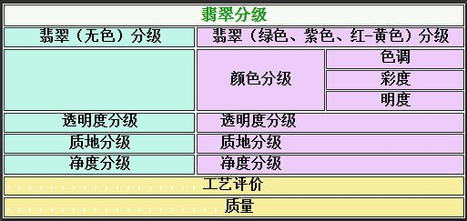

1. 颜色分级：色调、彩度、明度
   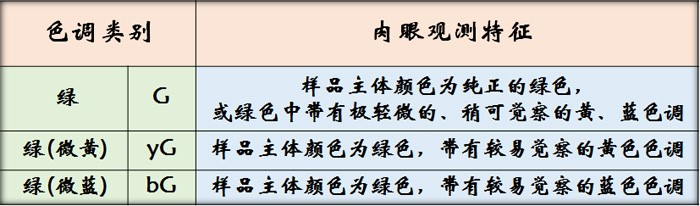
   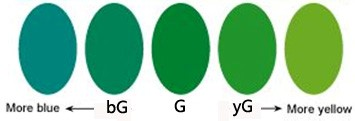

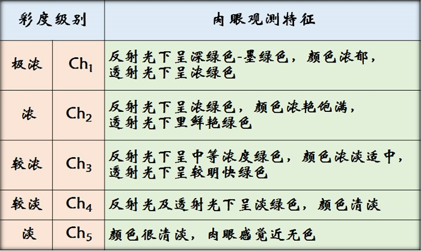
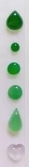

明度指颜色的明亮程度，即俗称“浓正阳和”中的“阳”。
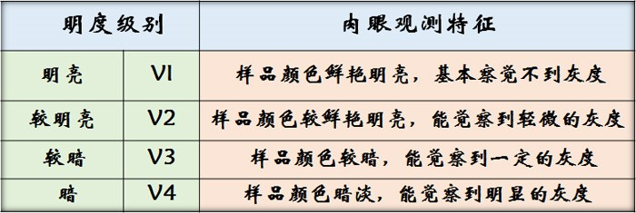

2. 透明度分级：指翡翠对可见光的透过程度
   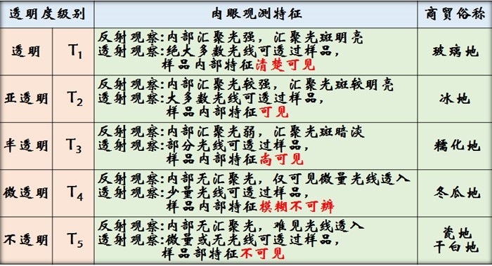

透明度差的翡翠：干青、白底青、干白地；透明度好的翡翠：玻璃地、冰地、蛋清地、藕粉底、糯化地。
一般情况下，戒面、耳环等小件首饰的颜色比透明度重要，但手镯、挂件等大件首饰的透明度可能比颜色更重要。

3. 质地分级：质地是指组成翡翠的矿物颗粒大小、形状、均匀程度及颗粒间相互关系等因素的综合特征。结晶颗粒细，呈纤维交织结构的翡翠，质地较好：玻璃地、蛋清地、冰地、糯化地；结晶颗粒粗大，结构疏松、颗粒界线分明的翡翠，质地较差：豆地、干白地、狗屎地。
   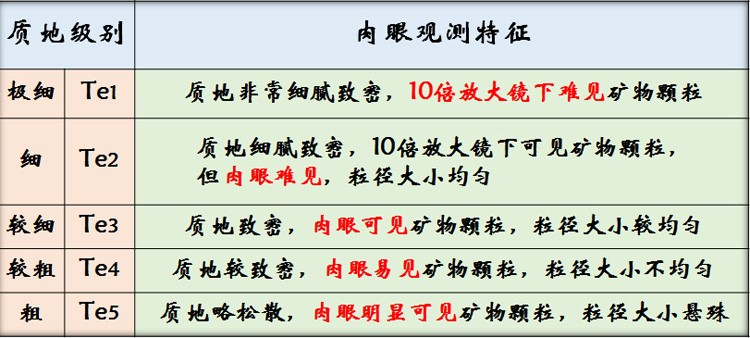

4. 净度分级：翡翠的内部或外表存在的天然内含物和缺陷等对其美观、耐久性的影响程度
   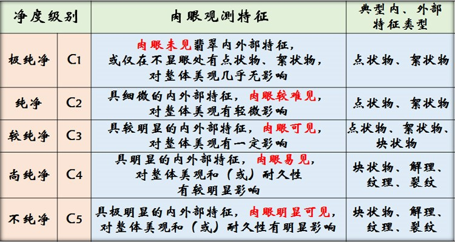
   裂：指翡翠原生或开采、加工过程中产生的断裂。裂隙是无矿物充填的，它对翡翠成品有很大的负面影响
   绺：呈丝状的絮状物，主要由翡翠愈合裂隙引起，一般是封闭的。也可以称之为翡翠的疤痕。俗称石纹、石筋。石纹在透射光照射下容易辨认，而在反射光下并不明显。
   绵：为雾状、薄雾状、片状、点状的絮状物。实际上就是翡翠结晶颗粒的边界线或解理缝，也可以理解为
   翡翠的肌理。结晶颗粒越粗的棉也就越明显；透明度越高越容易看得到棉。棉是通过透射光进行观察的。棉在佩戴过程中，随着人体油脂汗水渐渐渗透到这些边界中间，其肉眼可见度会逐渐变得不那么明显。
   痣：包含苍蝇屎、癣、锈色

5. 重量

6. 工艺

## 产地

世界上最重要的翡翠产地是缅甸，另外，危地马拉、美国、俄罗斯、哈萨克斯坦和日本等国也有些翡翠产出。

## 翡翠的贸易

1. 翡翠原料

    1. 低档料：多为色、种较差的玉雕料。一般用来加工各种摆件、中低档的佩件、低档手镯等。低档料多为山料，块度较大，最小的几公斤，一般的几十公斤到几百公斤，交易中习惯称之为“砖头料”。这类原料价格较低，风险较小。
    2. 中档料：中档料也为“花料”。一般用来制作手镯、玉佩、各种雕件。有时也能取出色好的戒面。交易时一般都“开窗口”或“揭盖子”，称为“半赌料”。
    3. 高档料：这类俗称“色料”。其颜色纯正，是获取戒面、高档玉佩、高档手镯的首饰级翡翠的原料。“色料”交易中绿色不可能充分暴露，评价十分困难。所谓“赌石”主要就是指赌“色料”。

2. 翡翠成品
    1. 市场交易：主要在缅甸曼德勒市场、腾冲翡翠市场、瑞丽珠宝交易市场、广州四会、玉石街等地。需要提醒的是市场上充斥了大量的“B 货”、“C 货”和假货。
    2. 拍卖：一般均为种色俱佳的精品，货品都经专家组鉴定评估，是收藏翡翠精品的重要场所。国际上著名的苏富比、佳士得拍卖会几乎每年春秋两季在香港拍卖，成交率极高。中国北京嘉德拍卖会每年也举行拍卖，其中翡翠成交率极高。

## 优化处理

1. 染色(炝色)处理：目的是使色浅或无色的翡翠变成绿色、红色或紫色
   选料(质地粗者)-稀酸清洗-干燥后放入染料液中(微加热)-烘干上蜡
   炝色：翡翠加热-产生微裂隙-迅速放入有色染料液中
   染色处理的鉴别：

    1. 染料沿颗粒边缘或裂隙分布，即色呈丝网状。炝色的还可见到人工炸裂纹，其颜色沿裂隙分布的特点更加明显。
    2. 染绿色者吸收光谱中出现 650nm 吸收带，而无 690nm、630nm 吸收带
    3. 有些染绿品种在滤色镜下变红褐色。
    4. 红外光谱可检测出有机染料中的 2854cm-1、2920cm-1 峰。另外，其阴极发光的特征是裂隙发育且不发荧光或发黑色光(由染料所致)。

2. 加热处理：将黄色、棕色、褐色的翡翠转变成鲜艳的红色，即促进氧化作用的发生，使褐铁矿经加热失水，变为赤铁矿。
   过程：选料(黄色、棕色、褐色)-清洗-加热-冷却。
   加热处理的鉴别：
   其过程同天然红色翡翠，一般不必区别，也不易区别，只是热处理后颜色过于鲜艳，并有一种“干”的感觉

3. 漂白处理：去除因 Fe、Mn 等杂质造成的黑、灰、褐、黄色，使翡翠变得较干净。

4. 漂白加充填处理： 行业内俗称“B 货”。
   严重酸洗的翡翠其颗粒之间出现较多、较大的缝隙，有的甚至呈疏松的面包渣状，使得翡翠不可能直接使用，
   必须用一些能够起胶结作用的有机聚合物(如树脂或塑料)充填于缝隙之间。
   “B 货”的鉴别：

    1. 绿色的定向性被破坏，有些发黄，有漂浮感；
    2. 表面产生沟渠状纵横交错的沟渠。
    3. 紫外线下若见到较强的黄绿、蓝白荧光，说明是“B 货”；
    4. 红外光谱可检测到较强的有机物产生的吸收峰。
    5. 阴极发光特点：整体发均匀的亮绿色光，晶体周边常被溶蚀成港湾状或参差状，充填于裂隙中的胶体发暗绿色光。

5. 镀膜翡翠：在色浅的翡翠戒面表面覆裹一层绿色的透明物质。为了逼真其折射率调整至 1.65。镀膜处理的鉴别：显微镜下可见到局部有脱落的现象；吸收光谱与其绿色外观不符。

6. 做假皮、贴片

## 翡翠的合成

## 翡翠仿制品及相似天然玉石

**料器**：早期仿翡翠的人造玻璃；**仿玉玻璃**：大致出现在上世纪 50 年代至 70 年代，主要是透明至半透明的绿色人造玻璃，颜色鲜艳而均匀，一般无漩涡构造，偶见气泡，折射率 1.52-1.55，比重 2.4-2.5；**脱玻化玻璃**：70 年代以后的人造玻璃品种，呈半透明到不透明，具特殊的梳状、叶片状构造，折射率 1.52±，比重 2.4-2.5g/cm3；**水沫子**：易与冰地飘蓝花翡翠相混的水沫子；**染色处理石英岩**： “马来玉”；**东陵玉**；**独山玉**；**水钙铝榴石**：“不倒翁”、“青海翠”；**葡萄石**；**绿玉髓(澳洲玉)**；**绿玛瑙** ；**蛇纹石化大理岩**：其外观与豆种翡翠相似
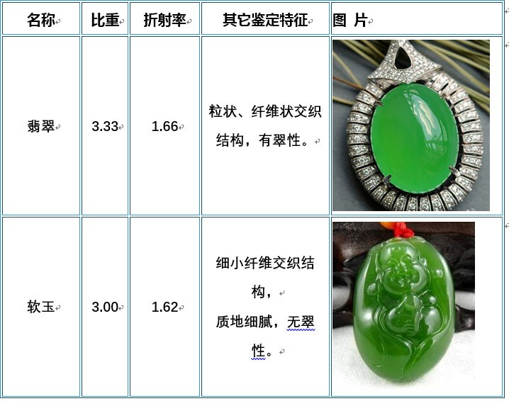 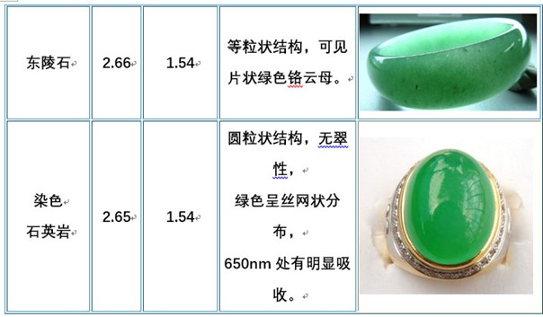
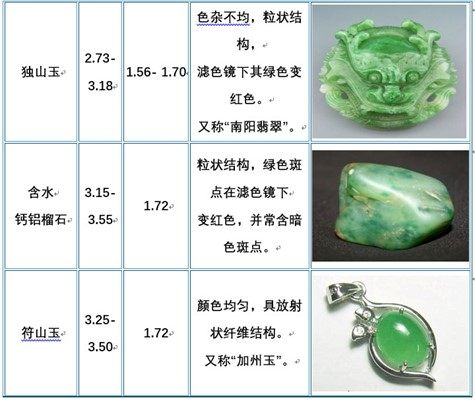 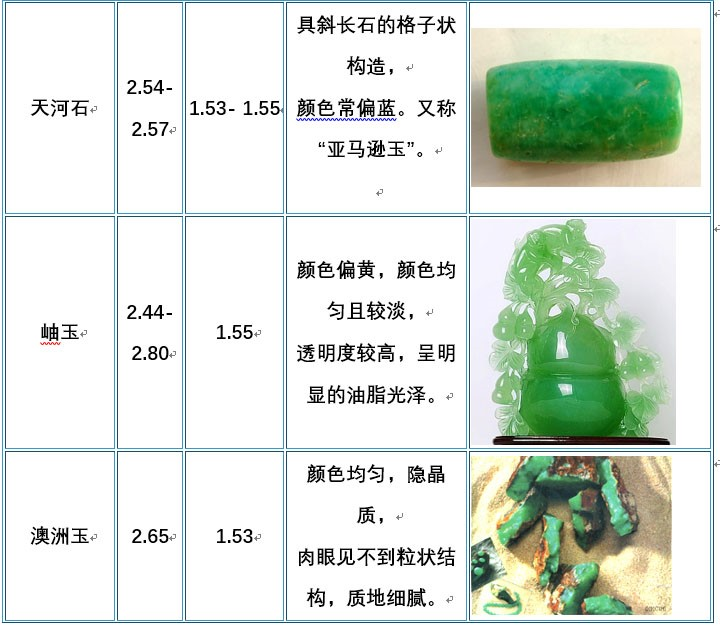

# 和田玉

和田玉是透闪石-阳起石矿物组成的集合体。其名称是相对硬玉(翡翠)而言的，它的硬度为 6-6.5，只是略小于硬玉(6.5-7)。

## 产地

1. 成因：碳酸盐岩与中酸性岩浆岩的接触变质成因；铁镁质超基性岩的交代成因
2. 中国是透闪石玉的著名产出国，苏联著名地质学家费尔斯曼称透闪石为“中国玉”。中国的透闪石玉又主要产于新疆。另外在四川、青海、辽宁岫岩和台湾也有部分产出。
3. 新疆和田玉：以前曾用“和阗玉”及“昆仑玉”的名称。
    1. 昆仑山地区：为新疆和田玉的主要产区。构成中国软玉的重要矿带。品种主要有白玉、青玉和青白玉，呈脉状、透镜状、条带状产出。
    2. 天山地区：天山地区的和田玉为“碧玉”，因产在玛纳斯县境内，称为“玛纳斯碧玉”，主要产在北天山的超基性岩带上。碧玉呈深绿色，块状，质地坚韧细腻。
    3. 阿尔金山地区：又称“金山玉”。除少量青玉外，主要是碧玉品种，性质与玛纳斯碧玉十分相似，也是产于超基性岩体中。
4. 青海和田玉：产于青海省格尔木市西南、青藏公路沿线一百余公里处的高原丘陵地区。属昆仑山脉东缘入青海省部分，西距新疆若羌境约 300 余公里。烟青玉、翠青玉是青海独有的，其它地方没有。2008 北京奥运会的 3000 多枚奖牌全部使用的青海和田玉。
5. 辽宁和田玉：也称为“河磨玉”，位于辽宁省岫岩满族自治县，地处辽东半岛腹地北部，千山山脉东段。
6. 台湾和田玉：分布于花莲县一带，当地人称为“台湾翠”、“闪玉”，多为碧玉品种，并有独特的猫眼效应。

除中国外，俄罗斯、加拿大、新西兰、韩国等也有和田玉矿，其中俄罗斯的和田玉质量较好。

## 基本特征

1. 化学成份：$Ca_2 Mg_5(Si_4 O_{11})_2(OH)_2——Ca_2Fe_5(Si_4O_{11})_2(OH)_2$，这是两种组分的类质同象系列，在多数情况下，和田玉是这两种端元组分的中间产物。
2. 矿物形态：和田玉组成矿物是阳起石和透闪石，这两种矿物为长柱状和纤维状，和田玉则是这些纤维状的集合体，具毛毡状的交织结构，因而具有极好的韧性，不易碎裂。当这些纤维定向排列时，还可以产生猫眼品种。
3. 颜色：有白、灰白、黄、黄绿、灰绿、深绿、墨绿、黑等颜色。当主要组成矿物为白色透闪石时则和田玉呈白色，随着 Fe 对 Mg 的类质同象替代，和田玉的绿色逐渐加深：
4. 和田玉呈油脂光泽、蜡状光泽，绝大多数近于不透明。折射率:1.61(点测)。比重:2.95。硬度:6-6.5

## 品种

1. 按产出环境划分：
    1. 仔玉：由原生和田玉矿藏经风化搬运至河流中堆积而成。籽玉呈卵石状，大小悬殊，磨圆度较好，外表可有厚薄不一的皮壳：红皮、乌鸦皮、桂花皮 、秋梨皮等
    2. 山玉：原生和田玉矿床的玉石，呈块状，棱角分明。俄罗斯山料的灰白皮
    3. 山流水：介于山料、仔料二者之间
    4. 戈壁料：产于戈壁滩的籽料
2. 按照颜色划分：

    1. 白玉：指白色和田玉。根据白的程度又有：羊脂白、梨花白、象牙白、鸡骨白等。其中以羊脂白(状如凝脂)为最好，售价也最高。
    2. 青玉：为淡青绿色，有时绿中带灰色。
    3. 青白玉：介于白玉与青玉之间，似白非白、似青非青。
    4. 碧玉：指呈绿、鲜绿、深绿、墨绿色的和田玉，但决非石英质玉石中的碧玉。
    5. “黄玉”：指呈黄、蜜腊黄、栗黄、秋葵黄等色的和田玉，但决非宝石中的黄玉。
    6. 墨玉：指呈纯黑、墨黑、深灰色的和田玉，光泽较暗淡。
    7. 糖玉：指呈血红、红糖红、褐红色的和田软玉。

    其中以血红色糖玉为最佳，多在白玉和青玉中居从属地位分布。

## 质量评价

1. 质地：质地应致密、细腻、坚韧、光洁、油润、无暇、无绺、无裂。
   其质地以仔料为最佳，这种料呈卵石状，是原生矿(山料)经风化、搬运、冲积至河床处的产物。
   而山料是原生矿，呈棱角状的外形，一般油润性及韧性稍差。
2. 颜色：要么洁白、要么浓艳，在各种颜色中白玉较为稀少。羊脂白玉是珍稀之宝。
3. 光泽：和田玉大多为油脂光泽，若油脂中透着清亮，则为最佳光泽。
4. 块度：应具有一定体积的原料才有利用的价值。
5. 缺陷：
    1. 水线：水线是和田玉中的常见瑕疵之一，为透明较高的浅色条带。
    2. 棉点：玉质内白色的结晶体，多为针状或者花片状，是和田玉的主要瑕疵之一。
    3. 黑点：内部所含的深色杂质或金属小颗粒
    4. 浆：也称作僵，古人给石皮取的美名。
    5. 裂：裂的程度不同，也决定了玉料价值的不同。

## 陷阱

1. 假原石：将一小片真正的白玉镶嵌在毫无利用价值的低劣玉石原石上
2. 假戈壁料 ：人工在玉石表面凿出凹痕
3. 充填和田玉：
   鉴别特征：
    1. 油润度普遍较高，但颜色均匀，透明度高；
    2. 比重仅为 2.75±0.15；
    3. 折射率为 1.60-1.61；
    4. 长波紫外灯下显示中等强度的白色荧光；而未处理的和田玉呈惰性；
    5. 大部分充填和田玉都是高抛光的。但显微观察： 少数充填和田玉腐蚀凹坑处光泽暗淡，其余部分高抛光
    6. 红外光谱具有诊断意义：显示胶的 C-H 峰位
4. 石英岩：近期又做充填处理，使得石英岩更加像白玉
5. 白玉髓：其油润感很有欺骗性
6. 碳酸盐玉：阿富汗玉、巴基斯坦玉、汉白玉
7. 独山玉：取料中纯白部分冒充和田玉
8. 岫玉：一般冒充碧玉
9. 料器：这些乳化玻璃可以仿白玉、碧玉、糖玉等

## 相似玉石&仿制品

|   名称   |     结构     | 折射率 | 比重 | 硬度  |      其它鉴定特征      |
| :------: | :----------: | :----: | :--: | :---: | :--------------------: |
|  和田玉  | 纤维交织结构 |  1.61  | 3.0  | 6-6.5 |  较为油润，参差状断口  |
|  石英岩  |   粒状结构   |  1.54  | 2.65 |   7   | 断口为粒状，透明度较高 |
|   岫玉   |  鳞片状结构  |  1.55  | 2.60 |   4   |  蜡状光泽，透明度较高  |
|   玉髓   |   隐晶结构   |  1.53  | 2.60 |  6.5  |     透明度高于软玉     |
| 乳白玻璃 |    非晶质    |  1.51  | 2.50 |   5   |   贝壳状断口，含气泡   |

# 欧珀

## 文化赏析

欧泊的英文名称 Opal，源于拉丁文“opalus”，意思是“集宝石之美于一身”，它的矿物名称是蛋白石。因这类矿物一般呈现蛋白色而得名。

## 产出

欧泊是在表生环境下由硅酸盐矿物风化后产生的二氧化硅胶体溶液凝聚而成。也可由热水中的二氧化硅沉淀而成的。
**捷克斯洛伐克**是世界上开采欧泊最早的国家。但现在世界上最重要的欧泊产出国是**澳大利亚**，其产量占世界总产量的 95%以上。其中**新南威尔士**所产的优质黑欧泊最为著名。属于沉积岩型成因类型。澳洲欧泊的密度一般为 2.15g/cm3 左右。 **墨西哥**则以产出火欧泊而闻名。属于火山岩型成因类型。墨西哥的欧泊密度一般为 1.90g/cm3 左右。近年来的新产地**埃塞俄比亚**欧泊：属于火山岩型成因类型。密度一般偏低，只有 1.80g/cm3 左右。

## 世界上较为著名的欧泊

1. Olympic Australis：1956 年奥林匹克年产出的质量最好的大欧泊，重 17，000 carats ，280-120-115 mm
2. Roebling Black：1919 年在美国内华达州发现的，重 2585 克拉的黑欧泊，现在由华盛顿自然历史博物馆收藏。
3. Roebling Opal was donated by John A. Roebling in 1926.
4. Galaxy opal：发现于 1976 年，重 3749 克拉，140-102-41mm
5. The Flame Queen：263.18 carats，1914 年采于 Australia
6. Pride of Australia 或 Red Emperor：发现于 1915 年，225 carats
7. The Andamooka Opal：重 205 克拉，1954 年澳大利亚政府将它镶在项链上送给了英国伊丽莎白女王
8. Opal Butte：740 carats.119.0 carats and measuring 46.0 x 44.0 x 10.1mm
9. Aurora Australis：1938 年发现于闪电岭，重 180 克拉
10. Virgin Rainbow：2003 年发现澳大利亚， 72.65 carats， 63.3mm long
11. 哈雷彗星：世界吉尼斯记录欧泊，重 1982.5 克拉，100-66-63mm，1986 年发现于澳大利亚的闪电岭
12. Halley’s Comet was for sale in 2005 for AUD $1.2 million.

## 欧泊的基本特征

1. 化学组成：$SiO_2\cdot nH_2O$，$SiO_2$占 80-90%，$H_2O$的含量一般 10%，最高达到 20%。
2. 形态：欧泊是非晶质体，无一定的外形，常呈皮壳状、钟乳状。
3. 微透明至半透明，完全透明者极为罕见。墨西哥的火欧泊大部分晶莹通透，可加工成刻面型。
4. 折射率为 1.45(+0.020，-0.080)，火欧泊可低至 1.37，硬度为 5-6。比重 2.15， 埃塞俄比亚欧泊最低可达 1.39
5. 颜色：欧泊的体色可有黑色、白色、橙色、蓝色、绿色等多种颜色。

## 欧泊的品种

1. 黑欧泊：体色为黑色、深绿、深蓝、褐色的品种，以黑色最为理想，它可使变彩显得更加鲜明夺目。
2. 白欧泊：体色为白、乳白、浅灰色的品种。它给人以清丽宜人之感。
3. 火欧泊：无变彩或少量变彩的半透明-透明品种。一般呈橙色、橙红色，色调热烈，具强烈动感。
4. 蓝欧泊：秘鲁蓝欧泊的色调为绿蓝色或蓝绿色。变彩不发育，颜色来自于水合铜离子。
5. 欧泊猫眼：罕见

## 欧泊的质量评价

评估欧泊的价值时应重点考虑下列因素：

1. 体色：体色以黑色或深色为佳，这样可以有较大的反差，衬托出艳丽的变彩。
2. 变彩：整个欧泊应变彩均匀，没有无色的死角，且变彩中颜色应齐全，即出现整个可见光光谱中的所有颜色(红、橙、黄、绿、蓝等)。色斑分布均匀，色斑愈大愈好。片状、丝状、点状搭配适宜。
3. 具有一定的透明度，质地致密、坚硬，无裂纹及其他缺陷。
   以上只是总体原则，不同地区和国家的人们对欧泊的色调有不同的偏爱。值得一提的是，目前市场上所见的欧泊多为拼合石，评价时应充分考虑。

## 欧珀的保养

1. 欧泊的主要成份虽然也是$SiO_2$，但其中含有$H_2O$，且属非晶质体，其硬度比结晶质的水晶低得多，容易被磨蚀而失去表面光泽。所以，佩戴时应尽量避免与其它较硬的东西磨擦，保存时不要与其他的珠宝混在一起放置。
2. 由于欧泊中的水属于吸附水，其逸出温度仅为 100℃-110℃。虽然在日常的佩戴过程中，欧泊中的水不会逸出，但长期的高温或湿度过低的环境中水份还是容易失去的，从而造成变彩丧失、光泽暗淡，甚至爆裂。所以，在加工或佩戴时不宜与火或高温接触，也不宜在日光下曝晒，在过于干燥的地区尽量少戴，对于原石最好置于水中保存，如珠宝柜台内装有射灯等光源，应放置水杯，以保持湿度。

## 合成欧泊

吉尔森欧泊

1. 步骤：
    1. 酒精和水的混合液中加有机硅化合物，使其均匀扩散呈小点粒状，再加入强碱把有机硅化合物转化成氧化硅，并使之呈球体(直径 200-300nm)。
    2. 使氧化硅球休在溶液中沉淀，随着沉淀的发生，堆积方式将自动取向。
    3. 胶结、压实、烧结。
2. 合成与天然的区别：
    1. 合成品色斑呈三维，天然品为二维，天然色斑中还可见到丝绢状条纹。
       但是！！！
    2. 合成品色斑界线清晰，呈蜂窝状或蜥蜴皮构造。
    3. 合成品密度较低，仅为 2.06。

## 仿制品：

1. 塑料：折射率较高 1.48-1.53；气泡发育；比重较低，为 1.20g/cm3；硬度也低，为 2.5 左右；具热塑性，加热后会软化。
2. 玻璃：细小的有色金属片掺入玻璃中以替代欧泊中的色斑。放大观察可见到金属薄片的皱折现象。折射率较高，为 1.49-1.52； 玻璃内常有气泡和漩涡状构造， 比重较高，为 2.4-2.5。

## 优化处理：

1. 无色处理：用油、蜡或塑料掩盖裂隙等缺陷，同时对水分的保持起到一定的作用
2. 炭化处理：
    1. 烟熏：浅色欧泊浸油后用纸包好，加热后使纸冒烟，这样欧泊的裂隙中就沉淀有黑色颗粒，从而把欧泊熏黑。特点是不耐久，用水清洗后会褪色。 在显微镜下，可以看到很多的小的黑(碳)斑点，裂隙中黑色碳富集
    2. 糖化：浅色欧泊浸没在糖水中，再将它浸泡在浓 H2SO4 中焦化，碳留在孔隙中，从而使欧泊颜色变黑。特点是其色斑界线明显，黑色的小点粒分布于缝隙或颗粒之间，10 倍放大镜下容易发现。这种处理通常只在表面，里面还是浅色的。
3. 拼合处理： 常为二层、三层拼合。一般自上而下是用水晶、欧泊、黑色玉髓类。
4. 染色处理：埃塞俄比亚欧泊分子间缝隙相对较大，比澳洲欧泊容易吸水脱水，浸泡染色剂容易上色：染成红色仿墨西哥火欧泊，染色黑色仿黑欧泊。染成蓝色仿秘鲁蓝欧泊

# 绿松石

## 文化赏析

其英文名称 Turquoise 来源于法语，原意为“土耳其石”，实际上，土耳其并不是绿松石的主要产地，大概是因为绿松石最初是由土耳其进入欧洲而得名的。
清朝祭月时必戴的绿松石朝珠。
在中国各民族中，藏民最喜爱绿松石，不仅用绿松石装饰拉萨大昭寺的佛像，从喇嘛、僧徒到普通百姓都喜爱绿松石制作服饰及首饰。

## 绿松石的宝石学特征

1. 化学组成：绿松石矿物的分子式为$CuAl_6(PO_4)_4(OH)_8\cdot 4H_2O$。是一种含水的铜铝磷酸盐。Cu 离子决定了它的天蓝色。绿松石玉的主要组成矿物是绿松石，另外有少量高岭土、褐铁矿等。随着 Cu 和 H2O 的流失，蔚蓝色会转变为灰绿色，直至灰白色。
2. 形态：晶体极为少见，通常见到的绿松石多为隐晶质集合体。原矿大致呈结核状、浸染状、细脉状产出。
3. 结构构造特征：
    1. 绿松石在绿色、蓝色基底上可以见到一些不规则的白色纹理或斑块(高岭土)
    2. 常有褐色、黑褐色的纹理和色斑，宝石界称之为“铁线”(由褐铁矿组成)
    3. 个别情况下可以见到蓝色的圆形斑点，是由绿松石沉积而成的。
4. 颜色：分蓝色、绿色、杂色三大类。
    1. 蓝色：天蓝、蔚蓝色、淡蓝色，色泽鲜艳。
    2. 绿色：深绿、绿、浅绿、灰绿等，其中深蓝绿色也非常美丽。
    3. 杂色：土黄色、灰白色等，需经过人工优化处理后才能使用。
5. 绿松石一般呈蜡状光泽，杂色的可呈土状光泽。
6. 折射率、比重和硬度均与其质量好坏有关。
   折射率：天蓝色为 1.62-1.63；灰白色为 1.61-1.62(结构部分破坏)。
   硬度： 5-6，灰白色、灰黄色等劣质品种较低，最低为 2.9。
   比重：2.76(+0.14，-0.36)，高品质的应在 2.8-2.9 之间。
7. 特殊性质：
    1. 不耐热。高温下绿松石会失水、爆裂，变成一些褐色碎块。
    2. 在盐酸中可溶解，只是溶解速度较慢。
    3. 绿松石孔隙发育，不宜与有色溶液(茶水、油污等)接触，以防被污染。

## 绿松石的品种

1. 晶体绿松石：极为罕见的透明晶体，其成品不足 1ct，仅美国弗吉尼亚州产出。
2. 瓷松：指颜色鲜艳，质地致密，硬度 5.5-6 ， 非常光亮，破碎后的断口犹如瓷器，故得此名
3. 面松：指质地不坚的绿松石，硬度在 4 以下，其断口呈粒状。
4. 泡松：指比面松还软的绿松石，为劣等品，不能用作玉雕材料。
5. 铁线绿松石：指具有褐色、黑褐色纹理的绿松石，是由铁锰氧化物造成的。
6. 白脑绿松石：在天蓝色基底上分布着脉状或斑状白色的绿松石，是高岭土石英等矿物引起的。
7. “唐三彩”绿松石：黄、蓝、绿、褐等色相间分布

## 绿松石的质量评价

1. 颜色：首饰用的高档绿松石必须具标准的天蓝色。其次为深蓝色、蓝绿色，而且颜色应均匀。那些浅蓝色、灰蓝色的绿松石只能用做雕件，黄褐色的基本无工艺价值。
2. 比重及硬度：因为密度值接反映出绿松石受风化的程度，随着风化程度的加深，绿松石比重降低，硬度降低，颜色质量也明显降低。高档绿松石要求具有较高的密度和硬度，即比重约 2.8，摩氏硬度在 6 左右。
3. 特殊花纹：绿松石是一种可与围岩共同磨制的玉石，当围岩与绿松石构成的图案具有一定的象征意义时，其作品将受到好评。
4. 块度：在绿松石原矿的销售中，对块度有一定的要求，总的原则是颜色好、质量高的绿松石，块度可以小些。如在美国，天蓝色的重量应大于 4 克，但浅蓝色、浅绿色的不应小于 7-28 克。

## 绿松石的产地

绿松石的主要产出国是伊朗、美国、智利，其次是中国、澳大利亚、墨西哥、苏联、秘鲁等国家。
伊朗东北部阿里米塞尔山上的尼沙普尔矿床，长期以来是世界上优质绿松石的主要来源。
美国的绿松石来自美国西南部的科罗拉多州、内华达州、亚利桑那州、加利福利亚州和新墨西哥州等。
市场上看到的主要是亚利桑那州 GLOBE 和新墨西哥州的“睡美人”及内华达州的铁线网状花纹绿松石。
中国传统的绿松石产地主要集中于湖北、河南、陕西交界处。
鄂西北绿松石矿山(即古书中的襄阳甸子)包括郧县、郧西、竹山三县。陕西：白河县月儿潭。河南：淅川县。安徽：马鞍山。质高量大

## 再造绿松石

绿松石微粒、各种铜盐的蓝色粉末在一定的温度、压力下压结而成。
其鉴别特征：

1. 外观像瓷器，具典型的粒状结构，放大检查可看到清晰的颗粒界限及基质中的深蓝色染料颗粒。有时为仿铁线绿松石而制作“蛛网状”细脉。
2. 因所含的蓝色铜盐可溶解于盐酸中，滴酸后擦拭白色棉球上将显出明显的蓝色。
3. 红外光谱上出现粘接剂引起的$1725cm^{-1}$峰。

## 人造“绿松石”

由菱镁矿、方解石、滑石、高岭石、重晶石等矿粉加胶压制而成“绿松石”

## 绿松石的优化处理

绿松石是一种多孔隙的玉石，其孔隙不仅影响其颜色，更影响其结构质地。
多孔性使其具有较强的吸附性，易吸附杂质致使绿松石脏污；多孔性还会造成光的散射，使绿松石的颜色变浅；
绿松石通过浸水、封蜡、浸胶、泡油等充填后，色泽加深，孔隙度改善。

1. 过蜡：也叫封蜡。属于**优化**
   将绿松石成品在融化的川蜡液体中浸一下，或表面喷蜡，封住细微的孔隙，这是绿松石的传统处理手段。其目的是为了填补表面的孔隙，防止失水和外来污染物进入孔隙弄脏绿松石。过蜡提高了表面光滑度，减弱了光的漫反射，所以颜色加深.
2. 染色处理：深度较浅，内核较浅，颜色过于均匀，沾氨水的棉球擦拭时可显示蓝绿色。
3. 充填处理：也称注胶或灌胶.使用环氧树脂、聚酯纤维、聚丙烯酸脂等高分子聚合物，在密闭真空高压条件下，注入质地疏松绿松石的内部，充填其孔隙，硬度增加，改善其耐久性和外观。
   其鉴别特征：
    1. 低比重(2.4-2.1)、低硬度(3-4)，与其外观不协调；
    2. 热针检测时，塑料会发出异味。
    3. 红外光谱检测可发现非绿松石的吸收线。
4. 致密度优化：适用于质地较好的绿松石，又称质地改善。在一定温度、压力和电解质的作用下，不同程度地改善绿松石表层、近表层的质地以及光学、力学性质。
   鉴定特征：
    1. 颜色通常较为鲜艳，断面颜色不均匀，通常表层色深、内部色浅，颜色突变或渐变；
    2. 沿裂隙两侧颜色变深而不是在裂隙自身颜色集中。质地较为坚硬，呈玻璃光泽
    3. 其表层化学成分中钾含量相对较高，由表层向内铮含量逐渐降低。
    4. 其浸提液 pH 值呈中性至弱碱性。未经优化处理绿松石的浸提液 pH 值呈中性至酸性。

## 与相似玉石及仿制品的鉴别

|      品种      |      比重      | 折射率 | 硬度 |          其它鉴定特征          |                         图 片                         |
| :------------: | :------------: | :----: | :--: | :----------------------------: | :---------------------------------------------------: |
|     绿松石     |    2.8-2.9     |  1.62  | 5-6  |               -                |            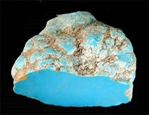             |
|    硅孔雀石    |    2.0-2.4     |  1.50  |  2   |        绿色比绿松石鲜艳        |       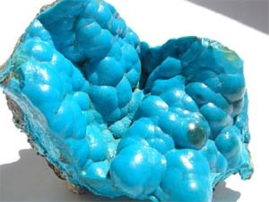       |
|     天蓝石     |      3.1       |  1.62  | 5.5  |          颜色呈斑驳状          |         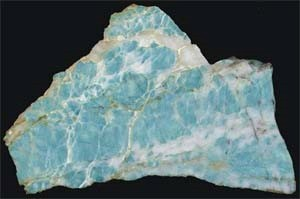         |
|     蓝玉髓     |      2.6       |  1.53  | 6.5  |    查尔斯滤色镜下可能显红色    |         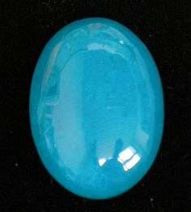         |
|  蓝铁染骨化石  |    3.0-3.2     |  1.60  | 2.75 |    放大镜下显示骨的结构特点    |                           -                           |
| 染色羟硅硼钙石 |    2.5-2.6     |  1.59  | 3.5  |         绿区有宽吸收带         | 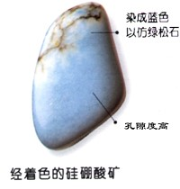 |
|      玻璃      | 可变，可达 3.3 |  可变  |  5   | 玻璃光泽，贝壳状断口，可含气泡 |           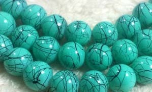           |
|       瓷       |    2.3-2.4     |   -    | 6-7  |            玻璃光泽            |             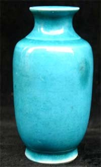             |

## 蛇纹石玉(岫玉)
我国历史最悠久、产量最大、产地最多、应用最广泛的玉石品种。
新西兰产称**鲍文玉**；美国产的称**威廉玉**；朝鲜产的称**高丽玉**。蛇纹石玉在我国也有众多名称：**岫岩玉**(产于辽宁岫岩)；**南方玉**(产于广东罗定、信宜)；**祁连玉**(产于青海祁连山)；**莱阳玉**(产于山东莱阳)；**陆川玉**(产于广西陆川)；**酒泉玉**(产于 甘肃酒泉)

## 产地
中国、阿富汗、朝鲜、美国、新西兰、 墨西哥等。
中国最主要的产地是**辽宁岫岩县**。因此，“岫玉”在新的国家标准中成为合法名称。
1960年7月在岫岩县发掘出的“**玉石王**”重达260余吨。其玉质细腻，通体五彩斑斓。周总理生前曾设想将其加工成巨型玉雕“**锦绣江山**”。由于受当时运输条件的限制，一直被保护和搁置在山中。1992年10月，在解放军4辆坦克牵引车的帮助下，“玉石王”从产地运抵鞍山市。耗时10天，耗资1000万元。后雕成了世界最大的玉佛。
1997年11月被评为吉尼斯世界之最。

## 蛇纹石的宝石学特征
1. 矿物组成：主要是蛇纹石$Mg_6[Si_4O_{10}](OH)_8$。伴生矿物有白云石、菱镁矿、透闪石、滑石、绿泥石等，这些伴生矿物的含量变化很大，并对蛇纹石的质量有明显的影响。
2. 结构构造：通常是均匀的致密块状，蛇纹石颗粒十分细小，仅在高倍显微镜下才可见到纤维状、细粒状形态。所以，玉质细腻，手感滑腻。
3. 颜色： 深绿色、黑绿色、绿色、黄绿色、灰黄色及杂色。通常以微带黄色调的淡绿色为主。
4. 透明度：一般较好。光泽不是太强，硬度3-3.5(随透闪石的增多可大至6)，折射率1.56-1.57，比重2.44-2.80，变化范围较大。

## 蛇纹石的质量评价
蛇纹石以其柔和的色彩、温润的光泽、剔透的质感而受人喜爱。绿色至深绿色、透明度高、无瑕疵、无裂隙者为上品。 
另外，市场上常有一种标名为“鸡血玉”的手镯或小挂件，实际上就是染色的蛇纹石玉，其红色明显沿裂隙分布。

# 石英质玉石
石英质玉石是指由细小石英颗粒集合体构成的单矿物岩石，其基本性质与水晶大致相同，但由于结晶程度、颗粒排列方式等差异，两者物理性质略有差异，石英质玉石的**比重**为2.60；**摩氏硬度**为6；**微透明--半透明**；外形多为**团块状、皮壳状、钟乳状**。
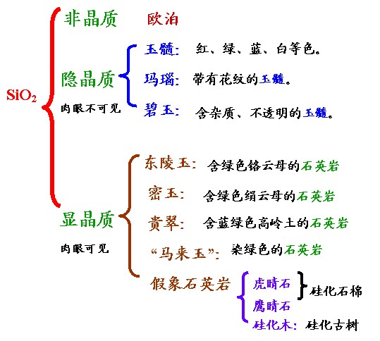

## 玉髓： 
一种分布很广的隐晶质石英。按照颜色特征分为以下几种：
1. 红玉髓：红--褐红色。其颜色源于氧化铁的存在。血红色的又称“血玉髓”。印度产的红橙色玉髓称为“光玉髓”，透明度较高
2. 绿玉髓：不同色调的绿色。其绿色来源于所含的镍。半透明--透明，色彩均一。其中最著名的是澳大利亚产的绿玉髓，又名澳洲玉或澳玉。但乌拉尔地区、巴西、奥地利也是重要产地。在历史上，波兰、捷克也曾出产过精美的绿玉髓。
3. 蓝玉髓：灰蓝--绿蓝色，不透明--半透明。其中最著名的是我国台湾省产的蓝玉髓，其高档品与高质量的绿松石相近。享有“台湾蓝宝石”之称。
4. 白玉髓： 灰白--灰色，是较纯的玉髓，常用来仿软玉。

## 玛瑙：即有花纹的玉髓。 
1. 按颜色分为白玛瑙、红玛瑙、绿玛瑙、蓝玛瑙、黑玛瑙。玉雕行业有一口头禅：“玛瑙无红一世穷”。**南红玛瑙**尤为价高；**柿子红**的颜色大气稳重，整体显得细腻、均匀、温润，油脂感强；**樱桃红**的红色显得俏丽、明快，有一定的透光性。目前市场上红玛瑙大多是加热后的颜色。而绿、蓝、黑三色在自然界极少产出，市场上的绝大多数是人工染色而成。
德国的伊达尔-奥伯斯坦因是世界著名的玛瑙产地，除此以外，巴西、乌拉圭、墨西哥也是重要产地。
我国辽宁阜新、内蒙古都有大型玛瑙矿。
2. 按条带分为缟玛瑙(条带较宽)、缠丝玛瑙(条带十分细窄)。两者的共同特征是纹理为直线状，而不是歪曲状。以此与普通玛瑙相区别。较为名贵的是由红、白相间条带构成的红缟玛瑙。缟玛瑙常浸泡于糖溶液中，然后用硫酸将糖粒炭化，形成醒目的黑色。
3. 按杂质分为苔藓玛瑙、火玛瑙、水胆玛瑙。**苔藓玛瑙**：由绿泥石细小鳞片聚集而成的绿色苔藓状或由铁锰氧化物聚集而成的黑色树枝状图案，给工艺师的想象
提供了很大的空间，因而较为名贵。 **火玛瑙**：由于在玛瑙微细层理之间含有薄层状氧化铁矿物，在光的照射下可产生薄膜干涉效应，如果切工正确，玛瑙将显示五颜六色的晕彩。主要产于美国的亚利桑那州和墨西哥。**水胆玛瑙**：玛瑙中心包裹有较大体积的天然液体。 **风景玛瑙**：所含铁、锰的氧化物或氢氧化物形成树状、山水等风景。**雨花石**：产于南京雨花台及其相邻地区六合、仪征等地的玛瑙质砾石。具有丰富多变的色彩和瑰丽幻化的图案，以色、影、形、线条见长，有人形容它“似宝非宝、似玉非玉”、“花非花，石非石”，具有极高的观赏价值。 

## 碧玉：
是一种含较多杂质、不透明的玉髓。民间有人称之为“肝石”。通常按颜色命名，如绿碧玉、红碧玉。
较名贵的品种有风景碧玉和血滴石。主要产地是印度、委内马拉等国。
1. 风景碧玉：不同颜色的条带、包块交相辉映，犹如一幅美丽的自然风景。
2. 血滴石：是一种暗绿色的碧玉，其上散布着棕红色氧化铁的斑点，犹如滴滴鲜血。最为有名的产地是印度。

## 多晶石英质玉石   
其中的石英颗粒比玉髓中的颗粒大，为显晶质结构。集合体呈块状。常见的品种有：
1. 砂金石：具砂金效应的石英岩，所含内含物是能够反射光线的小晶体，颜色因所含杂质矿物的不同而不同：含铬云母或纤维状阳起石者呈现绿色；国内市场上最常见的是绿色东陵石，国内的主要产地是新疆。含蓝线石者呈蓝色；含锂云母者呈现紫色;含赤铁矿者呈橙红色。市场上常出现黄色的仿砂金石，是由玻璃中夹含三角形或六边形的铜片构成
2. 密玉：因产于河南密县而得名，为一种含细小鳞片状绢云母的致密石英岩，无砂金效应。
3. 贵翠：是一种含高岭土的石英岩，微透明，呈天蓝色、浅绿色。
4. “马来西亚玉”：是一种带欺骗性的不正确的名称，许多人上当受骗，它是一种结构较细的染色石英岩。有时还冒充高档翡翠。 

## 假象石英质玉石
1. 虎睛石与鹰睛石： 
当蓝色的钠闪石石棉被SiO2置换后，SiO2质的石英保留了石棉矿物的纤维状形态，抛光后的成品表面具有丝绢光泽，当切成弧形时还可出现猫眼效应。其中黄色、黄褐色的品种称为“**虎睛石**”，其黄色黄褐色是由氧化铁所致；蓝色、灰蓝色的品种为“**鹰睛石**”，其蓝色、灰蓝色是由保留了原来钠闪石石棉所致。
世界上最大的虎睛石、鹰睛石矿藏位于南非的德兰士瓦省。它与长360km、宽约45km的青石棉矿带有关。此外，纳米比亚、巴西、澳大利亚、斯里兰卡也有质量较好的虎睛石。

市场上的黄龙玉、大别山玉、金华玉、黄山玉、金丝玉等都属于显晶质——隐晶质的$SiO_2$集合体。因含铁、锰杂质而呈现不同的颜色
1. 黄龙玉：名称来源于云南龙陵县。
2. 金丝玉：产于中国新疆和田地区及西昆仑山前的河流、阶地、戈壁滩、沙漠等地域。

# 青金岩
青金岩是一种古老而神圣的玉石，由于它那蓝天般的颜色，使它被视为天穹的象征，受到那些自命为天之骄子的帝王的格外喜爱，素有“天青”、“帝青”之美称。
清代皇帝在天坛祀天时，无论是朝珠、朝带以及杂饰均饰以青金岩。雍正八年后，四品官的顶戴以青金岩为顶。
我国古代常将其做为彩绘的蓝色颜料---“群青”，如敦煌莫高窟壁画上的蓝色颜料大部分为青金岩。
智利将青金岩定为“国石”
 
## 青金岩的宝石学特征
组成矿物主要是青金石，次为黄铁矿、方解石。颜色有深蓝色、天蓝色、紫蓝色、蓝白杂色。
“**青**”代表天空的颜色；主要是指青金石矿物，“**金**”代表经常分布于蓝色基底上的小粒黄铁矿的金色，犹如缀天的繁星。一般为斑块状、细脉状构造。**硬度**为5.5左右。青金石在查尔斯滤色镜下呈**褐红色**。所含的白色方解石与酸强烈反应，产生气泡。青金岩矿床均属于接触交代夕卡岩型矿床。

## 青金岩的主要品种  
1. 青金石：青金石含量大于99%，不含黄铁矿、方解石，即“青金不带金者”。纯净、细腻，颜色浓艳、均匀，以深蓝色、天蓝色为上品。
2. 青金：青金石含量为90%左右，无方解石，但又少量黄铁矿呈零星分布。
颜色比较浓艳、均匀，质地较细腻，同样以深蓝色、天蓝色为上品。
3. 金克浪：含大量黄铁矿，有时其含量大于青金石，黄铁矿呈带状、团块状分布，可含方解石白斑或白花，质地不均匀。          
4. 催生石：不含黄铁矿，青金石与方解石混杂在一起。古代人将此入药，帮助孕妇生产，故而得名“催生”。

## 青金岩的产地  
青金岩虽然是中国传统的重要玉石原料，但中国至今未发现青金岩的产地，所用的青金岩多来自世界最著名的产地。
**阿富汗**，阿富汗自古以来以盛产最优质的青金岩而闻名于世，而且，其储量、产量、质量保持世界第一。阿富汗的青金岩矿床位于东北部的巴达赫尚省，分布于兴都什库山脉东部科克奇河流域
**智利**安第斯山脉金博卡连的青金石一般含较多的白色方解石并常带有绿色色调，价格较便宜。
**俄罗斯**贝加尔地区小贝斯特拉赫和斯柳甸的青金石具不同色调的蓝色，通常含黄铁矿，质量较好的。
**加拿大**的巴芬岛和雷克岛、美国加州也有一些青金岩。 

用棉签取适量酒精，多次重复擦拭青金石表面约半分钟左右，如果棉签上出现蓝色的为染色青金石，无色的为天然青金石。

仿青金石：树脂+石粉+铜屑粘合而成。

## 与相似玉石及其仿制品的鉴别 
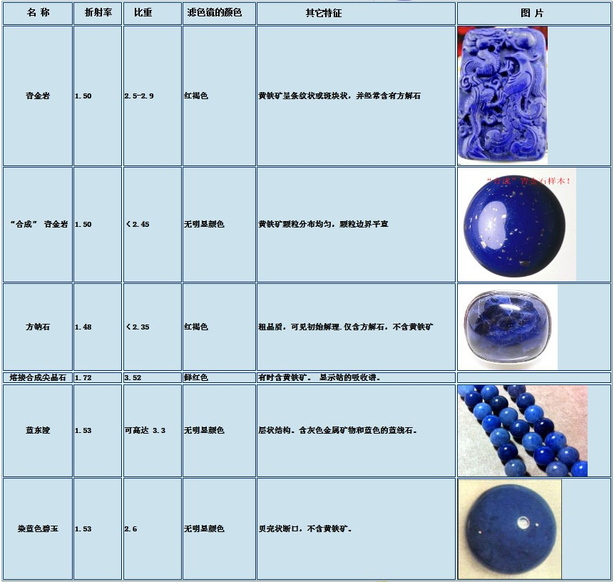

# 鸡血石
## 简介
鸡血石因含有殷红艳丽的辰砂，宛如鸡血凝成。故名“鸡血石”。

## 宝石学特征 
1. 矿物组成：主要有地开石、辰砂(HgS)，另有少量高岭石、明矾石、石英。 
2. 结构与构造：主要呈显微隐晶质结构。血的形态可分为点状、线状、团块状。 
3. 颜色：血的颜色可呈鲜红、朱红、暗红和淡红色。随着感光元素 Se、Te对S的替代，血的颜色逐渐从鲜红变为朱红，最后变为暗红色。另外，辰砂的粒度越大，血色越暗，粒度越细小，血色越纯正。地的颜色很多： 白色、灰色、深灰、红色、粉红、紫红、黄色、褐黄、浅黄绿、深绿、黑色、无色等。 
4. 透明度与光泽：鸡血石多为不透明至微透明，半透明时称为“冻地”。原石一般为土状光泽，透明度稍好者可呈蜡状光泽。辰砂本身可呈金刚光泽。
5. 比重平均为2.61，硬度为2.4-2.7。昌化鸡血石硬度高于巴林鸡血石。

总体来说鸡血石的韧性极好，具有滑腻感。

## 品种
鸡血石的分类较为复杂。主要依据分别是地的颜色、地的性质、血的含量。
下面按照不同依据介绍主要名称：
1. 地的性质：
    1. 冻地鸡血石：质地细润，透明度好，犹如“胶冻”，呈强蜡状光泽，硬度较低，仅为2-3。 
    2. 刚地鸡血石：颜色发白，质地粗糙，性较脆，易碎裂，不透明，硬度较高，达 4-6，主要是所含石英造成的。
    
    除此以外，尚有软地鸡血石、硬地鸡血石等。
2. 地的颜色： 
    1. 红花地鸡血石：地呈红色或以红色为主，由于地色与血色相近，有“地子吃血”的感觉，质量越好，让人越遗憾。
    2. 羊脂冻鸡血石：地呈奶白色，透明度较好，给人以特别鲜嫩的感觉，再配上鲜红的血，红白掩映。正所谓“皓赤朱唇，相得益彰”。

    除此以外，尚有芙蓉冻鸡血石、瓜瓤红冻鸡血石、藕粉冻鸡血石、石榴红地鸡血石、瓷白地鸡血石、黑冻鸡血石等。
3. 血的含量： 
    1. “大红袍”鸡血石：血的含量大于70% ，满眼看去几乎全为血，可谓“全石浸血”，而且，血呈鲜红色或朱红色。
    2. “红帽子”鸡血石：血的含量大于30% ，上部全为血，又有“鸿运当头”之说。 
    
    另外，还有鸡血石中的极品“刘关张”： 地呈黑色、黄色或白色，无其他杂色，并配有鲜红的血。红色指红脸关羽，黑色指黑面张飞，黄色或白色指皇叔刘备，寓意“桃园三结义”。

## 质量评价 
鸡血石的颜色是否美观，与其地的颜色和血的颜色是否协调有关，也与地的透明度密切相关。
若血色和地色对比强烈，则血的红色鲜明生动，效果极佳；若血色与地色反差很小，如地色为红色、粉红色或紫红色等，则会发生“地子吃血”的现象。
鸡血石的透明度越高，越油润，血就有扩大和增多的趋势，出现“血照映地子” 效应。
另外，过多的杂质(即砂钉)、绺(即愈合后的原生裂隙)、裂(即后生裂隙) 的存在都会降低鸡血石的价值。 
1. 血的评价：由血色、血量、血形、浓度四个要素所决定。
    1. 血色：要求鲜艳而纯正，并且要“活”，有渐融于地中的感觉。鲜红色最佳， 朱红色次之，暗红色和淡红色最差。
    2. 血量：血的含量越多，覆盖的面积越大，含血面越多，其品级就越高，价值也就越高。特级品的血量大于50%，
    一级品的血量大于30%，二级品的 血量大于10%，三级品的血量小于10%。
    2. 血形：有团血、条血和点血之分。其中，以团血、条血为佳，点血次之。若三者构成栩栩如生的自然景观和优美图案时，品级可大大提高。  
    4. 浓度： 血分布的越集中价值越高。 
2. 地的评价：由颜色、透明度、光泽、硬度四个要素所决定。
    1. 颜色：有单色和杂色之分，其中以均匀的单色为佳。
    2. 透明度：半透明的冻地最佳，微透明的次之，不透明的最差。
    3. 光泽：由强至弱依次为油脂光泽、强蜡状光泽、蜡状光泽、弱蜡状光泽和无光泽。其中以油脂光泽和强蜡状光泽为最佳。
    4. 硬度：冻地的硬度为2-3，软地的硬度为3-4，刚地的硬度为4-6，硬地的硬 度为6-7。随着硬度的增加，鸡血石的质量依次降低。

## 鸡血石的产地 
鸡血石是我国特有的玉石品种，主要产于**浙江昌化镇玉岩山至康石岭一带**以及**内蒙古巴林右旗大板镇**以北50公里的**雅玛吐山**北侧。
两地均产于含汞溶液交代酸性火山岩的次级裂隙中。
昌化：其血色鲜活浑厚、纯正无邪，因而有“**南血**”之称，但地稍差。
巴林：其地细腻滋润，透明度好，以冻地为主，因而有“**北地**”之称，但血色一般较淡薄。
陕西旬阳近年来成为国内储量最大的鸡血石产地。另外绩溪县荆州乡也有产出

## 仿制品
1. “金顶红”：是一种含有条状、块状、环带状、浸染状红色辰砂微粒的硅质岩石。
首次发现于美国，因其常分布于金矿的顶部故而得名。总产量不足1吨，现已基本开采殆尽.在我国的**吉林**也有发现，并称之为“朱砂玉”或“牡丹玉”。**贵州三都县**的“鸡血石”：辰砂造就了 “血”。硬度4—4.5，地的矿物成分以方解石为主。“**桂林鸡血玉**”: 地子为隐晶质结构的二氧化硅，红色部分不是辰砂，而是赤铁矿
2. “鸡血玉”：先使岫玉产生裂纹，再放入红色染料中上色。
3. 假血鸡血石：
    1. 涂层法：将粉末状辰砂(即朱砂)或大红水彩与502胶混匀后，手绘于鸡血石表面或充填于鸡血石的凹处。然后涂上一层保护树脂。 
    2. 压制法：用岩粉伴胶水用高压法制成。血的材料是用大红油漆，地子的材料五花八门，经鉴定有绿泥石、滑石、萤石、碳酸盐、石盐等。
4. 工艺“鸡血石”：以辰砂粉末或红色有机颜料为血，外表涂一层保护树脂。 
5. 拼接鸡血石：用502胶粘接鸡血石的碎块，然后雕琢。
5. 寿山桃花冻：是寿山石的一个品种。在白色透明的地子中散布着米粒大小的鲜红赤铁矿斑点。与白冻鸡血石很相似。区别在于桃花冻的红色呈圆点状，仅米粒大小，或密或稀均匀分布；而鸡血石的血呈块状、条状和点状以及它们的组合，可大可小，千姿百态。

# 孔雀石
因颜色似绿孔雀尾羽的翠绿色而得名。我国古代将孔雀石称之为“石绿”、 “绿青”。 
孔雀石是由单一矿物组成的玉石，其**化学成分**为 Cu2(CO3)(OH)2 。
常呈放射状、同心环带状、皮壳状、葡萄状集合体。不透明，抛光面具丝绢光泽。
折射率1.655-1.909，具极高的双折射率。硬度较小(3.5-4)，脆性大。由于是碳酸盐矿物，易与盐酸起反应.
历史上最有名的**产地**是俄罗斯。赞比亚、津巴布韦、扎伊尔、纳米比亚则是孔雀石现代的重要产地。
中国最著名的孔雀石产地为广东石碌铜矿和湖北大冶铜绿山铜矿
孔雀石因性脆，不够坚韧，其作品主要是展示孔雀石的颜色与花纹之美，并不讲究其雕刻线条与造型。有时干脆巧妙地利用其自然形态。

# 独山玉
独山玉是我国特有的玉石品种，因产于我国**河南省南阳市郊的独山**而得名。又名“南阳玉”。外国学者曾把它当作翡翠来研究。
独山玉是一种黝帘石化的蚀变斜长岩，所含矿物种类相当繁多，不像其他玉石那样由单一矿物种类构成，可以呈现多种不同的颜色，并容易与多种玉石混淆。
现陈列于北京北海公园团城的**渎山大玉海**就是用独山玉制作的，重3500公斤，是元代忽必烈犒赏三军时盛酒的器物，这件渎山大玉海又称“玉瓮”，是元世祖忽必烈在1265年令皇家玉工制成，置于北海琼岛顶上的广寒殿，后历经战乱，至清代遗落于西华门外真武庙中，为道士作菜瓮用，清乾隆帝发现后，用重金将其收回，在团城承光殿前专建玉瓮亭珍藏，已亲制御诗三首。原配底座，1988年在北京法源寺内发现。

## 独山玉的宝石学特征
1. 矿物组成：独山玉是由多种矿物组成的玉石。主要有白色斜长石、绿色黝帘石，另有翠绿色的铬云母、浅绿色的透辉石、深绿色的绿帘石、黄绿色的角闪石、黄褐色的褐铁矿、褐红色的金红石、深褐色的榍石等。随着矿物种类及含量的变化，其化学成分也有较大的变化。
2. 颜色：有30余种色调，十分丰富，主要颜色有白色、绿色、紫色、黄色、红色、黑色。通常一块独山玉上有2-3种以上的颜色。以绿色为主的品种常常仿冒充翡翠，细粒白色的品种常常仿冒充白玉：
3. 微透明至半透明，粒状结构，硬度6-6.5，折射率、比重的变化范围较大。 

## 独山玉的质量评价
优质独山玉为绿色和白色。**绿色**品种要求呈翠绿色，微透明，质地细腻，无裂纹。 **白色**品种要求色白，且呈油脂光泽。而颜色杂、色调暗、不透明、有裂纹的独山玉为劣等品。  

# 梅花玉
又名“汝玉”，产于**河南汝阳县**上店乡关帝沟。
梅花玉制作的酒瓶曾被我国礼宾司定为馈赠外国领导人礼品杜康酒的装瓶，1988年国际象棋大赛奖杯及1990年11届
亚运会奖杯的制作就采用了梅花玉。  

## 成因与特征
梅花玉是由火山喷流的岩浆冷凝而成的岩石。由于岩浆在冷凝过程中大量气体逸出，形成了许多气孔，这些气孔被后来生成的多种矿物所充填，这样就形成了地质学中所称的**杏仁状安山岩**。这种奇形怪状的杏仁体经加工磨光后，很像梅花的花朵，而各个气孔之间的细裂隙被矿物充填后，形似梅花的枝杆。极富观赏性。其中：**红色杏仁体**为正长石或含铁的玛瑙；**绿色杏仁体**为绿帘石或少量绿泥石；**白色杏仁体**为石英或方解石。 

## 评价  
梅花玉的图案是天然形成的，其价值以梅花的多少、枝杆是否齐全、图案的美观程度而定。通常以底色为黑色、梅花为多种颜色、枝杆齐全者为上品。

# 蔷薇辉石玉
因产于**北京昌平**地区、硬度与翡翠相似、呈现粉色而得名“京粉翠”，又称**桃花玉**。
60年代以前我国主要从澳大利亚新南威尔士进口这种玉料。除此以外，俄罗斯、瑞典、 巴西、墨西哥等国也有产出。俄罗斯的乌拉尔地区曾产出一重达47吨的特大玉料，用其加工成重7吨的玉棺，被传为奇闻。
其主要组成矿物为蔷薇辉石，**化学成分**为$(Mn，Fe，Mg，Ca)SiO_3$，常呈致密块状。硬度5-6，比重3.5，折射率约1.73，
颜色有浅红色、粉红色、紫红色、褐红色。其上常有黑色斑点和细脉分布，黑色是由锰质氧化所致。
多构成多种风景图案，给人以无穷的联想空间。 京粉翠一般常用来雕刻，也可琢磨成凸面型戒面或圆颗粒。有时，为了展示其独特的花纹，仅切平抛光。

# 碳酸盐质玉石
碳酸盐质的玉石其主要矿物成分是：方解石$CaCO_3$或白云石$CaMg(CO_3)_2$
这类玉石的名称很多，主要是根据产地、颜色、花纹等的不同而命名：
1. “汉白玉”：纯白色，细腻均匀，最为著名的产地是北京房山周口店。有时用来仿白玉。也有人用粗粒的大理岩染绿后仿翡翠。
2. “云石”：产于云南大理，灰色、深灰色、深绿色、褐色的花纹衬托在白色的底色上，形成了中国山水画的效果。其白色部分是方解石，而暗色花纹中含有金云母、 绿泥石、角闪石、黑云母、炭质。
3. “灵璧玉”：产于安徽灵璧的石灰岩。战国时代就已开发利用。其中有三个著名品种：红皖螺、灰皖螺、磬云石。前两种含有地质上称之为叠层石的化石，即蓝绿藻低等植物的遗迹。而磬云石是含有金属矿物和有机质的一种非常细腻的石灰岩，
4. “百鹤玉”：又称“百合玉”。产于湖北鹤峰距今4.3亿年的古老地层中，是一种含有海百合茎化石的石灰岩。其中，生物碎屑的形态有圆形、椭圆形、长条形或圆锥形，颜色有白色、红色、绿色、褐色。适宜制作动物摆件或是香炉、宝塔、花瓶等仿古玉器。
5. “蜜蜡黄玉”：产于新疆哈密地区，是一种黄色的白云岩。其颜色来源于所含的氧化铁。呈明显的蜡状光泽。
6. “肉形石”：主要成分是碳酸盐，其纹理由铁质渲染而成。
7. 蓝田玉：蓝田玉是古代名玉，唐代及以前的许多古籍中都有蓝田产美玉的记载。“蓝田玉”因其产于**西安北部的蓝田山**而得名。但后来大概由于矿点被采空，后世人找寻不着，对“蓝田产美玉”之说产生疑问，推测蓝田只是个玉石的集散地，而不是产玉之地。我国古代著名的蓝田玉就产于蓝田，其玉质为**蛇纹石化大理岩**。
8. “阿富汗玉”、“巴基斯坦玉”：近年来在市场上出现的新品种，由很纯的方解石组成。 
9. 红纹石 ：矿物成分是菱锰矿 MnCO3

# 菊花石 
菊花石是产于黑色、灰黑色石灰岩中的一种天然“花卉”。由**天青石($SrSO_4$)或方解石矿物**组成花瓣，花瓣中心由近似圆形的燧石构成花蕊，活似怒放盛开的菊花，故名“菊花石”。基质灰岩中还可见到蜓类、腕足类、珊瑚类等化石的存在给菊花石增添了生动情趣。
菊花石除了制作盆景、屏风、花瓶、笔筒等外，制作伟人的浮雕墓碑尤为庄严穆，其中，素雅、耐久的白色“菊花”象征着永恒不朽。
目前，我国发现的菊花石均产于二叠系地层中。质量最佳的是**湖南浏阳**，其花瓣呈多层状，具立体感，花朵大小不一，大者直径数十厘米，最小的仅几厘米，一般在10厘米左右。
除此以外，菊花石还有以下产地：  
1. 江西永丰：除白色外，还有橘黄色、褐红色，也可同时出现几种颜色。
2. 湖北宣恩：花朵大小差异也很大，大者30厘米以上，小者2-3厘米，
3. 陕西南部：花瓣较小，仅为3-4厘米，花瓣呈放射状对称分布，多为单层，但花朵密集而均匀，似精心设计的印花布的图案。 
另外，**北京西山**还有一种“菊花石”，基底是炭质板岩，花瓣由束状、放射状灰白色红柱石矿物组成。
