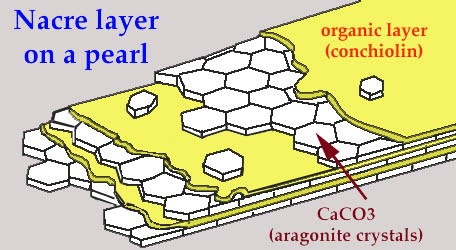
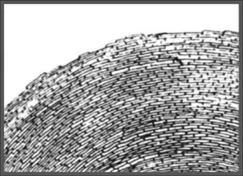

# 天然有机宝石

# 珍珠

珍珠是海洋或淡水中某些贝类或蚌类动物因受到外来物质刺激而分泌出的珍珠质圆珠体。

1. 天然珍珠：在贝类或蚌类等动物体内，不经人为因素自然的分泌物。它们由碳酸钙(主要是文石)、有机质(主要为贝壳硬蛋白)和水、多种微量元素等组成，呈同心层状或同心层放射状结构，呈珍珠光泽。
2. 养殖珍珠：在贝类或蚌类等动物体内，经人为因素干预珍珠质的形成物。由碳酸钙(主要是文石)、有机质(主要为贝壳硬蛋白)和水、多种微量元素等组成，呈同心层状或同心层放射状结构，呈珍珠光泽。
   对于所有的养殖珍珠，珍珠层是由活着的软体动物的分泌物形成的。人为干预只是为了开始这一过程。

## 文化赏析

清朝将产自**黑龙江、乌苏里江、鸭绿江及其流域**的珍珠称为“**东珠**”。
清朝大量使用东珠嵌在朝冠上、串于朝珠上、缀于官服上
清朝典制规定：东珠朝珠只有皇帝、皇太后、皇后在宫中举行大典时才可佩戴。
**祭天**戴**青金石**朝珠，**祭地**戴**琥珀**或**蜜腊**朝珠，**祭日**戴**红珊瑚**朝珠，**祭月**戴**绿松石**朝珠“漫游者” (La Peregrina)

## 珍珠的用途

优质珍珠主要用来制作首饰及服饰，与月光石一起被用做六月份的生辰石，象征健康、长寿、富贵。
质量较次的珍珠主要用于保健产品，如药物、营养品、化妆品等。

## 著名精品介绍

1. 真主之珠(老子珠)：世界上最大的天然海水珍珠，241mm-139mm，重 6350 克(8266 克？)，形似人脑，命名为“真主之珠”。 现存在美国旧金山银行的保险库中 并不是一颗优质珍珠 光泽较差

2. 亚洲之珠：波斯湾海域，长 100mm，宽 60-70mm，重 121 克 送给了中国的乾隆皇帝 第二次世界大战后在巴黎出售。

3. 希望之珠：是一粒畸形附壳淡水珠。重 117 克，50.8-104.3mm 最早为伦敦银行家霍普所收藏 第二次世界大战期间丢失
4. 摄政王 La Regente Pearl 世界第五大珍珠。2005 年 11 月在瑞士日内瓦以 160 万英镑的价格拍出。

## 珍珠的宝石学特征

1. 组成：珍珠的主要化学成分是$CaCO_3$(约 91%-92%)，水分和有机质约 4%-8%，另外有约 0.4%的其它杂质。其中$CaCO_3$主要以斜方晶系的文石出现，少数以三方晶系的方解石出现。
   珍珠的结构：
    
2. 颜色：珍珠的颜色由体色、伴色和晕彩组成。
    1. 体色：珍珠对白光选择性吸收产生的颜色
    2. 伴色：漂浮在珍珠表面的一种或几种颜色。
    3. 晕彩：在珍珠表面或表面下形成的可飘移的彩虹色。是从珍珠表面反射光中观察到的、由珍珠次表面的内部珠层对光的反射、干涉等综合作用形成的特有色彩。
3. 光泽：珍珠表面反射光的强度及映像的清晰程度。珍珠光泽的强度随着珍珠层厚度的增加而增强。俗话说“珠光宝气”，说明珍珠的魅力主要体现在其光泽上。
4. 构造：显微镜下可见到珍珠表面由小的板状物叠置而成的“等高线状”纹理。仿珍珠表面的桔皮状构造。
5. 珍珠一般为**不透明-微透明**，极少数有很高的透明度。**硬度**2.5-4。用牙磨其表面时具有砂感。天然珍珠的**比重**为 2.68-2.78，养殖珍珠的**比重**为 2.72-2.78。珍珠在加热、燃烧时会变为褐色。遇到盐酸会发生溶解作用。在长波紫外光照射下，黑珍珠通常**红色调的荧光**。

## 珍珠的分类

1. 按照其**成因**划分为：天然珍珠和养殖珍珠两类。
2. 按照其**生长水域**划分为：海水珍珠和淡水珍珠两类。
3. 按照**其地域分布**有以下名称：东方珠、南洋珠、日本珠、塔希提珠等。
4. 按照**体色**的不同划分为：白色系列、黑色系列、有色系列。
    1. 白色系列：白色、奶油色、粉红色为主，白色和奶油色常有玫瑰色的伴色。
    2. 黑色系列：紫色、绿色、蓝绿色、黑蓝色、黑色为主，常有伴色及晕彩。
    3. 有色系列：浅到中等的黄、绿、蓝、紫罗兰色调。

另外还有稀有的海螺珍珠(即孔克珍珠 Conch Pearls)

## 珍珠的质量评价

颜色、大小、形状、光泽、光洁度、珠层厚度(对海水珍珠)

1. 颜色：评价珍珠的质量应在灰色或白色背景下，采用北向日光或采用 5500K-7200K 日光灯进行观察。以体色描述为主，伴色和晕彩描述为辅。珍珠的颜色十分丰富。

    1. 其体色主要有：白色、粉红色、金黄色、黑色、紫色。以白色系列最为常见。
    2. 伴色主要有：玫瑰色、绿色、银白色、古铜色、蓝色、紫色、灰色等。

    对于白珍珠来说，粉红色和玫瑰色伴色可增加珍珠的价格，银白色伴色对价格无影响，绿色伴色则会降低珍珠的价格。但对于黑珍珠来说，最受欢迎的是孔雀绿、浓紫、海蓝等彩虹色。
    黑色系列是珍珠中的珍品。

2. 光泽：分为极强、强、中、弱四个等级。珍珠的魅力主要体现在其光泽上，优质珍珠表面应具有强珍珠光泽，并带有彩虹般的晕彩。
   珍珠光泽的强弱主要取决于珠层的厚度，珠层越厚光泽越强。
   海水珍珠层厚度级别:≥0.6mm 的为特厚、≥0.5mm 的为厚、≥0.4mm 的为中、≥0.3mm 的为薄、 ＜ 0.3mm 的为极薄
   珍珠层厚度是测量方法：直接侧量法、X 光照相法、光学相干层析法。

3. 形状：珍珠可以有多种形状，一般分为圆形、椭圆形、扁平形和异形。

4. 大小：
   在珍珠贸易中常用的质量单位是**珍珠格令**，1 珍珠格令 =0.25 克拉。“七分为珠、八分为宝”：6 毫米以下的珍珠一般不被列入珠宝级珍珠的范畴。但 3mm-4mm 的淡水珍珠适宜于编制各种工艺品，在市场上很受欢迎。同一等级的珍珠，直径越大，价值越高。

5. 光洁度：分为五个级别：无暇、微瑕、小瑕、瑕疵、重瑕。
   珍珠往往存在瑕疵，瑕疵越少，珍珠的光洁度越好。
   珍珠的表面瑕疵有：线、隆起、凹陷、皱纹、缺口、斑点、剥落、裂纹、划痕等。其中破口和珍珠层剥落 对珍珠质量的影响最严重。瑕疵出现在比较隐蔽的位置时对珍珠质量的影响较小。

## 珍珠的养殖

养殖珍珠最早源于中国，后来传入了日本。
养殖珍珠一般包括以下工作：

1. 选择合适的珠母贝： 适用于海水养殖珍珠的贝类主要有马氏贝、大珠母贝、黑蝶贝、白蝶贝等。适用于淡水养殖珍珠的贝类主要有三角帆蚌、池蝶蚌、背瘤丽蚌等。
2. 人工育苗：母贝以前来源于潜水员所采集的天然珠贝，现在是在 25 ℃ 水温下经人工受精、饲养、培育而得到。
3. 人工置核：选择养殖二、三年的健康成年贝作为母贝，实施外科置核手术。将母贝的壳撬开 1 厘米，用消毒过的手术刀在外套膜上割一个小口，插入来自细胞贝的外套膜碎片，一次可多达 50 个，这样养殖的是**无核珍珠**。若养殖**有核珍珠**，则在插入珠核的同时插入外套膜。而且，外套膜片必须紧贴在珠核上。
   半边珠：也称 Mabe 珠、馒头珠和半圆珠。半球形的珠核插入贝壳的内壁，凸面朝珠母贝的套膜，平面贴紧珠母的壳壁。加工时连同壳壁一起抛磨成一件饰品，故其个体硕大。较为理想的珠核材料：淡水的背瘤丽蚌、多疣丽蚌的贝壳。近年逐渐较多地使用砗磲贝壳。珠核直径一般 5-7mm
   淡水珠的置核季节在 3-5 月或 9-12 月，而海水珠在 2-4 月。
4. 养殖与收获：
   将置核后的母贝装入笼内，并标上记号及时送回环境较好的水域中养殖，经过精心养护就可以收获。淡水珠的养殖周期通常为 2-4 年，而海水珠的养殖周期为 1-2 年。收获的季节一般选择在 10 月下旬-12 月下旬，这时的珍珠光泽较好。

## 珍珠的产地

1. 波斯湾的巴林岛，巴黎市场上所销售的珍珠，90%以上来自波斯湾。
2. 日本珍珠也有淡水珍珠和海水珍珠之分。淡水珍珠被称为**琵琶珠**(因琵琶湖而得名)，近来因湖水质受污染，加之受中国淡水珠珍珠市场的冲击，所以琵琶珠的生产几近停顿。海水珍珠被称之为**AKOYA 珍珠**。其孕育的母贝是**马氏贝**，这种贝在日本称为“あこや”，日语读音 Akoya，中文谐音为“阿古屋”。一般养殖时间 3-4 年，珍珠的粒径范围一般在 7-9mm 之间，所以日本海水珍珠作为珍珠项链设计更受欢迎。一般以白色为主，常见有透粉的晕彩色泽。以极强的光泽和晕彩著称：
3. 南洋珠：分布在太平洋与印度洋地区，在南、北回归线之间与东经 90-140 之间构成的矩形范围内。该水域气候温暖、水温较高、水生物质丰富，极适合珍珠贝的生长与珍珠的养殖。
   其中包括澳大利亚、菲律宾、印度尼西亚、缅甸、泰国、印度等国家。
   南洋珍珠的母贝主要是**金唇贝、白蝶贝和黑蝶贝**，其贝体要比马氏贝大，可以养育更大的珍珠，养殖时间更长，至少需要 5-6 年。珍珠的粒径一般在 9mm 以上，一般作为珍珠吊坠、耳环、戒指首饰的所用。
   南洋珍珠拥有最高级的白色，表皮非常细腻光滑，除了圣洁高雅的白色外，还有富含贵族气息的金色以及神秘魅惑的黑色系。
4. 黑珍珠的主要产地是**法属玻利尼西亚的塔希提岛**(港台译为大溪地)，全球 95%的黑珍珠均来自这里。由黑嘴唇珠母贝养殖出来的塔希提珍珠，直径一般在 8-16 毫米，常呈孔雀绿、茄紫、棕色、浓紫色、灰鸽色、无烟煤色，无须再接受任何加色处理，其产量约占世界珍珠总产量的 1%，因此，特别珍贵。
5. 在委内瑞拉海域出产的白色、褐色、棕色、黑色珍珠中，其中的白色品种几乎近于透明，非常独特。

## 中国的养殖珍珠

中国是最早进行珍珠养殖的国家，近年来中国终于崛起成为世界第一养殖大国。
中国珍珠的产量高达全世界珍珠产量的 96%。而中国海水珠销售额 1.6 亿美元，淡水珠销售额 3.8 亿美元，仅占总销售额的 12%。说明中国珍珠数量与价值存在明显的偏差。
国内珍珠企业主要以原材料出口为主，深加工能力薄弱，没有核心技术。另外在设计环节研发投入不够，不少企业缺乏专业的设计团队，这些都导致我国珍珠产品缺少高附加值。

## 中国养殖珍珠的分布

淡水珍珠的养殖场主要集中在长江中下游湖泊、水系发达的省份。如浙江、江苏、湖北、湖南、安徽、江西等省。其中浙江的珍珠产量占全国淡水珠的 2/3，年销售额约 2 亿美元。有核淡水珍珠的养殖基地位于广东省澄海县。近年来在安徽等地也开发出养殖场。有核养珠尺寸多为 7-8 mm，最大可达 17mm。
海水珍珠的养殖集中于广西、广东、海南沿海一带。其中中国第一颗人工养殖海水珍珠就诞生在广西北海，而广西合浦则是南珠的代表产地，但海南的养珠质量却更胜一筹。
浙江省诸暨市是国内最大的淡水珍珠批发市场所在地。

## 珍珠的保养

1. 应避免让珍珠接触酸、碱质及化学品(如香水、肥皂、定型水等)。紧贴皮肤佩戴时应尽量不涂抹化妆品、不出汗。
2. 避免将珍珠与坚硬、粗糙的物质接触。
3. 不要佩戴珍珠首饰游泳或洗澡，化妆之后再戴上珍珠。
4. 不要用水清洁珍珠项链。水可以进入珠的小孔内，不仅难于抹干。如穿戴时出了很多汗，可用软湿毛巾小心抹净，自然晾干后用柔软、干净的绒布衬垫收藏。

由于珍珠中斜方晶系的文石会慢慢地向三方晶系的方解石转变，引起结构上的变化，再加上有机质的缓慢变化，珍珠最终会慢慢地失去其美丽，就像人会衰老一样，属于自然规律，不可抗拒，即所谓“人老珠黄”。但珍珠的这种变化与人的衰老相比要缓慢得多。

## 仿珍珠及珍珠的优化处理

1. 仿珍珠
   早在 17 世纪的法国就出现了用青鳞鱼提取的“珍珠精液”，将其涂在乳白色塑料球或乳白色玻璃球或圆球形贝壳上，就制成了以假乱真的仿珍珠。
   其鉴别特征是：

    1. 显微镜下其表面具有粒状的粗糙感。
    2. 没有珍珠的“等高线状”纹理。
    3. 牙磨时打滑，无砂感。
    4. 塑料仿珍珠和玻璃仿珍珠均不溶于盐酸。

2. 珍珠的优化处理
   珍珠的优化工艺一般包括以下流程：
    1. 前处理：包括分选、膨化、脱水、打孔等处理。
    2. 分选：按珠层的厚薄、颜色、光泽、形状、大小等归类。
    3. 打孔：为了加工成型的需要；也便于脱脂、漂白、增白和染色等工序中化学液体更好地渗入到珍珠中。
    4. 膨化：用氨水和苯的混合液对珍珠进行膨化处理，以使结构变得“疏松”。
    5. 脱水：用无水酒精或纯甘油作脱水剂，脱去珍珠内的缝隙水和吸附水。也可采用抽真空或烘干处理。
    6. 增光处理：增光是珍珠加工中重要工序之一。含镁的化合物在弱碱性条件下对珍珠有显著的增光作用。
    7. 漂白处理：漂白是珍珠优化工艺中最重要的一环。将珍珠浸泡于浓度低于 5%的过氧化氢溶液中，温度控制在 20-30℃，pH 值 7-8 之间，同时将其暴露在阳光下或紫外线下，经过 20-30 天的漂白，珍珠即会变为灰白色或银白色，效果好时可变为纯白色。
    8. 增白处理：对于过氧化氢不起作用的黄色物质需要进一步增白处理。该法是利用光学中互补色原理来达到增白的目的。所用的荧光增白剂在吸收紫外光后，即发出 400nm－500nm 的紫、蓝光，这种光与黄色光互为补色，从而使珍珠显白色。使用这种方法要求水质很高，不含铁、铜等金属离子。
    9. 调色处理：漂白后的珍珠颜色可能不均匀，部分珍珠还要经过调色处理。不同地区所选用的色彩有所不同。根据所使用的染料、溶剂不同可分为水染、油染、酒精染三种。
    10. 上光处理：即抛光处理。这是珍珠优化工艺中的最后一道工序，其结果直接影响珍珠的光泽，好的上光可增加漂白、增白效果。目前采用的抛光材料有：小竹片、石蜡、木屑、硅藻土、颗粒食盐、硬化的玉米籽等。
    11. 其它方法：
        γ 射线辐照法：以 Co 为放射源，可改变珍珠的颜色，且处理结果稳定。海水有核珍珠辐照后基本上为银灰色。所以，市场上出现的辐照改色珍珠多为淡水珍珠。
        剥皮处理：用极细的工具小心的剥掉珍珠不美观的表层，操作难度很大。
        染色处理：化学着色是将珍珠浸于某些特殊的化学溶液中上色。
        褪色处理：由黑褪成金黄色或巧克力色

# 珊瑚

珊瑚是珊瑚虫分泌的石灰质骨骼聚集而成的，生长极缓慢。珊瑚虫是圆筒状的腔肠动物，生活于海洋中，它靠管口上段的触手来捕捉微生物，送入口中后通过内腔消化食物，同时分泌出石灰质以建造自己的躯壳，当它死后，下一代珊瑚在其残留的躯壳上
又发育起来，一代又一代珊瑚虫不断繁衍，便形成了千姿百态的树枝状、蘑菇状、花卉状珊瑚，甚至形成巨大的珊瑚礁。
1988 年就被列为国家一级重点保护动物，2008 年被列入《濒危野生动植物物种国际贸易公约》目录。天然红珊瑚是可以合法买卖的，前提是必须获得国家颁发的野生水生动物经营许可证。
在我国古代又称为“火树”。人们还常常将其饰以其它珠宝，制成所谓的“玉树”。
清朝祭日时必须戴红珊瑚朝珠。清朝二品官的朝冠、官帽为红珊瑚顶。

## 珊瑚的宝石学特征

珊瑚的主要化学成分为$CaCO_3$，少量有机质和水分。红珊瑚的$CaCO_3$以方解石为主，白珊瑚的$CaCO_3$以文石为主。
珊瑚集合体形态很奇特，多呈树枝状、蜂窝状。珊瑚在纵截面上珊瑚表现为颜色和透明度稍有差异的平行条纹，在横截面上呈放射状同心圆状构造。
珊瑚的颜色常为白色、奶油色、粉红色至深红色，偶见蓝色和紫色。
珊瑚一般为不透明至微透明，硬度约 3-4，比重约 2.65，折射率约 1.65。遇稀盐酸产生大量气泡

## 珊瑚的质量评价

1. 颜色：要求纯正而鲜艳。我国工艺美术界一直偏爱鲜红色。西方称“安琪儿皮肤”的粉红肉色在我国称为“孩儿面”，也是较好的品种，而暗红色或粉红发白的品种价值较低。白珊瑚以纯白色为最佳，其次为瓷白色，再次为灰白色。
2. 块度：要求大而完整，越大越好，大者能做雕件，小的只能做首饰。
3. 质地：质地致密坚硬、无瑕疵者为佳，有虫蛀孔、有裂隙者价值较低。
4. 做工：包括造型的艺术构思和雕刻工艺的精细程度。

## 珊瑚的产地

珊瑚多产于岩岸和沙岸的交接处，其产区相当广大：

1. 太平洋海区：主要是日本、琉球、台湾东岸、澎湖及南沙群岛。白珊瑚产在水深约 100-200 米的海床上。红珊瑚约在水深 200 米至 2000 米的深海中呈群体产出。生长速度极其缓慢，二十年才长一寸。被人们誉为“深海灵芝”。**台湾**是当代红珊瑚最重要的产地，占世界总产量的 60%。商业品种有“AKA 阿卡珊瑚”以及“MOMO 么么珊瑚”。两种红珊瑚的共同点就是都有白芯，除颜色上的差异外，AKA 珊瑚具晶莹微透的质感，而 MOMO 则瓷实的质感。
2. 大西洋海区：欧洲地中海撒丁岛附近的海域。如意大利、阿尔及利亚、突尼斯、西班牙、法国等都是红珊瑚的主要产区。**意大利**的那不勒斯则是红珊瑚最著名的加工区。商业上称之为“沙丁珊瑚”。也称为“意大利珊瑚”。沙丁珊瑚没有白芯，颜色类似阿卡，常见橘色、橘红、朱红、正红、深红，但是很难达到红得发黑的程度。
3. 夏威夷西北部中途岛附近：此海区是红色、粉红色珊瑚的产地。

## 仿制品及优化处理品的鉴别

1. 红玻璃：玻璃仿珊瑚具有明显的玻璃光泽，含有气泡、旋涡纹，呈贝壳状断口，硬度为 5.5，大于珊瑚的硬度，遇盐酸不起泡。
2. 红塑料：塑料仿珊瑚上常留下模具的痕迹，表面不平整，硬度、比重均低于珊瑚，遇盐酸不起泡，内部可能含有气泡。
3. “吉尔森珊瑚”：是用方解石粉末加上少量染料在高温、高压下粘制而成的一种材料。其颜色、光泽等外观特征与天然珊瑚很相象。但放大检查时看不到珊瑚特有的条带状、放射同心圆状构造，只能看到细微粒状结构。
4. 染色骨制品：不与盐酸起反应，比重、硬度均低于珊瑚，具有骨髓、鬃眼等特征，而没有珊瑚的放射同心圆状构造。
5. 染色珊瑚：珊瑚柱体截面有像树一样的年轮，即珊瑚生长纹，相对规则。天然红珊瑚外边最红向内渐成浅红，中间发白，形成白色的中心。由于红珊瑚的价值较高，染色品一般为红色。用蘸有丙酮的棉签擦拭染色珊瑚时，棉签可能会被染红。与盐酸起反应时产生红色气泡，镜下检查时可见染料集中于缝隙内，颜色往往外深内浅，着色不均。中心常常呈红色或者粉色。
6. 海竹(竹节珊瑚)：染色竹节珊瑚横截面纹路呈放射状，又称太阳心。海竹生长速度快速，导致了其纹理的粗糙。竖纹极明显由于中心部分致密，染剂较难渗入，染色后色差对比强烈。

# 琥珀

琥珀是几千万年前的针叶树木的分泌物(树脂、松脂)经过石化作用的产物。树脂从树干的伤口中流出也称为“树脂化石”或“松脂化石”。

## 文化赏析

琥珀除了用于装饰外，还是一味名贵的中药。据《神农本草经》载：“琥珀无毒，味甘平，安五脏，定魂魄”。中医用于主治小便涩痛、尿血、惊悸失眠等症。

## 琥珀的宝石学性质

琥珀是 C、H、O 组成的有机化合物，主要成分为琥珀脂酸、琥珀松香酸，另含量琥珀油、$H_2S$等。
琥珀为非晶质体，常呈结核状、瘤状、水滴状，产于煤层及其它沉积岩层中。
硬度仅为 2-2.5。折射率为 1.54。 比重为 1.08 左右，在饱和盐水(比重 1.2)中可以上浮，是已知宝石中最轻的品种。
颜色有黄色-蜜黄色、黄棕色-棕色、浅红棕色、浅绿褐色。具典型的树脂光泽，透明-半透明，韧性较差，外力撞击时容易发生碎裂。长波紫外光下蓝绿色荧光，中至强。琥珀是很好的绝缘体，摩擦带电现象明显。琥珀导热性差，用嘴唇触之有温感。加热至 150 摄氏度时开始软化分解，250 摄氏度时发生熔融，产生白色蒸气，并发出松香味，鉴于这一特性，琥珀常被用做卫生香，德国人将琥珀称为“燃烧石”。
传说汉成帝的皇后赵飞燕就有一琥珀枕，用于睡眠时摄取芳香。
琥珀易溶于 H2SO4 和热 HNO3，部分溶于酒精、汽油、乙醚中。在阳光下曝晒或置于过分干燥的环境中，琥珀表面会因脱水而产生裂隙。

## 琥珀的品种

1. 琥珀：黄红色、褐黄色，透明。
2. 金珀：金黄色、明黄色，透明。
3. 血珀：色红如血，透明。
4. 蜜蜡：“色如蜜、质如蜡”。棕黄色、金黄色、淡黄色，半透明-微透明，有蜡状感。蜜蜡中气泡的存在是导致其透明度不好的主要因素，并且气泡越小，分布越密集，蜜蜡的透明度则越差，色度也逐渐变白
5. 蓝珀: 体色为淡黄色，对着光的表面呈蓝色，这种蓝色在太阳光或明亮的白光下更为明显，而且蓝色会随着光的照射角度的变化而灵活的移动。
6. 绿珀：
7. 虫珀：包含有动物遗体的琥珀。
8. 植物珀：包含有植物碎片的琥珀。
   其他品种：
9. “爆星”：气泡爆裂形成的裂片
10. “金砂种”：
11. “花珀”：多种颜色的“爆花”
12. “金绞蜜”：透明的金珀与半透明的蜜蜡互相缠绞在一起。
13. “咖啡珀”：
14. “香珀”：具有香味的琥珀。
15. “翳珀”：用肉眼垂直平视呈现黑色，在透射光下则呈现红色.

## 琥珀的质量评价

琥珀的质量评价应从颜色、块度、透明度及内含物四个方面进行：

1. 颜色：以颜色浓重者为佳，其中价值最高的是红色和绿色。
2. 块度：一般要求具有一定的块度，且越大越好。
3. 透明度：要求洁净无裂纹，越透明越好，以晶莹剔透者为上品，半透明至微透明者为次品、劣品。
4. 包裹物：琥珀中可含有许多种类的动物、植物包裹物，其中以含昆虫者最好。依据昆虫完整程度、清晰程度、形态大小、数量多少来决定虫珀的价值。

## 琥珀的产地

琥珀的产地众多。主要有欧洲波罗的海沿岸的波兰、德国、丹麦、俄罗斯等国家，国际市场销售的琥珀 80%产于**波罗的海**地区。其中**俄罗斯**的萨姆兰是世界上最大的琥珀矿。**多米尼加**海域也产出优质琥珀，国际市场销售的琥珀 10%出自这里。琥珀赋存于石灰岩、灰色碳质泥灰岩、砾岩的褐煤夹层中。但丹麦是第一个发现琥珀的国家。目前，在罗马尼亚、捷克、意大利西西里岛、挪威、英国、新西兰、黎巴嫩、美国、缅甸、加拿大、智利、中国均有产出。
中国的琥珀主要产自**抚顺煤田**中，而且有大量优质虫珀。另外，河南、云南、福建也有琥珀产出。

## 琥珀的保养

琥珀与珍珠一样也属于有机宝石，挥发性、腐蚀性的物质对它不利，一般的珠宝清洗液并不适用于琥珀，保养琥珀时应用温水清洗，用柔软的布吸干水分后，以少量的橄榄油轻轻擦拭，即可恢复琥珀的光泽。另外，由于琥珀硬度很小，应避免被硬物磨损。

## 琥珀的优化处理及仿制品

1. 热处理：其目的是增加琥珀的透明度，方法是将因含大量气泡而呈云雾状的琥珀放在植物油中加热。特征是：常出现“太阳光芒”、“睡莲叶”般的盘状裂面。热处理改色琥珀的折射率可显示十多条细线。
2. 再造琥珀：方法是先将琥珀破碎至一定粒度，用重力浮选除去杂质，在 2.5×106 帕的压力、200-230 摄氏度的温度下压制成型。其鉴别特征如下：
    1. 具有糖浆状搅动构造。
    2. 放大观察见粒状结构。
    3. 气泡呈扁平拉长定向排列或含有未熔物。
    4. 短波紫外光下表现为明亮的白垩状蓝色荧光，而非浅白、浅蓝或浅黄色荧光。
3. 染色处理：天然琥珀在空气中暴露若干年后会发红，因此，染色的目的是仿旧。其特征是红色集中于裂隙内。
4. 塑料仿琥珀：“非洲琥珀”实际上就是酚醛塑料制品，欧洲的古董店中可见到这类的项链。特征：
    1. 除聚苯乙烯外，塑料仿制品均在饱和盐水中下沉。
    2. 塑料具可切性，会成片剥落，而琥珀因脆性会崩落。
    3. 琥珀具松香味，而塑料气味因品种各异。
    4. 塑料的折射率与琥珀不同。

天然虫琥中的昆虫陷入粘稠的天然树脂中，呈现垂死挣扎的形态。人造树脂仿虫珀是将昆虫遗体置入炽热粘稠的液态树脂中，呈收缩状状态。

国外较有名气的仿制琥珀：

1. 波兰：出现于 20 世纪 40 年代，目前最为常见的是聚乙烯树脂琥珀仿制品。
2. 俄罗斯：用天然树脂或聚乙烯树脂与研磨得很细的琥珀粉末混合加工而成。在烘烤时会产生近似老琥珀的外观，
   并取名为“bermit”，极易与缅甸天然树脂化石“burmite”相混淆。
3. 南非合成蜜蜡、蓝玻璃，“中东蜜蜡”，“非洲蜜蜡”，“阿富汗原蜡”，“尼泊尔原蜡”，“巴基斯坦原蜡”，“贵族蜜蜡”，“丝蜡”等。这些都是台湾骗子制作的塑料。他们有意把这些塑料蜜蜡的原产地说成是战乱和恐惧分子多发地伊拉克、阿富汗、伊朗、巴勒斯坦，巴基斯坦等或是人迹罕致的非洲某些地域
4. 天然树脂仿制品柯巴树脂：100 万年左右的树脂化石

新手法：

1. 修补：这种方法主要针对琥珀表面的凹坑、缺损以及开放裂隙，使用人工或天然的材料来进行修复，以达到外观完美的效果。修补区域的特征表现为：修补区域边界清晰，与琥珀主体特征不连续，表面光泽较弱，一些修补区域含有气泡和杂质
2. 贴皮：由于风化作用琥珀表面会形成一层颜色较深的外皮。当琥珀成品在雕刻时出现不可去除的瑕疵时，便利用天然皮在瑕疵处粘贴上外皮。如一片树叶，一朵花，或是一个小动物，使作品“锦上添花”。贴皮往往在雕件较为平整的地方。
3. “原石”现场打磨：自 2013 年以来琥珀开始出现原石造假，马丽散、优化柯巴脂、塑料层出不穷。“马丽散”是挖矿时用来填充缝隙的胶。行内叫“填充胶”。专业术语叫“聚亚胺胶脂”。当它被高压推挤注入到煤岩层或混凝土中的裂缝后会膨胀，把缝隙填满达到止漏目的。化工厂几毛一公斤。

# 象牙

象牙是指大象两根弯曲的长牙，而不是指大象的所有牙齿。
2018 年，我国全面停止商业性象牙加工销售活动。所有象牙买卖都是非法的，不论新旧，不论来源。

象牙有非洲象牙和亚洲象牙之分:
非洲象牙一般较长，其牙质相对较硬，为奶白色，最优质的主要来自坦桑尼亚和喀麦隆。
亚洲象牙一般较短，色白但易变黄，其中以斯里兰卡产的为最好。

## 象牙的基本性质

象牙的化学组成是羟基磷灰石和有机质。两者的比例大致为 65:35。 象牙一般呈弧形弯曲的角状，几乎一半是中空的。
象牙的横截面多呈圆形、近圆形，直径随品种、生长期和部位而异。同一根象牙从牙尖到牙根横截面直径逐渐变大。横截面具有特征的“Retzius”纹理(勒兹纹理线)，即由两组呈十字交叉状纹理线以大于 115 度或小于 65 度角相交组成的菱形图案。纵切面上具有近于平行的小纹线。
除此以外，象牙的横截面还具有分层结构，且分界线较清楚，一般从外到内分为四层：
Ⅰ 层即表层，为致密的同心密纹层，外缘附有珐琅质膜。
Ⅱ 层为粗“Retzius”线层，纹理线夹角较大，可至 124 度左右，纹理线间距较宽，约为 1-2.5mm。
Ⅲ 层为细“Retzius”线层，纹理线夹角较 Ⅱ 层小，平均在 120 度左右，纹理线间距很窄，约为 0.1-0.5mm。
Ⅳ 层为致密状同心层或空腔状。

象牙的颜色新鲜时呈白色、奶白色、瓷白色、淡玫瑰白色。象牙具有美丽柔和的油脂光泽，多呈微透明至半透明。折射率为 1.54，硬度仅为 2.5 左右， 比重通常为 1.85，断口呈裂片状、参差状。在长短波紫外线下发弱至强的白蓝色至蓝紫色荧光。具有极好的韧性。

## 象牙的优化处理

1. 漂白处理：将日久变黄或是本身带有黄色调的象牙，浸泡于双氧水等氧化性溶液中，以去除黄色，达到提高象牙档次和价值的目的。**漂白是大多数象牙必做的优化处理。**
2. 染色处理：将颜色不理想的象牙浸于所需的各种染色剂中，以得到所需的颜色。

## 常见仿制品的鉴别

1. 骨制品：致密型骨制品与象牙在外观、折射率、比重等方面都很相似，但其结构有所不同。动物骨骼具空心管状构造，在横截面上这些细管表现为圆形或椭圆形，在纵切面上表现为线条状。当污垢渗入空管中时，这些结构更为明显。
2. 植物象牙：即象牙棕榈和杜姆棕榈的果实。生长南美洲和非洲地区，皮呈棕色，内部的硬壳鸡蛋般大小，呈白色或蛋白色，其硬度、折射率和荧光特征均与象牙相近，但其横切面上呈蜂巢状结构，纵切上表现为平行粗直线，线条中还具有细胞结构。坚果的比重为 1.4 左右，比象牙还低。在硫酸中浸泡，象牙不会褪色，而坚果则呈现玫瑰色调，很容易染色。坚果的韧性比象牙还好，可用刀片切削，易于加工。
3. 塑料：赛璐珞是最常见和最有效的象牙仿制材料。为了模仿象牙纵切面的条纹而把塑料压成薄片，但这种条纹比象牙规则得多，而且不能产生“Retzius”花纹。

## 象牙的质量评价

以颜色罕见或是纯白色、半透明、质地致密坚韧、纹理线细密、质量大者为优等品，而颜色发黄、块体小、结构疏松的象牙价值就低，甚至失去珠宝的价值。
在象牙的评价因素中**雕刻工艺**非常重要。中国象牙雕刻具有悠久的历史和独特的传统风格， 雕刻技术闻名中外：**象牙套球**雕刻工艺古时有“鬼工球”之称。

## 象牙的产地

象牙主要产于**非洲**，如坦桑尼亚、喀麦隆、塞内加尔、埃塞俄比亚、加蓬等，以坦桑尼亚的潘加里附近产的象牙质量为最佳。其次是**亚洲**的泰国、缅甸、斯里兰卡和印度。
一般来说，产于非洲的象牙质地细腻，截面上带有细纹理。而亚洲质地较疏松柔软，颜色容易变黄。
